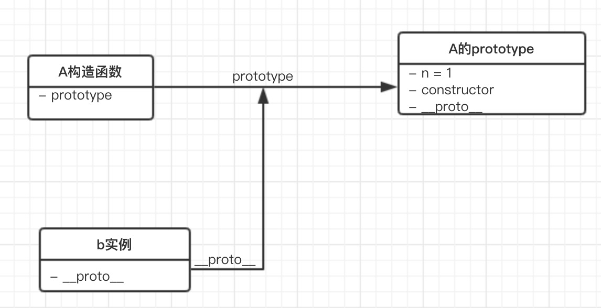
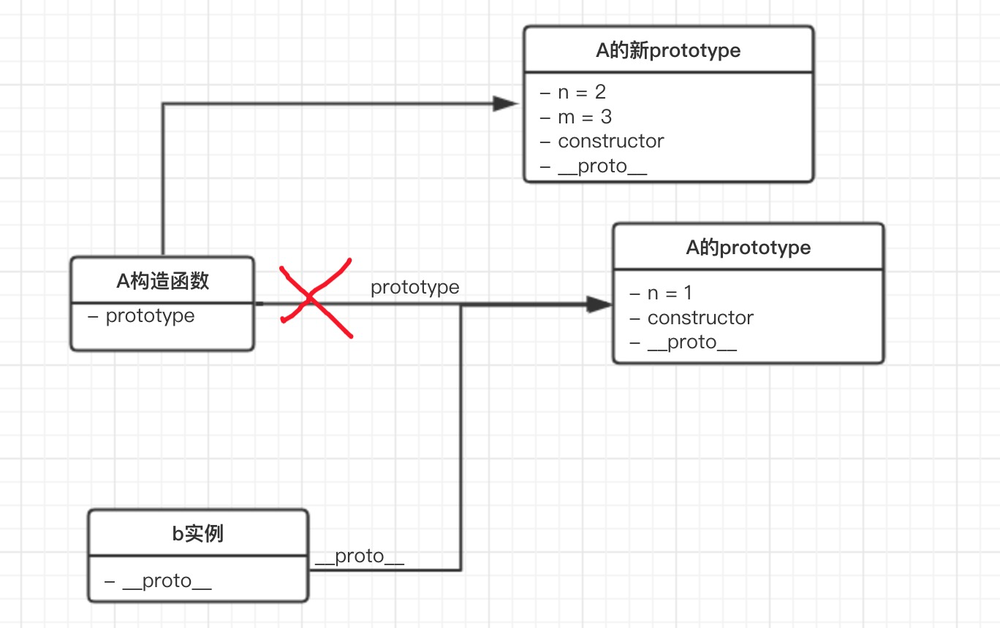

## 闭包

#### 理解作用域

`var name = 'hahaha'`

- var name -- 编译时处理

  > 编译阶段： 这时登场的是一个叫 **编译器** 的家伙。编译器会找遍当前作用域，看看是不是已经有一个叫 name 的家伙了。如果有，那么就忽略 var name 这个声明，继续编译下去；如果没有，则在当前作用域里新增一个 name。然后，编译器会为引擎生成运行时所需要的代码，程序就进入了执行阶段

- name = 'hahaha' -- 运行时处理

  > 执行阶段： 这时登场的就是 **JS 引擎** 了。JS 引擎在执行代码的时候，仍然会找遍当前作用域，看看是不是有一个叫 name 的家伙。如果能找到，那么万事大吉，我来给你赋值。如果找不到，它也不会灰心，它会从当前作用域里 “探出头去”，看看 “外面” 有没有，或者 “外面的外面” 有没有。如果最终仍然找不到 name 变量，引擎就会抛出一个异常

#### 作用域链

- 全局作用域
- 函数作用域（局部作用域）
- 块作用域（局部作用域）

```javascript
function add(a){
	console.log(a+b)
  console.log(c) // 报错
}

var b = 1

add(2) // 3
```


在函数add里访问变量b，发现找不到，于是js引擎去上层作用域找到了b，拿来使用；没找到c并且全局之外没有别的作用域，于是报错。

```javascript
function addABC(){
  var a = 1,b = 2;
  
  function add(){
    return a+b+c;
  }
  return add;
}

var c = 3

var globalAdd = addABC()

console.log(globalAdd()) // 6
```


对于函数add，它嵌套在addABC内部，用到变量a,b,c时，需要去上层作用域中获取。

像a,b,c这种在函数中被使用，但它既不是函数参数也不是函数的局部变量，而是一个不属于当前作用域的变量，此时它相对于当前作用域来说是一个自由变量；而像add这样引用了自由变量的函数，被称作闭包。

#### 词法作用域和动态作用域

**JS 的作用域遵循的就是词法作用域模型**

词法作用域模型是指在书写的过程中，根据书写的位置来决定划分作用域的方式。

动态作用域模型则会遵循沿着函数调用栈的方式来寻求变量的方式。

因此，词法作用域和动态作用域的区别主要在作用域划分的时机：

- 词法作用域在代码定义的时候完成划分，作用域链沿着定义的位置向外延伸
- 动态作用域在代码运行的时候完成划分，作用域链沿着调用栈向外延伸

#### 循环体和闭包系列真题

------

```javascript
for(var i = 0; i < 5; i++) {
	setTimeout(function() {
    console.log(i);
  }, 1000);
}

console.log(i);
// 5 0 1 2 3 4
```

正确输出：`5 5 5 5 5`

因为setTimeout函数将for循环中的打印操作延后了，因此for循环外的console会最先被执行，打印出第一个5；一秒后，setTimeout中的函数开始执行，因为function中没有定义自己的变量，因此会根据闭包的作用域链去全局中取变量i，此时i的值以及变成5了，这样的操作循环了四次，因此又打印了四个5。


要想打印出`5 0 1 2 3 4`的结果，我们可以通过下面三个方法去改造上述函数：

1. 将每一轮循环里i的值，传入setTimeout函数

   ```javascript
   for(var i = 0; i < 5; i++) {
   	setTimeout(function() {
       console.log(i);
     }, 1000, i);
   }
   
   console.log(i);
   ```

2. 在setTimeout函数外嵌套函数，缓存并通过入参来告诉每个循环i的值

   ```javascript
   var output = function (i) {
       setTimeout(function() {
           console.log(i);
       }, 1000);
   };
   
   for (var i = 0; i < 5; i++) {
       // 这里的 i 被赋值给了 output 作用域内的变量 i
       output(i);  
   }
   
   console.log(i);
   ```

3. 同样是在 setTimeout 外面再套一层函数，只不过这个函数是一个**立即执行函数**。

   ```javascript
   for (var i = 0; i < 5; i++) {
       // 这里的 i 被赋值给了立即执行函数作用域内的变量 j
       (function(j) {  
           setTimeout(function() {
               console.log(j);
           }, 1000);
       })(i);
   }
   ```

------

```javascript
function test (){
    var num = []
    var i

    for (i = 0; i < 10; i++) {
        num[i] = function () {
            console.log(i)
        }
    }

    return num[9]
}

test()()
// output: 10 对于num数组来说，0-9每一项都是一个函数，他们的函数内部都没有定义属于自己的变量，因此打印函数被调用的时候会去访问获取全局作用域中的i的值，因此num的每一项打印出来的数据都是全局i的值10
```

------

```javascript
var test = (function() {
    var num = 0
    return () => {
        return num++
    }
}())

for (var i = 0; i < 10; i++) {
    test()
}

console.log(test())
// output: 10 test是一个立即执行函数，封装了变量num，箭头函数为闭包，没定义变量，因此每次函数被调用都是去修改test函数中的num的值，for循环结束后，num的值是9，console语句再次调用test函数，return的值为9++ -> 10
```

------

```javascript
var a = 1;
function test(){
    a = 2; // 声明var被提前 var a=2
    return function(){
        console.log(a);
    }
    var a = 3; // 变量提升
}
test()();
// 2
```


------

```javascript
function foo(a,b){
  console.log(b);
  return {
    foo:function(c){
      return foo(c,a);
    }
  }
}
 
var func1=foo(0);
func1.foo(1);
func1.foo(2);
func1.foo(3);
var func2=foo(0).foo(1).foo(2).foo(3);
var func3=foo(0).foo(1);
func3.foo(2);
func3.foo(3);
```

## js内存管理机制

#### js内存生命周期

js语言向用户隐藏了内存管理的相关方法，自己默默完成了所有的管理动作。

js的内存生命周期分为三个阶段：分配内存-内存读写-内存释放

js中的数据类型分为基本类型和引用类型；基本类型包括string,number,boolean…他们的特征是大小固定、体积轻量、相对简单，被放在js的栈内存中；引用类型包括object,array,function等，他们比较复杂、占用空间大、大小不定，他们被放在js的堆内存中。

访问基本数据类型的变量时，从栈中直接获取该变量的值；而访问引用类型的变量，需要先从栈中获取变量对应对象的引用（即它在堆内存中的地址），然后用获取到的地址去堆内存查询才能拿到数据内容。

#### 垃圾回收机制

1. 引用计数法（弃用）

   每当一个变量指向一个值，就创建了一次这个值得引用，一段时间后，js会对所有值进行巡检，引用标记为0的值内存会被清除。

   但引用计数法无法甄别循环引用场景下的垃圾，长此以往就会造成内存泄漏。

2. 标记清除法

   一个变量被机制判断是否清除的标准是它是否可抵达。

## this指向原则

多数情况下，this指向调用方法的对象。

```javascript
// 声明位置
var me = {
  name: 'xiuyan',
  hello: function() {
    console.log(`你好，我是${this.name}`)
  }
}

var you = {
  name: 'xiaoming',
  hello: me.hello
}

// 调用位置
me.hello() // xiuyan
you.hello() // xiaoming
```

```javascript
// 声明位置
var me = {
  name: 'xiuyan',
  hello: function() {
    console.log(`你好，我是${this.name}`)
  }
}

var name = 'BigBear'
var hello = me.hello

// 调用位置
me.hello() // xiuyan
hello() // BigBear
```

```javascript
// 声明位置
var me = {
  name: 'xiuyan',
  hello: function() {
    console.log(`你好，我是${this.name}`)
  }
}

var you = {
  name: 'xiaoming',
  hello: function() {
    var targetFunc = me.hello
    targetFunc()
  }
}

var name = 'BigBear'

// 调用位置
you.hello() // BigBear

// targetFunc虽然声明在you函数中，但在调用时，并未给任何对象的前缀，因此此时的targetFun是挂在在全局作用域的，you对象的this并没有被传递给函数
```

**不管方法被书写在哪个位置，它的 this 只会跟着它的调用方走**

#### 特殊情景下的this

在三种特殊情况下，this指向window：

1. 立即执行函数
2. setTimeout中传入的函数
3. setInterval传入的函数

```javascript
var name = 'BigBear'

var me = {
  name: 'xiuyan',
  // 声明位置
  sayHello: function() {
    console.log(`你好，我是${this.name}`)
  },
  hello: function() {
    (function(cb) {
      // 调用位置
      cb()
    })(this.sayHello)
  }
}

me.hello() // BigBear
```

#### 箭头函数

箭头函数中的this只认“词法作用域”，因此箭头函数中this的指向和调用方式无关，由书写的位置决定。

```javascript
var name = 'BigBear'
var me = {
  name: 'xiuyan',
  // 声明位置
  hello: () => {
      console.log(this.name)
  }
}

// 调用位置
me.hello() // BigBear
```

练习

```javascript
var a = 1
var obj = {
  a: 2,
  func2: () => {
    console.log(this.a)
  },
  
  func3: function() {
    console.log(this.a)
  }
}

// func1
var func1  = () => {
  console.log(this.a)
}

// func2
var func2 = obj.func2
// func3
var func3 = obj.func3

func1() // 1
func2() // 1
func3() // 1
obj.func2() // 1
obj.func3() // 2
```

#### 改变this指向的方式

##### - 改变书写代码的方式

箭头函数（根据声明位置决定this的指向）

```javascript
var a = 1

var obj = {
  a: 2,
  // 声明位置
  showA: () => {
      console.log(this.a)
  }
}

// 调用位置
obj.showA() // 1
```

构造函数（构造函数里的this会绑定到new出来的对象上）

```javascript
function Person(name) {
  this.name = name
  console.log(this)
}

var person = new Person('xiuyan')
Person{ name : "xiuyan" }
```

##### - 显示调用方法帮忙

call、apply和bind的作用和区别？


```javascript
var me = {
  name: 'xiuyan'
}

function showName() {
  console.log(this.name)
}

showName.call(me) // xiuyan
```

- call是可以被所有函数继承的，应该定义在Function.prototype上
- call方法先改变了this的指向，将this绑定到第一个参数指定的对象上；再根据输入的参数执行函数

## 执行上下文与调用栈

- 为什么要有执行上下文

  分治是代码书写过程中很重要的一个思想，即细分文件、模块、方法的书写方式。

  我们可以把执行上下文理解为引擎在执行过程中对代码进行了又一次划分，从而降低复杂度。

- 执行上下文的分类

  1.全局上下文

  2.函数上下文

- 上下文的生命周期

  1.创建阶段 - 初始阶段，代码未执行，只是做了准备工作

  2.执行阶段 - 逐行执行脚本中的代码
  
- 调用栈

  在js代码执行过程中，引擎会创建执行上下文栈，也叫调用栈，函数上下文的创建和销毁过程，对应着入栈和出栈的操作。

## 原型编程范式与面向对象

在JavaScript中，每个构造函数都有一个prototype属性，它指向构造函数的原型对象，这个原型对象中有一个construtor属性指回构造函数；每个实例有一个\_proto\_属性，当我们使用构造函数去创建实例时，实例的\_proto\_属性就会指向构造函数的原型对象。

```javascript
// 创建一个Dog构造函数
function Dog(name, age) {
  this.name = name
  this.age = age
}
Dog.prototype.eat = function() {
  console.log(this.name,this.age,'肉骨头真好吃')
}
// 使用Dog构造函数创建dog实例
const dog = new Dog('旺财', 3)

// someFunc.__proto__ === Function.prototype;
// Function.prototype.__proto__ === Object.prototype;
```


#### 真题

```javascript
var A = function() {};
A.prototype.n = 1;
var b = new A();
A.prototype = {
  n: 2,
  m: 3
}
var c = new A();

console.log(b.n);
console.log(b.m);

console.log(c.n);
console.log(c.m);

// 1
// undefined
// 2
// 3
```

b和A的原型关系：



c和A的原型关系：


**为什么b和c继承自同一个原型对象，却有不同的表现呢？**

new一个实例对象的时候发生了什么事：为新对象开辟一块新的内存  => 把函数体内的this指向开辟的内存空间 => 将新对象的\_proto_属性指向对对应构造函数的prototype属性，把实例和原型对象关联 => 执行函数体内的逻辑并return新对象

因此，在第二步执行完后，b的原型就把A的prototype的引用储存下来了。

而在修改A的prototype时，只是重新赋值，使得A的prototype指向一个全新的对象。



因此b指向旧的引用，c指向新的引用，最终造成了不一样的输出结果。

------

```javascript
function A() {
    this.name = 'a'
    this.color = ['green', 'yellow']
 }
 function B() {
   
 }
 B.prototype = new A()
 var b1 = new B()
 var b2 = new B()
 
 b1.name = 'change'
 b1.color.push('black')

console.log(b2.name) // 'a'
console.log(b2.color) // ["green", "yellow", "black"]
```

原型链图：


在写操作的过程中，如果发现name属性在b1上没有，会原地为b1创建新属性而不会沿着原型链向上寻找定位；但对于读操作来说，如果在当前对象的属性中没有发现对应的值，则会顺着原型链逆流而上寻找已经存在的值。

```b1.color.push('black')```这样的写法没有改变对象的引用，而是在原有对象的基础上修改了内容，因此走的是原型链**查询+修改**的操作。

如果想要单纯执行写操作，应该```b1.color=["green", "yellow", "black"]```

------

```javascript
function A() {}
function B(a) {
    this.a = a;
}
function C(a) {
    if (a) {
        this.a = a;
    }
}
A.prototype.a = 1;
B.prototype.a = 1;
C.prototype.a = 1;

console.log(new A().a); // 1
console.log(new B().a); // undefined
console.log(new C().a); // 1
console.log(new C(2).a); // 2
```

原型链图：


当我们去new对象的实例时，会先开辟空间，this指向空间，将实例的\_prop_属性指向构造函数的prototype，执行函数体并return实例。

对于实例a来说，执行了空函数体后的a中没有找到变量a，因此沿着\_prop_找到A的prototype中的a=1；

对于实例b来说，构造函数会无条件为实例创建一个自有属性a，并将a赋值为入参，入参为undefined，所以a=undefined；

对于实例c，如果入参不为false，则自有属性a的值为入参的值，若传入的值为false，则不会为实例创建自有属性，沿着\_proto_找到原型链中的值输出为a=1

## 异步专题

#### JS中的同步和异步

JS 语言的任务执行模式就分为同步和异步。

同步，就是说后一个任务必须严格等待前一个任务执行完再执行，任务的执行顺序和排列顺序是高度一致的（上一个人取到炸鸡之前，下一个人不许点餐）；异步，则恰恰相反，任务的执行顺序不必遵循排列顺序。

异步进化史：回调函数 => Promise => Generator => async/await

#### 回调函数

回调函数时期是Promise出现前的一个阶段，这个阶段中除了回调函数，还有事件监听和发布订阅等方式。

```javascript
document.getElementById('#myDiv').addEventListener('click', function (e) {
  console.log('我被点击了')
}, false);
```

```javascript
function consoleTrigger() {
    console.log('trigger事件被触发')
}
jQuery.subscribe('trigger',consoleTrigger);

function publishTrigger() {
    jQuery.publish('trigger');
}

// 2s后，publishTrigger方法执行，trigger信号发布，consoleTrigger就会执行了
setTimeout(publishTrigger, 2000)
```

```javascript
const https = require('https');
 
// 发起网络请求
https.get('目标接口', (res) => {
  console.log(data)
 
}).on("error", (err) => {
  console.log("Error: " + err.message);
});
```

#### Promise

```javascript
new Promise(function(resolve,reject){
    https.get(url, (res) => {
      resolve(data);
    }).on("error", (err) => {
      reject(error);
    });
  })
```

Promise会接收一个执行器，在Promise实例创建后，执行器里的逻辑会立刻执行，在执行的过程中根据异步返回的结果，决定用resolve或者reject来改变Promise实例的状态。

Promise实例有三种状态：

- pending 进行中，Promise实例创建后的初始态
- fullfilled 成功完成，在执行器中调用resolve后达成的状态
- rejected 操作失败，在执行器中调用reject后达成的状态

#### Async/Await

首先，我们用async关键字声明一个函数为异步函数；然后就可以在函数内部使用await关键字了；声明了await关键字的任务会暂停函数的整个进程，直到异步任务的结果返回之后，函数才会被唤醒，继续执行后面的语句。

Promise的错误需要通过回调函数去捕获，但async和await允许使用try-catch来捕捉。

#### **Promise 命题思路全解析**

- **Promise特性类问题**

  > 问：说说你理解的promise
  >
  > 答：Promise对象是一个代理对象，它接受你传入的执行器作为入参，允许你把异步任务的成功和失败分别绑定到对应的处理方法上。一个Promise实例有三种状态。Promise实例的状态可以改变且只可以改变一次。当 Promise 的状态为 resolved 时，会触发其对应的 then 方法入参里的 onfulfilled 函数；当 Promise 的状态为 rejected 时，会触发其对应的 then 方法入参里的 onrejected 函数。

  > 问：Promise的出现是为了解决什么问题？
  >
  > 答：更加简洁地处理异步任务，优化了多层回调函数循环调用的代码。

  > 问：Promise的常见方法有哪些？各自是干什么的？
  >
  > 答：1.all方法，该方法返回一个新的promise对象，改promise对象在iterable参数对象里的所有promise对象都成功地时候才会触发成功，如果有任何一个对象失败则立刻触发新promise对象的失败。
  >
  > 2.race方法，当iterable参数里的任何一个子promise被成功或失败后，父promise马上也会用子promise的成功返回值或失败详情作为参数调用父promise绑定的相应函数，并返回该promise对象。
  >
  > 3.reject方法，返回一个状态失败的promise对象，并将给定的失败信息传递给相应的处理方法
  >
  > 4.resolve方法，返回一个promise对象，对象的状态由传入的value决定：如果传入的是thenable对象，返回的promise对象的最终状态由then方法执行决定；否则返回的promise对象状态为fulfilled，同时value会作为then方法中指定的onfulfilled的入参

- **看代码说答案类问题**

  ```javascript
  const promise = new Promise((resolve, reject) => {
      console.log(1);
      resolve();
      console.log(2);
  });
  
  promise.then(() => {
      console.log(3);
  });
  
  console.log(4);
  
  // 1
  // 2
  // 4
  // 3
  ```

  ```javascript
  const promise = new Promise((resolve, reject) => {
    resolve('第 1 次 resolve')
    console.log('resolve后的普通逻辑')
    reject('error')
    resolve('第 2 次 resolve')
  })
   
  promise
  .then((res) => {
    console.log('then: ', res)
  })
  .catch((err) => {
    console.log('catch: ', err)
  })
  
  // resolve后的普通逻辑
  // then: 第 1 次 resolve
  ```

  ```javascript
  Promise.resolve(1)
    .then(Promise.resolve(2))
    .then(3)
    .then()
    .then(console.log)
  
  // 1
  ```

  > **考点点拨：Promise 值穿透问题**
  >
  > **分析**：大家知道，then 方法里允许我们传入两个参数：`onFulfilled`（成功态的处理函数）和 `onRejected`（失败态的处理函数）。
  >
  > 你可以两者都传，也可以只传前者或者后者。但是无论如何，then 方法的入参只能是函数。万一你想塞给它一些乱七八糟的东西，它就会“翻脸不认人”。
  >
  > 具体到我们这个题里，第一个 then 方法中传入的是一个 Promise 对象，then 说：”我不认识“；第二个 then 中传入的是一个数字， then 继续说”我不认识“；第四个干脆啥也没穿，then 说”入参undefined了，拜拜“；直到第五个入参，一个函数被传了进来，then 哭了：”终于等到一个我能处理的！“，于是只有最后一个入参生效了。
  >
  > 在这个过程中，我们最初 resolve 出来那个值，穿越了一个又一个无效的 then 调用，就好像是这些 then 调用都是透明的、不存在的一样，因此这种情形我们也形象地称它是 Promise 的“值穿透”。

- **Promise底层原理考察 - 手写promise**

  **基本轮廓**

  ```javascript
  function MyPromise(executor){
    // value 记录异步任务成功的执行结果
  	this.value = null;
    // status 记录当前状态，初始化是 pending
  	this.status = 'pending';
    // reason 记录异步任务失败的原因
  	this.reason = null;
  	
  	var self = this;
  	
  	function resolve(value){
  		self.value = value;
  		self.status = 'resolved';
  	}
  	
  	function reject(reason){
      self.reason = reason;
      self.status = 'rejected';
    }
    // 把 resolve 和 reject 能力赋予执行器
    executor(resolve,reject);
  }
  ```

  **then方法 **：每一个 promise 实例一定有个 then 方法，因此then 方法应该装在 Promise 构造函数的原型对象上

  ```javascript
  // then方法接受两个入参，可选
  MyPromise.prototype.then = function(onResolved,onRejected){
    // onResolved 和 onRejected必须是函数；如果不是，我们此处用一个透传来兜底
    if(typeof onResolved !== 'function'){
      onResolved = function(x){ return x };
    }
    if(typeof onRejected !== 'function'){
      onRejected = function(y){ return y };
    }
    
    var self = this;
    
    if(self.status === 'resolved'){
      onResolved(self.value);
    }else if(self.status === 'rejected'){
      onRejected(self.reason);
    }
  };
  ```

  **链式调用**

  ```javascript
  function MyPromise(executor){
    // value 记录异步任务成功的执行结果
  	this.value = null;
    // status 记录当前状态，初始化是 pending
  	this.status = 'pending';
    // reason 记录异步任务失败的原因
  	this.reason = null;
  	
    // 缓存两个队列，维护 resolved 和 rejected 各自对应的处理函数
    this.onResolvedQueue = [];
    this.onRejectedQueue = [];
    
  	var self = this;
  	
  	function resolve(value){
      if(self.status !== 'pending'){
        return;
      }
  		self.value = value;
  		self.status = 'resolved';
      setTimeout(()=>{
        self.onResolvedQueue.forEach(resolved => resolved(self.value));
      });
  	}
  	
  	function reject(reason){
      if(self.status !== 'pending'){
        return;
      }
      self.reason = reason;
      self.status = 'rejected';
      setTimeout(function(){
        self.onRejectedQueue.forEach(rejected => rejected(self.reason));
      })
    }
    // 把 resolve 和 reject 能力赋予执行器
    executor(resolve,reject);
  }
  ```

  ```javascript
  // then方法接受两个入参，可选
  MyPromise.prototype.then = function(onResolved,onRejected){
    // onResolved 和 onRejected必须是函数；如果不是，我们此处用一个透传来兜底
    if(typeof onResolved !== 'function'){
      onResolved = function(x){ return x };
    }
    if(typeof onRejected !== 'function'){
      onRejected = function(y){ return y };
    }
    
    var self = this;
    
    if(self.status === 'resolved'){
      onResolved(self.value);
    }else if(self.status === 'rejected'){
      onRejected(self.reason);
    }else if(self.status === 'pending'){
      self.onResolvedQueue.push(onResolved);
      self.onRejectedQueue.push(onRejected);
    }
    
    return this;
};
  ```
  


## 变量提升与暂时性死区

#### 变量提升

ES2015之前，JS引擎用var声明一切变量，不管变量声明写在程序的哪个位置，都会被提升到作用域的顶端。

```javascript
console.log(num) 
var num = 1
// undefined

// 代码相当于
var num;
console.log(num) 
num = 1
```

- 变量提升的原理

  JS引擎在编译阶段会搜索所有的变量声明，并提前然声明生效，剩下的语句则要等到执行阶段才会生效

- let和const不存在变量提升

  let和const声明的变量，声明生效的时机和代码执行时机保持一致。声明提升的机制导致忘记声明的变量无法在开发阶段被明显地察觉，因此为了减少运行时错误，ES6特意将声明前不可用做了强约束。

#### 块作用域

块作用域是伴随ES6而生的概念，一对花括号括起来的代码成为一个代码块，被代码块圈起来的变量集就是块作用域。

```JavaScript
{
  let me = 'xiuyan'
  console.log(me) // 'xiuyan'
}
```

#### let和const

- let关键字

  let和var非常相似，let区别于var的地方在于，let声明的变量会被绑定到块作用域，而var是不感知块作用域的。

  ```javascript
  {
    var me = 'xiuyan'
    console.log(me) // 'xiuyan'
  }
  
  console.log(me) // 'xiuyan' 
  ```

  在代码块中用var定义的变量，在代码块之外也能访问到。

  ```JavaScript
  {
    let me = 'xiuyan'
    console.log(me) // 'xiuyan'
  }
  
  console.log(me) // 报错
  ```

  而当我们用let声明的变量被绑定在代码块里，出了块作用域，就访问不到里面的变量了。

- const关键字

  const和let具有相同的生命周期——用const声明的变量也会绑定到块作用域。

  const声明的变量，**必须在声明的同时被初始化**，否则会报错。

  const声明的变量，**在赋值过后，值也不可以再被修改**，否则会报错。

  要注意该规则在声明引用类型时的差异，引用类型的属性值可以被更改，但不能改变引用的指向。

  ```javascript
  const me = {
    name: 'xiuyan'
  }
  
  me.name = 'Bear'      ✔️
  ```

  ```javascript
  const me = {
    name: 'xiuyan'
  }
  
  me = {
  	name: 'Bear'
  }                      ❌
  ```

#### 暂时性死区

```javascript
var me = 'xiuyan';

{
	me = 'bear';
	let me;
  console.log(me);
}
// 报错
```

ES6中规定：如果区块中存在let和const命令，这个区块对这些命令声明的变量，从一开始就形成了封闭作用域，这段会报错的危险区域叫“暂时性死区”。

```javascript
var me = 'xiuyan';

{
	me = 'bear';
  console.log(me);
}
// bear
```

其实这也就是暂时性死区的本质：当我们进入当前作用域时，let 或者 const 声明的变量已经存在了——它们只是不允许被获取而已。要想获取它们，必须得等到代码执行到声明处。

## ES2015+考点解析

#### 对象与数组的解构

```javascript
const [a,b,c] = [0,1,2]
// a=0 b=1 c=2

const [a,,c] = [0,1,2]
// a=0 c=2
```

```javascript
const stu = {
	name: 'Tim',
  age: 23
}

const {name,age} = stu;
```

提取高度嵌套对象里的属性

```javascript
const school = {
   classes: {
      stu: {
         name: 'Bob',
         age: 24,
      }
   }
}
```

逐层解构

```javascript
const { classes } = school
const { stu } = classes
const { name } = stu

name // 'Bob'
```

```javascript
const {classes: {stu: {name: newName }}} = school

newName // 'Bob'
```

#### “...”的使用

对象中的扩展运算符用于取出参数对象中所有可遍历属性拷贝到当前对象之中

```javascript
const me = { 
  name: 'xiuyan',
  age: 24
}

const meCopy = { ...me } // Object.assign({}, me)

meCopy // {name: "xiuyan", age: 24}
```

数组中的扩展运算可以将一个数组转为用逗号分隔的参数序列

```javascript
console.log(...['haha', 'hehe', 'xixi']) // haha hehe xixi
```

```javascript
function mutiple(x, y) {
  return x*y
}

const arr = [2, 3]
mutiple(...arr) // 6
```

合并两个数组

```javascript
const arr1 = [1, 2, 3, 4]
const arr2 = [5, 6, 7, 8]

const newArray = arr1.concat(arr2)
const newArray = [...arr1,...arr2]
```

rest参数

当扩展运算符被用在函数形参的位置时，还可以吧一个分离的参数序列整合成一个数组

```javascript
function mutiple(...args) {
  let result = 1;
  for (var val of args) {
    result *= val;
  }
  console.log(args); // [1,2,3,4]
  return result;
}

mutiple(1, 2, 3, 4) // 24
```

#### 类数组的转换

定义：它必须是一个对象，它有length属性

```javascript
const book = {
  name: 'how to read a book',
  age: 10,
  length: 300 
} // 这是一个类数组对象
```

类数组对象转换为数组的方法

```javascript
const arrayLike = {0: 'Bob', 1: 'Lucy', 2: 'Daisy', length: 3 }
- Array原型上的slice方法
const arr = Array.prototype.slice.call(arrayLike);
- Array.from方法，ES6新增
const arr = Array.from(arrayLike);
- 扩展运算符
```

#### 模板语法与字符串处理

模板语法让我们拼接字符串变得更加简单易读

```JavaScript
var name = 'xiuyan'   
var career = 'coder' 
var hobby = ['coding', 'writing']

var finalString = `my name is ${name}, I work as a ${career} I love ${hobby[0]} and ${hobby[1]}`
```

模板字符串的关键优势有两个

- 在模板字符串中，空格、缩进、换行都会被保留
- 模板字符串完全支持“运算”式的表达式，可以再${}中进行运算

存在性判定：includes、startsWith、endsWith

- includes：判断字符串与子串的包含关系

  ```javascript
  const son = 'haha';
  const father = 'xixi haha heheh';
  
  father.includes(son) // true
  ```

- startsWith：判断字符串是否是以某个/某串字符开头

  ```javascript
  const father = 'xixi haha heheh';
  
  father.startsWith('xixi'); // true
  father.startsWith('haha'); // false
  ```

- endsWith：判断字符串是否以某个/某串字符结尾

  ```javascript
  const father = 'xixi haha hehe'
  
  father.endsWith('hehe') // true
  father.endsWith('baba') // false  
  ```

自动重复：我们可以使用repeat方法来使同一个字符串输出多次

```JavaScript
const sourceCode = 'repeat for 3 times;'
const repeated = sourceCode.repeat(3) 

console.log(repeated) // repeat for 3 times;repeat for 3 times;repeat for 3 times;
```

## DOM基本功

**什么是DOM？**

> 文档对象模型 (DOM) 是HTML和XML文档的编程接口。它提供了对文档的结构化的表述，并定义了一种方式可以使从程序中对该结构进行访问，从而改变文档的结构，样式和内容。DOM 将文档解析为一个由节点和对象（包含属性和方法的对象）组成的结构集合。简言之，它会将web页面和脚本或程序语言连接起来。

**DOM树的解析**

DOM结构以熟的形态存在，在DOM中每个元素都是一个节点，节点的类型有多种：

- Document：就是指这份文件，也就是这份 HTML 档的开端。当浏览器载入 HTML 文档, 它就会成为 Document 对象。
- Element：就是指 HTML 文件内的各个标签，像是`<div>、<span>`这样的各种 HTML 标签定义的元素都属于 Element 类型。
- Text：Text 就是指被各个标籤包起来的文字```<span>哈哈哈</span>```这里的哈哈哈被标签包了起来，它就是这个Element的Text
- Attribute：表示元素的特性。从技术角度讲，这里的特性就是说各个标签里的属性。

**解析DOM树**

```javascript
<html>
  <head>
    <title>DEMO</title>
  </head>
  <body>
    <h1 class="title">我是标题</h1>
  </body>
</html>
```


**DOM节点间关系**

在树状结构的DOM里，节点间关系可以划分为以下两类：

- 父子节点：表示节点间的嵌套关系
- 兄弟节点：表示节点层级的平行关系，兄弟节点共享一个父节点

**常考的DOM API**

- DOM节点的获取

  ```
  - getElementById // 按照 id 查询
  - getElementsByTagName // 按照标签名查询
  - getElementsByClassName // 按照类名查询
  - querySelectorAll // 按照 css 选择器查询
  ```

  ```javascript
  // 按照 id 查询
  var imooc = document.getElementById('imooc')
  
  // 按照标签名查询
  var p = getElementsByTagName('p')
  
  // 按照类名查询
  var mooc = getElementsByClassName('mooc')
  
  // 按照 css 选择器查询
  var css = querySelectorAll('.mooc')
  ```

- DOM节点的创建

  ```javascript
  <html>
    <head>
      <title>DEMO</title>
    </head>
    <body>
      <div id="container"> 
        <h1 id="title">我是标题</h1>
      </div>   
    </body>
  </html>
  ```

  添加一个有内容的 span 节点到 id 为 title 的节点后面

  ```javascript
  var father = document.getElementById('container')
  
  var new = document.createElement('span')
  new.innerHTML = 'hello world'
  
  father.appendChild(new)
  ```

- DOM节点的删除

  ```javascript
  <html>
    <head>
      <title>DEMO</title>
    </head>
    <body>
      <div id="container"> 
        <h1 id="title">我是标题</h1>
      </div>   
    </body>
  </html>
  ```

  删除id为title的节点

  ```javascript
  // 获取目标元素的父元素
  var father = document.getElementById('container')
  // 获取目标元素
  var son = document.getElementById('title')
  // var son = container.childNodes[1]
  
  father.removeChild(son)
  ```

- 修改DOM元素

  ```JavaScript
  <html>
    <head>
      <title>DEMO</title>
    </head>
    <body>
      <div id="container"> 
        <h1 id="title">我是标题</h1>
        <p id="content">我是内容</p>
      </div>   
    </body>
  </html>
  ```

  交换id为title和content的元素的位置

  ```JavaScript
  // 获取目标元素的父元素
  var father = document.getElementById('container')
  // 获取目标元素
  var son = document.getElementById('title')
  
  father.removeChild(son)
  father.appendChild(son)
  ```

  ```javascript
  var father = document.getElementById('container')
  
  var son = document.getElementById('title')
  var son2 = document.getElementById('content')
  
  father.insertBefore(son2,son)
  ```

- DOM元素属性的获取和修改

  获取并修改 title 元素的 id 名

  ```javascript
  var target = document.getElementById('title')
  
  // 获取 id 属性
  var titleId = target.getAttribute('id')
  
  // 修改 id 属性
  target.setAttribute('id',newValue)
  ```

- 《JavaScript——DOM编程艺术》

## DOM事件体系

#### DOM事件流

- 事件流：描述的是事件在页面中传播的顺序
- 事件：描述的是发生在浏览器里的动作，这个动作可以是用户触发的，也可以是浏览器触发的
- 事件监听函数：事件发生后，浏览器如何响应——用来应答事件的函数，就是事件监听函数，也叫事件处理程序

**一个事件的旅行**

W3C标准约定了一个事件的传播过程要经过以下三个阶段：

1. 事件捕获阶段
2. 目标阶段
3. 事件冒泡阶段


当事件在DOM元素中穿梭时，所到之处都会触发当前元素上安装的时间处理函数。当DOM接受了一个事件、对应的事件处理函数被触发时，就会产生一个事件对象event作为处理函数的入参，这个对象中囊括了与事件有关的信息，比如事件具体是有哪个元素所触发、事件的类型等等。

```javascript
<!DOCTYPE html>
<html lang="en">
<head>
  <meta charset="UTF-8">
  <meta name="viewport" content="width=device-width, initial-scale=1.0">
  <meta http-equiv="X-UA-Compatible" content="ie=edge">
  <title>Document</title>
</head>
<body>
  <div class="outer">
    <button id="button">点击我</button>
  </div>
</body>
</html>
```

```javascript
const button = document.getElementById('button')
button.addEventListener('click', clickProcessor)

function clickProcessor(event) {
  console.log(event)
}
```


#### 事件对象考点梳理

- currentTarget

  它记录了事件当下正在被哪个元素接收，这个元素是一直在改变的，因为事件的传播是层层穿梭的过程。

  如果事件处理程序绑定的元素，与具体的触发元素是一样的，那么函数中的this、event.currentTarget和event.target三个值是相同的，我们可以以此判断当前的元素是否是目标元素。

- target

  触发事件的具体目标，是事件的真正来源。就算事件处理程序没有绑定在目标元素上，而是绑定在目标元素的父元素上，只要它是由内部的目标元素冒泡到父容器上触发的，那么我们仍然可以通过target来感知到目标元素。

- preventDefault

  这个方法用于阻止特定事件的默认行为

- stopPropagation

  阻止冒泡，这个方法用于终止事件在传播过程中的捕获、目标处理或起泡阶段进一步传播。调用该方法后，该节点上处理该事件的处理程序将被调用，事件不再被分派到其他节点。

#### 自定义事件

对于三个同级的div元素A、B、C，如何实现在点击A之后，B和C都能感应到A被点击了，并作出相应的行为？

```javascript
<!DOCTYPE html>
<html lang="en">
<body>
  <div id="divA">我是A</div>
  <div id="divB">我是B</div>
  <div id="divC">我是C</div>
</body>
</html>
```

经典解法就是自定义事件，创建一个“A被点击”的事件，并由B和C来监听这个事件执行对应的处理函数。

 *事件对象可以手动创建```event = new Event(typeArg, eventInit);```*

因此点击A的事件创建为```var clickAEvent = new Event('clickA');```

接下来完成事件的监听和派发

```javascript
// 获取 divB 元素 
var divB = document.getElementById('divB');
// divB 监听 clickA 事件
document.addEventListener('clickA',function(e){
	console.log('我是小B，我感觉到了小A')
  console.log(e.target)
})

var divC = document.getElementById('divC');
document.addEventListener('clickA',function(e){
	console.log('我是小C，我感觉到了小A')
  console.log(e.target)
})

divA.addEventListener('click',function(){
  console.log('我是小A')
  // 注意这里 dispatch 这个动作，就是我们自己派发事件了
  divB.dispatchEvent(clickAEvent)
  divC.dispatchEvent(clickAEvent)
})
```

#### 事件代理

在如下的 HTML 里，我希望做到点击每一个 li 元素，都能输出它内在的文本内容。你会怎么做？

```JavaScript
<!DOCTYPE html>
<html lang="en">
<head>
  <meta charset="UTF-8">
  <meta name="viewport" content="width=device-width, initial-scale=1.0">
  <meta http-equiv="X-UA-Compatible" content="ie=edge">
  <title>Document</title>
</head>
<body>
  <ul id="poem">
    <li>鹅鹅鹅</li>
    <li>曲项向天歌</li>
    <li>白毛浮绿水</li>
    <li>红掌拨清波</li>
    <li>锄禾日当午</li>
    <li>汗滴禾下土</li>
    <li>谁知盘中餐</li>
    <li>粒粒皆辛苦</li>
    <li>背不动了</li>
    <li>我背不动了</li>
  </ul>
</body>
</html>
```

本题目有三个特征——事件代理

- 要你安装监听某一个事件的监听函数（事件相同）
- 监听函数是被安装在一系列具有相同特征的元素上（元素特征相同，一般来说就是具备同样的父元素）
- 这一系列相同特征元素上的监听函数还干的都是一样的事儿（监听逻辑相同/雷同）

因为点击任何一个li，事件都会冒泡到共同的父元素ul上去，因此我们可以让ul来监听点击事件，并拿到实际触发事件的元素。

```javascript
var ul = document.getElementById('poem');
ul.addEventListener('click',function(e){
  console.log(e.target.innerHTML)
})
```

像这样利用事件的冒泡特性，把多个子元素的同一类型的监听逻辑，合并到父元素上通过一个监听函数来管理的行为，就是事件代理。通过事件代理，我们可以减少内存开销、简化注册步骤，大大提高开发效率。

## 事件的防抖与节流

需要关注那些容易过度触发的事件，比如scroll事件、resize事件、鼠标事件、键盘事件都存在被频繁触发的风险。

频繁触发回调导致的大量计算会引发页面的抖动甚至卡顿，为了规避这种情况，我们需要手段来控制事件被处罚的频率，throttle（事件节流）和debounce（事件防抖）就出现了。他们都以闭包的形式存在：他们通过对事件对应的回调函数进行包裹、以自由变量的形式缓存时间信息，最后用setTimeout来控制事件的触发频率。

#### Throttle

throttle的中心思想是在某段时间内，不管触发了多少次回调，都只认第一次，并在计时结束后给予响应。

所谓的节流，就是通过在一段时间内**无视后来产生的回调请求**来实现的。在实际交互中，每当用户触发了一次scroll事件，我们就开启计时器，一段时间内，后续所有scroll事件都无法触发新的scroll回调，直到计时器结束，第一次触发的scroll事件对应的回调才会执行，而这段时间内触发的后续scroll回调都会被节流阀无视。

```javascript
// fn是回调函数，interval是计时器的时间间隔
function throttle(fn, interval){
  // last为上一次触发回调的时间
	let last = 0;
	
  // 将throttle处理结果当作函数返回
	return function(){
    // 保留调用时的this上下文
		let context = this;
    // 保留调用时传入的参数
		let args = arguments;
    // 记录本次触发回调的时间
		let now = + new Date();
		
    // 判断上次触发的时间和本次触发的时间差是否小于时间间隔的阈值
		if(now - last >= interval){
      // 如果时间间隔大于我们设定的时间间隔阈值，则执行回调
			last = now;
			fn.apply(context,args);
		}
	}
}

const better_scroll = throttle(() => console.log('触发了滚动事件'),1000);
document.addEventListener('scroll', better_scroll)
```

#### Debounce

防抖的中心思想是在某段时间内，不管触发了多少次回调，都只认最后一次。

在实际交互中，每一次用户触发事件之后，都会重新开启计时器，直到某次计时器从开始到结束的时间内，都没有新的事件被触发，事件对应的回调才会被执行。

```javascript
function debounce(fun,delay){
  // 定时器
  let timer = null
  
  return function(){
    // 保留调用时的this上下文
		let context = this;
    // 保留调用时传入的参数
		let args = arguments;
    // 每次事件被触发时，都去清除之前的旧定时器
    if(timer){
      clearTimeout(tmier)
    }
    // 设立新定时器
    time = setTimeout(function(){
      fun.apply(context,args);
    },delay)
  }
}

// 用debounce来包装scroll的回调
const better_scroll = debounce(() => console.log('触发了滚动事件'), 1000)
document.addEventListener('scroll', better_scroll)// 定时器
```

## 浏览器渲染原理剖析

#### 概念与预备知识

浏览器的零件


浏览器内核：

- Trident（IE）
- Gecko（火狐）
- Blink（Chrome，Opera）
- **Webkit（Safari）**

浏览器渲染引擎工作原理


1. HTML解析：浏览器对HTML文档进行解析，并在解析HTML的过程中发出了页面渲染所需的各种外部资源请求
2. CSS解析：浏览器将识别并加载所有的CSS样式信息
3. 样式与结构合并：将样式信息和文档结构合并，最终生成页面render树（:after和:before这样的伪元素会在这个环节被构建到DOM树中）
4. 布局阶段：页面中所有元素的相对位置信息、大小信息等均在这一步得到计算
5. 页面绘制：浏览器会根据前面处理出来的结果，把每一个页面图层转换为像素，并对所有的媒体文件进行解码。

这五个阶段分别对应了以下五种产物：

- DOM树
- CSSOM树
- 渲染树
- 盒模型
- 目标界面

实例理解

```javascript
<!DOCTYPE html>
<html lang="en">
<head>
  <meta charset="UTF-8">
  <meta name="viewport" content="width=device-width, initial-scale=1.0">
  <meta http-equiv="X-UA-Compatible" content="ie=edge">
  <title>前端面试体系专栏</title>
  <style>
    body {
      font-size: 20px；
    }
    div {
      width: 100px;
      height: 100px;
    }
    span {
      color: #000;
    }
    p {
      display: none
    }
  </style>
</head>
<body>
  <div class="box1">
    <span>我在盒子1号里</span>
  </div>
  <div class="box2">
    <span>我在盒子2号里</span>
  </div>
  <p>你看不见我</p>
</body>
</html>
```


当DOM树和CSSOM树都解析完毕后，他们会被结合构建出渲染树。值得注意的是，渲染树只包含渲染网页所需的节点，因此在结合的过程中，浏览器还会做一些额外的操作。

- 从DOM树的根节点开始遍历，筛选出所有可见的节点
- 仅针对可见节点，为其匹配CSSOM中的CSS规则
- 发射可见节点（连同内容和样式）


接下来，浏览器会对渲染树进行遍历，将元素间嵌套关系以盒子模型的形式写入文档流。


盒模型在布局过程中会计算出元素确切的大小和定位，相应的信息被写回渲染树上就形成了布局渲染树。

布局阶段结束后，浏览器会将渲染树上的每一个节点转换为肉眼可见的像素，最终呈现在我们面前。


#### 难点深入挖掘——重绘与重排

