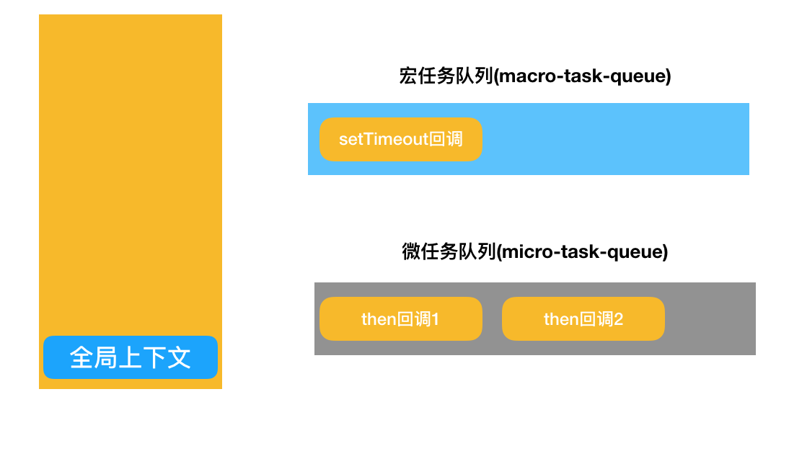
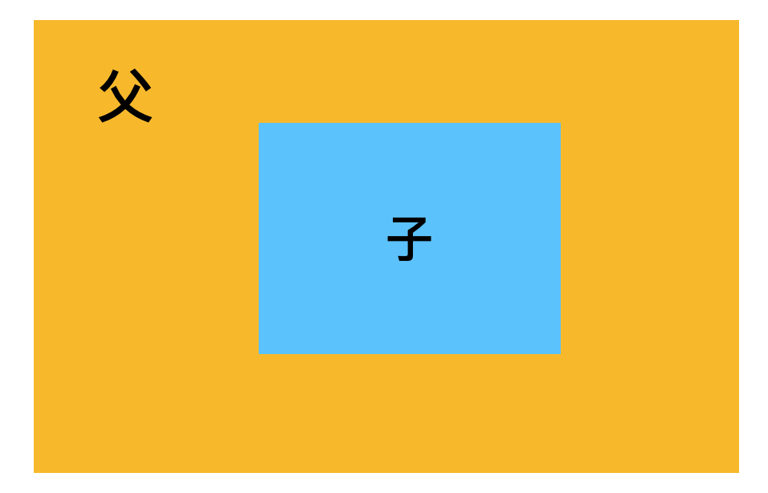
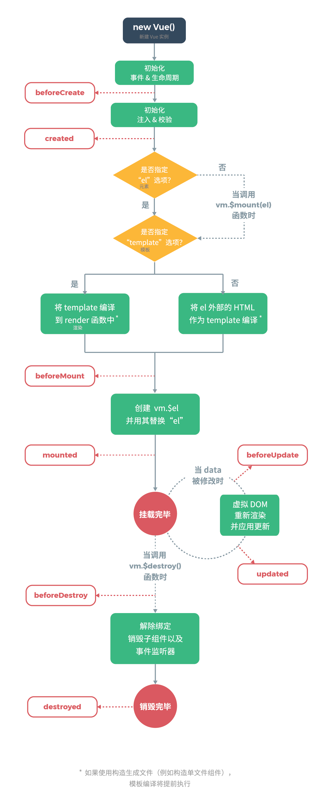

## 闭包

#### 理解作用域

`var name = 'hahaha'`

- var name -- 编译时处理

  > 编译阶段： 这时登场的是一个叫 **编译器** 的家伙。编译器会找遍当前作用域，看看是不是已经有一个叫 name 的家伙了。如果有，那么就忽略 var name 这个声明，继续编译下去；如果没有，则在当前作用域里新增一个 name。然后，编译器会为引擎生成运行时所需要的代码，程序就进入了执行阶段

- name = 'hahaha' -- 运行时处理

  > 执行阶段： 这时登场的就是 **JS 引擎** 了。JS 引擎在执行代码的时候，仍然会找遍当前作用域，看看是不是有一个叫 name 的家伙。如果能找到，那么万事大吉，我来给你赋值。如果找不到，它也不会灰心，它会从当前作用域里 “探出头去”，看看 “外面” 有没有，或者 “外面的外面” 有没有。如果最终仍然找不到 name 变量，引擎就会抛出一个异常

#### 作用域链

- 全局作用域
- 函数作用域（局部作用域）
- 块作用域（局部作用域）

```javascript
function add(a) {
  console.log(a + b);
  console.log(c); // 报错
}

var b = 1;

add(2); // 3
```


在函数add里访问变量b，发现找不到，于是js引擎去上层作用域找到了b，拿来使用；没找到c并且全局之外没有别的作用域，于是报错。

```javascript
function addABC() {
  var a = 1, b = 2;

  function add() {
    return a + b + c;
  }
  return add;
}

var c = 3;

const globalAdd = addABC();

console.log(globalAdd()); // 6

```


对于函数add，它嵌套在addABC内部，用到变量a,b,c时，需要去上层作用域中获取。

像a,b,c这种在函数中被使用，但它既不是函数参数也不是函数的局部变量，而是一个不属于当前作用域的变量，此时它相对于当前作用域来说是一个自由变量；而像add这样引用了自由变量的函数，被称作闭包。

#### 词法作用域和动态作用域

**JS 的作用域遵循的就是词法作用域模型**

词法作用域模型是指在书写的过程中，根据书写的位置来决定划分作用域的方式。

动态作用域模型则会遵循沿着函数调用栈的方式来寻求变量的方式。

因此，词法作用域和动态作用域的区别主要在作用域划分的时机：

- 词法作用域在代码定义的时候完成划分，作用域链沿着定义的位置向外延伸
- 动态作用域在代码运行的时候完成划分，作用域链沿着调用栈向外延伸

#### 循环体和闭包系列真题

------

```javascript
for (var i = 0; i < 5; i++) {
  setTimeout(function () {
    console.log(i);
  }, 1000);
}

console.log(i);
// 5 0 1 2 3 4
```

正确输出：`5 5 5 5 5`

因为setTimeout函数将for循环中的打印操作延后了，因此for循环外的console会最先被执行，打印出第一个5；一秒后，setTimeout中的函数开始执行，因为function中没有定义自己的变量，因此会根据闭包的作用域链去全局中取变量i，此时i的值以及变成5了，这样的操作循环了四次，因此又打印了四个5。


要想打印出`5 0 1 2 3 4`的结果，我们可以通过下面三个方法去改造上述函数：

1. 将每一轮循环里i的值，传入setTimeout函数

   ```javascript
   for (var i = 0; i < 5; i++) {
     setTimeout(
       function () {
         console.log(i);
       },
       1000,
       i
     );
   }
   
   console.log(i);
   ```

2. 在setTimeout函数外嵌套函数，缓存并通过入参来告诉每个循环i的值

   ```javascript
   var output = function (i) {
     setTimeout(function () {
       console.log(i);
     }, 1000);
   };
   
   for (var i = 0; i < 5; i++) {
     // 这里的 i 被赋值给了 output 作用域内的变量 i
     output(i);
   }
   
   console.log(i);
   ```

3. 同样是在 setTimeout 外面再套一层函数，只不过这个函数是一个**立即执行函数**。

   ```javascript
   for (var i = 0; i < 5; i++) {
     // 这里的 i 被赋值给了立即执行函数作用域内的变量 j
     (function (j) {
       setTimeout(function () {
         console.log(j);
       }, 1000);
     })(i);
   }
   ```

------

```javascript
function test (){
    var num = []
    var i

    for (i = 0; i < 10; i++) {
        num[i] = function () {
            console.log(i)
        }
    }

    return num[9]
}

test()()
// output: 10 对于num数组来说，0-9每一项都是一个函数，他们的函数内部都没有定义属于自己的变量，因此打印函数被调用的时候会去访问获取全局作用域中的i的值，因此num的每一项打印出来的数据都是全局i的值10
```

------

```javascript
var test = (function() {
    var num = 0
    return () => {
        return num++
    }
}())

for (var i = 0; i < 10; i++) {
    test()
}

console.log(test())
// output: 10 test是一个立即执行函数，封装了变量num，箭头函数为闭包，没定义变量，因此每次函数被调用都是去修改test函数中的num的值，for循环结束后，num的值是9，console语句再次调用test函数，return的值为9++ -> 10
```

------

```javascript
var a = 1;
function test(){
    a = 2; // 声明var被提前 var a=2
    return function(){
        console.log(a);
    }
    var a = 3; // 变量提升
}
test()();
// 2
```


------

```javascript
function foo(a,b){
  console.log(b);
  return {
    foo:function(c){
      return foo(c,a);
    }
  }
}
 
var func1=foo(0);
func1.foo(1);
func1.foo(2);
func1.foo(3);
var func2=foo(0).foo(1).foo(2).foo(3);
var func3=foo(0).foo(1);
func3.foo(2);
func3.foo(3);
```

## js内存管理机制

#### js内存生命周期

js语言向用户隐藏了内存管理的相关方法，自己默默完成了所有的管理动作。

js的内存生命周期分为三个阶段：分配内存-内存读写-内存释放

js中的数据类型分为基本类型和引用类型；基本类型包括string,number,boolean…他们的特征是大小固定、体积轻量、相对简单，被放在js的栈内存中；引用类型包括object,array,function等，他们比较复杂、占用空间大、大小不定，他们被放在js的堆内存中。

访问基本数据类型的变量时，从栈中直接获取该变量的值；而访问引用类型的变量，需要先从栈中获取变量对应对象的引用（即它在堆内存中的地址），然后用获取到的地址去堆内存查询才能拿到数据内容。

#### 垃圾回收机制

1. 引用计数法（弃用）

   每当一个变量指向一个值，就创建了一次这个值得引用，一段时间后，js会对所有值进行巡检，引用标记为0的值内存会被清除。

   但引用计数法无法甄别循环引用场景下的垃圾，长此以往就会造成内存泄漏。

2. 标记清除法

   一个变量被机制判断是否清除的标准是它是否可抵达。

## this指向原则

多数情况下，this指向调用方法的对象。

```javascript
// 声明位置
var me = {
  name: 'xiuyan',
  hello: function() {
    console.log(`你好，我是${this.name}`)
  }
}

var you = {
  name: 'xiaoming',
  hello: me.hello
}

// 调用位置
me.hello() // xiuyan
you.hello() // xiaoming
```

```javascript
// 声明位置
var me = {
  name: 'xiuyan',
  hello: function() {
    console.log(`你好，我是${this.name}`)
  }
}

var name = 'BigBear'
var hello = me.hello

// 调用位置
me.hello() // xiuyan
hello() // BigBear
```

```javascript
// 声明位置
var me = {
  name: 'xiuyan',
  hello: function() {
    console.log(`你好，我是${this.name}`)
  }
}

var you = {
  name: 'xiaoming',
  hello: function() {
    var targetFunc = me.hello
    targetFunc()
  }
}

var name = 'BigBear'

// 调用位置
you.hello() // BigBear

// targetFunc虽然声明在you函数中，但在调用时，并未给任何对象的前缀，因此此时的targetFun是挂在在全局作用域的，you对象的this并没有被传递给函数
```

**不管方法被书写在哪个位置，它的 this 只会跟着它的调用方走**

#### 特殊情景下的this

在三种特殊情况下，this指向window：

1. 立即执行函数
2. setTimeout中传入的函数
3. setInterval传入的函数

```javascript
var name = 'BigBear'

var me = {
  name: 'xiuyan',
  // 声明位置
  sayHello: function() {
    console.log(`你好，我是${this.name}`)
  },
  hello: function() {
    (function(cb) {
      // 调用位置
      cb()
    })(this.sayHello)
  }
}

me.hello() // BigBear
```

#### 箭头函数

箭头函数中的this只认“词法作用域”，因此箭头函数中this的指向和调用方式无关，由书写的位置决定。

```javascript
var name = 'BigBear'
var me = {
  name: 'xiuyan',
  // 声明位置
  hello: () => {
      console.log(this.name)
  }
}

// 调用位置
me.hello() // BigBear
```

练习

```javascript
var a = 1
var obj = {
  a: 2,
  func2: () => {
    console.log(this.a)
  },
  
  func3: function() {
    console.log(this.a)
  }
}

// func1
var func1  = () => {
  console.log(this.a)
}

// func2
var func2 = obj.func2
// func3
var func3 = obj.func3

func1() // 1
func2() // 1
func3() // 1
obj.func2() // 1
obj.func3() // 2
```

#### 改变this指向的方式

##### - 改变书写代码的方式

箭头函数（根据声明位置决定this的指向）

```javascript
var a = 1

var obj = {
  a: 2,
  // 声明位置
  showA: () => {
      console.log(this.a)
  }
}

// 调用位置
obj.showA() // 1
```

构造函数（构造函数里的this会绑定到new出来的对象上）

```javascript
function Person(name) {
  this.name = name
  console.log(this)
}

var person = new Person('xiuyan')
Person{ name : "xiuyan" }
```

##### - 显示调用方法帮忙

call、apply和bind的作用和区别？


```javascript
var me = {
  name: 'xiuyan'
}

function showName() {
  console.log(this.name)
}

showName.call(me) // xiuyan
```

- call是可以被所有函数继承的，应该定义在Function.prototype上
- call方法先改变了this的指向，将this绑定到第一个参数指定的对象上；再根据输入的参数执行函数

## 执行上下文与调用栈

- 为什么要有执行上下文

  分治是代码书写过程中很重要的一个思想，即细分文件、模块、方法的书写方式。

  我们可以把执行上下文理解为引擎在执行过程中对代码进行了又一次划分，从而降低复杂度。

- 执行上下文的分类

  1.全局上下文

  2.函数上下文

- 上下文的生命周期

  1.创建阶段 - 初始阶段，代码未执行，只是做了准备工作

  2.执行阶段 - 逐行执行脚本中的代码
  
- 调用栈

  在js代码执行过程中，引擎会创建执行上下文栈，也叫调用栈，函数上下文的创建和销毁过程，对应着入栈和出栈的操作。

## 原型编程范式与面向对象

在JavaScript中，每个构造函数都有一个prototype属性，它指向构造函数的原型对象，这个原型对象中有一个construtor属性指回构造函数；每个实例有一个\_proto\_属性，当我们使用构造函数去创建实例时，实例的\_proto\_属性就会指向构造函数的原型对象。

```javascript
// 创建一个Dog构造函数
function Dog(name, age) {
  this.name = name
  this.age = age
}
Dog.prototype.eat = function() {
  console.log(this.name,this.age,'肉骨头真好吃')
}
// 使用Dog构造函数创建dog实例
const dog = new Dog('旺财', 3)

// someFunc.__proto__ === Function.prototype;
// Function.prototype.__proto__ === Object.prototype;
```


#### 真题

```javascript
var A = function() {};
A.prototype.n = 1;
var b = new A();
A.prototype = {
  n: 2,
  m: 3
}
var c = new A();

console.log(b.n);
console.log(b.m);

console.log(c.n);
console.log(c.m);

// 1
// undefined
// 2
// 3
```

b和A的原型关系：


c和A的原型关系：


**为什么b和c继承自同一个原型对象，却有不同的表现呢？**

new一个实例对象的时候发生了什么事：为新对象开辟一块新的内存  => 把函数体内的this指向开辟的内存空间 => 将新对象的\_proto_属性指向对对应构造函数的prototype属性，把实例和原型对象关联 => 执行函数体内的逻辑并return新对象

因此，在第二步执行完后，b的原型就把A的prototype的引用储存下来了。

而在修改A的prototype时，只是重新赋值，使得A的prototype指向一个全新的对象。


因此b指向旧的引用，c指向新的引用，最终造成了不一样的输出结果。

------

```javascript
function A() {
    this.name = 'a'
    this.color = ['green', 'yellow']
 }
 function B() {
   
 }
 B.prototype = new A()
 var b1 = new B()
 var b2 = new B()
 
 b1.name = 'change'
 b1.color.push('black')

console.log(b2.name) // 'a'
console.log(b2.color) // ["green", "yellow", "black"]
```

原型链图：


在写操作的过程中，如果发现name属性在b1上没有，会原地为b1创建新属性而不会沿着原型链向上寻找定位；但对于读操作来说，如果在当前对象的属性中没有发现对应的值，则会顺着原型链逆流而上寻找已经存在的值。

```b1.color.push('black')```这样的写法没有改变对象的引用，而是在原有对象的基础上修改了内容，因此走的是原型链**查询+修改**的操作。

如果想要单纯执行写操作，应该```b1.color=["green", "yellow", "black"]```

------

```javascript
function A() {}
function B(a) {
    this.a = a;
}
function C(a) {
    if (a) {
        this.a = a;
    }
}
A.prototype.a = 1;
B.prototype.a = 1;
C.prototype.a = 1;

console.log(new A().a); // 1
console.log(new B().a); // undefined
console.log(new C().a); // 1
console.log(new C(2).a); // 2
```

原型链图：


当我们去new对象的实例时，会先开辟空间，this指向空间，将实例的\_prop_属性指向构造函数的prototype，执行函数体并return实例。

对于实例a来说，执行了空函数体后的a中没有找到变量a，因此沿着\_prop_找到A的prototype中的a=1；

对于实例b来说，构造函数会无条件为实例创建一个自有属性a，并将a赋值为入参，入参为undefined，所以a=undefined；

对于实例c，如果入参不为false，则自有属性a的值为入参的值，若传入的值为false，则不会为实例创建自有属性，沿着\_proto_找到原型链中的值输出为a=1

## 异步专题

#### JS中的同步和异步

JS 语言的任务执行模式就分为同步和异步。

同步，就是说后一个任务必须严格等待前一个任务执行完再执行，任务的执行顺序和排列顺序是高度一致的（上一个人取到炸鸡之前，下一个人不许点餐）；异步，则恰恰相反，任务的执行顺序不必遵循排列顺序。

异步进化史：回调函数 => Promise => Generator => async/await

#### 回调函数

回调函数时期是Promise出现前的一个阶段，这个阶段中除了回调函数，还有事件监听和发布订阅等方式。

```javascript
document.getElementById('#myDiv').addEventListener('click', function (e) {
  console.log('我被点击了')
}, false);
```

```javascript
function consoleTrigger() {
    console.log('trigger事件被触发')
}
jQuery.subscribe('trigger',consoleTrigger);

function publishTrigger() {
    jQuery.publish('trigger');
}

// 2s后，publishTrigger方法执行，trigger信号发布，consoleTrigger就会执行了
setTimeout(publishTrigger, 2000)
```

```javascript
const https = require('https');
 
// 发起网络请求
https.get('目标接口', (res) => {
  console.log(data)
 
}).on("error", (err) => {
  console.log("Error: " + err.message);
});
```

#### Promise

```javascript
new Promise(function(resolve,reject){
    https.get(url, (res) => {
      resolve(data);
    }).on("error", (err) => {
      reject(error);
    });
  })
```

Promise会接收一个执行器，在Promise实例创建后，执行器里的逻辑会立刻执行，在执行的过程中根据异步返回的结果，决定用resolve或者reject来改变Promise实例的状态。

Promise实例有三种状态：

- pending 进行中，Promise实例创建后的初始态
- fullfilled 成功完成，在执行器中调用resolve后达成的状态
- rejected 操作失败，在执行器中调用reject后达成的状态

#### Async/Await

首先，我们用async关键字声明一个函数为异步函数；然后就可以在函数内部使用await关键字了；声明了await关键字的任务会暂停函数的整个进程，直到异步任务的结果返回之后，函数才会被唤醒，继续执行后面的语句。

Promise的错误需要通过回调函数去捕获，但async和await允许使用try-catch来捕捉。

#### **Promise 命题思路全解析**

- **Promise特性类问题**

  > 问：说说你理解的promise
  >
  > 答：Promise对象是一个代理对象，它接受你传入的执行器作为入参，允许你把异步任务的成功和失败分别绑定到对应的处理方法上。一个Promise实例有三种状态。Promise实例的状态可以改变且只可以改变一次。当 Promise 的状态为 resolved 时，会触发其对应的 then 方法入参里的 onfulfilled 函数；当 Promise 的状态为 rejected 时，会触发其对应的 then 方法入参里的 onrejected 函数。

  > 问：Promise的出现是为了解决什么问题？
  >
  > 答：更加简洁地处理异步任务，优化了多层回调函数循环调用的代码。

  > 问：Promise的常见方法有哪些？各自是干什么的？
  >
  > 答：1.all方法，该方法返回一个新的promise对象，改promise对象在iterable参数对象里的所有promise对象都成功地时候才会触发成功，如果有任何一个对象失败则立刻触发新promise对象的失败。
  >
  > 2.race方法，当iterable参数里的任何一个子promise被成功或失败后，父promise马上也会用子promise的成功返回值或失败详情作为参数调用父promise绑定的相应函数，并返回该promise对象。
  >
  > 3.reject方法，返回一个状态失败的promise对象，并将给定的失败信息传递给相应的处理方法
  >
  > 4.resolve方法，返回一个promise对象，对象的状态由传入的value决定：如果传入的是thenable对象，返回的promise对象的最终状态由then方法执行决定；否则返回的promise对象状态为fulfilled，同时value会作为then方法中指定的onfulfilled的入参

- **看代码说答案类问题**

  ```javascript
  const promise = new Promise((resolve, reject) => {
      console.log(1);
      resolve();
      console.log(2);
  });
  
  promise.then(() => {
      console.log(3);
  });
  
  console.log(4);
  
  // 1
  // 2
  // 4
  // 3
  ```

  ```javascript
  const promise = new Promise((resolve, reject) => {
    resolve('第 1 次 resolve')
    console.log('resolve后的普通逻辑')
    reject('error')
    resolve('第 2 次 resolve')
  })
   
  promise
  .then((res) => {
    console.log('then: ', res)
  })
  .catch((err) => {
    console.log('catch: ', err)
  })
  
  // resolve后的普通逻辑
  // then: 第 1 次 resolve
  ```

  ```javascript
  Promise.resolve(1)
    .then(Promise.resolve(2))
    .then(3)
    .then()
    .then(console.log)
  
  // 1
  ```

  > **考点点拨：Promise 值穿透问题**
  >
  > **分析**：大家知道，then 方法里允许我们传入两个参数：`onFulfilled`（成功态的处理函数）和 `onRejected`（失败态的处理函数）。
  >
  > 你可以两者都传，也可以只传前者或者后者。但是无论如何，then 方法的入参只能是函数。万一你想塞给它一些乱七八糟的东西，它就会“翻脸不认人”。
  >
  > 具体到我们这个题里，第一个 then 方法中传入的是一个 Promise 对象，then 说：”我不认识“；第二个 then 中传入的是一个数字， then 继续说”我不认识“；第四个干脆啥也没穿，then 说”入参undefined了，拜拜“；直到第五个入参，一个函数被传了进来，then 哭了：”终于等到一个我能处理的！“，于是只有最后一个入参生效了。
  >
  > 在这个过程中，我们最初 resolve 出来那个值，穿越了一个又一个无效的 then 调用，就好像是这些 then 调用都是透明的、不存在的一样，因此这种情形我们也形象地称它是 Promise 的“值穿透”。

- **Promise底层原理考察 - 手写promise**

  **基本轮廓**

  ```javascript
  function MyPromise(executor){
    // value 记录异步任务成功的执行结果
  	this.value = null;
    // status 记录当前状态，初始化是 pending
  	this.status = 'pending';
    // reason 记录异步任务失败的原因
  	this.reason = null;
  	
  	var self = this;
  	
  	function resolve(value){
  		self.value = value;
  		self.status = 'resolved';
  	}
  	
  	function reject(reason){
      self.reason = reason;
      self.status = 'rejected';
    }
    // 把 resolve 和 reject 能力赋予执行器
    executor(resolve,reject);
  }
  ```

  **then方法 **：每一个 promise 实例一定有个 then 方法，因此then 方法应该装在 Promise 构造函数的原型对象上

  ```javascript
  // then方法接受两个入参，可选
  MyPromise.prototype.then = function(onResolved,onRejected){
    // onResolved 和 onRejected必须是函数；如果不是，我们此处用一个透传来兜底
    if(typeof onResolved !== 'function'){
      onResolved = function(x){ return x };
    }
    if(typeof onRejected !== 'function'){
      onRejected = function(y){ return y };
    }
    
    var self = this;
    
    if(self.status === 'resolved'){
      onResolved(self.value);
    }else if(self.status === 'rejected'){
      onRejected(self.reason);
    }
  };
  ```

  **链式调用**

  ```javascript
  function MyPromise(executor){
    // value 记录异步任务成功的执行结果
  	this.value = null;
    // status 记录当前状态，初始化是 pending
  	this.status = 'pending';
    // reason 记录异步任务失败的原因
  	this.reason = null;
  	
    // 缓存两个队列，维护 resolved 和 rejected 各自对应的处理函数
    this.onResolvedQueue = [];
    this.onRejectedQueue = [];
    
  	var self = this;
  	
  	function resolve(value){
      if(self.status !== 'pending'){
        return;
      }
  		self.value = value;
  		self.status = 'resolved';
      setTimeout(()=>{
        self.onResolvedQueue.forEach(resolved => resolved(self.value));
      });
  	}
  	
  	function reject(reason){
      if(self.status !== 'pending'){
        return;
      }
      self.reason = reason;
      self.status = 'rejected';
      setTimeout(function(){
        self.onRejectedQueue.forEach(rejected => rejected(self.reason));
      })
    }
    // 把 resolve 和 reject 能力赋予执行器
    executor(resolve,reject);
  }
  ```

  ```javascript
  // then方法接受两个入参，可选
  MyPromise.prototype.then = function(onResolved,onRejected){
    // onResolved 和 onRejected必须是函数；如果不是，我们此处用一个透传来兜底
    if(typeof onResolved !== 'function'){
      onResolved = function(x){ return x };
    }
    if(typeof onRejected !== 'function'){
      onRejected = function(y){ return y };
    }
    
    var self = this;
    
    if(self.status === 'resolved'){
      onResolved(self.value);
    }else if(self.status === 'rejected'){
      onRejected(self.reason);
    }else if(self.status === 'pending'){
      self.onResolvedQueue.push(onResolved);
      self.onRejectedQueue.push(onRejected);
    }
    
    return this;
};
  ```
  


## 变量提升与暂时性死区

#### 变量提升

ES2015之前，JS引擎用var声明一切变量，不管变量声明写在程序的哪个位置，都会被提升到作用域的顶端。

```javascript
console.log(num) 
var num = 1
// undefined

// 代码相当于
var num;
console.log(num) 
num = 1
```

- 变量提升的原理

  JS引擎在编译阶段会搜索所有的变量声明，并提前然声明生效，剩下的语句则要等到执行阶段才会生效

- let和const不存在变量提升

  let和const声明的变量，声明生效的时机和代码执行时机保持一致。声明提升的机制导致忘记声明的变量无法在开发阶段被明显地察觉，因此为了减少运行时错误，ES6特意将声明前不可用做了强约束。

#### 块作用域

块作用域是伴随ES6而生的概念，一对花括号括起来的代码成为一个代码块，被代码块圈起来的变量集就是块作用域。

```JavaScript
{
  let me = 'xiuyan'
  console.log(me) // 'xiuyan'
}
```

#### let和const

- let关键字

  let和var非常相似，let区别于var的地方在于，let声明的变量会被绑定到块作用域，而var是不感知块作用域的。

  ```javascript
  {
    var me = 'xiuyan'
    console.log(me) // 'xiuyan'
  }
  
  console.log(me) // 'xiuyan' 
  ```

  在代码块中用var定义的变量，在代码块之外也能访问到。

  ```JavaScript
  {
    let me = 'xiuyan'
    console.log(me) // 'xiuyan'
  }
  
  console.log(me) // 报错
  ```

  而当我们用let声明的变量被绑定在代码块里，出了块作用域，就访问不到里面的变量了。

- const关键字

  const和let具有相同的生命周期——用const声明的变量也会绑定到块作用域。

  const声明的变量，**必须在声明的同时被初始化**，否则会报错。

  const声明的变量，**在赋值过后，值也不可以再被修改**，否则会报错。

  要注意该规则在声明引用类型时的差异，引用类型的属性值可以被更改，但不能改变引用的指向。

  ```javascript
  const me = {
    name: 'xiuyan'
  }
  
  me.name = 'Bear'      ✔️
  ```

  ```javascript
  const me = {
    name: 'xiuyan'
  }
  
  me = {
  	name: 'Bear'
  }                      ❌
  ```

#### 暂时性死区

```javascript
var me = 'xiuyan';

{
	me = 'bear';
	let me;
  console.log(me);
}
// 报错
```

ES6中规定：如果区块中存在let和const命令，这个区块对这些命令声明的变量，从一开始就形成了封闭作用域，这段会报错的危险区域叫“暂时性死区”。

```javascript
var me = 'xiuyan';

{
	me = 'bear';
  console.log(me);
}
// bear
```

其实这也就是暂时性死区的本质：当我们进入当前作用域时，let 或者 const 声明的变量已经存在了——它们只是不允许被获取而已。要想获取它们，必须得等到代码执行到声明处。

## ES2015+考点解析

#### 对象与数组的解构

```javascript
const [a,b,c] = [0,1,2]
// a=0 b=1 c=2

const [a,,c] = [0,1,2]
// a=0 c=2
```

```javascript
const stu = {
	name: 'Tim',
  age: 23
}

const {name,age} = stu;
```

提取高度嵌套对象里的属性

```javascript
const school = {
   classes: {
      stu: {
         name: 'Bob',
         age: 24,
      }
   }
}
```

逐层解构

```javascript
const { classes } = school
const { stu } = classes
const { name } = stu

name // 'Bob'
```

```javascript
const {classes: {stu: {name: newName }}} = school

newName // 'Bob'
```

#### “...”的使用

对象中的扩展运算符用于取出参数对象中所有可遍历属性拷贝到当前对象之中

```javascript
const me = { 
  name: 'xiuyan',
  age: 24
}

const meCopy = { ...me } // Object.assign({}, me)

meCopy // {name: "xiuyan", age: 24}
```

数组中的扩展运算可以将一个数组转为用逗号分隔的参数序列

```javascript
console.log(...['haha', 'hehe', 'xixi']) // haha hehe xixi
```

```javascript
function mutiple(x, y) {
  return x*y
}

const arr = [2, 3]
mutiple(...arr) // 6
```

合并两个数组

```javascript
const arr1 = [1, 2, 3, 4]
const arr2 = [5, 6, 7, 8]

const newArray = arr1.concat(arr2)
const newArray = [...arr1,...arr2]
```

rest参数

当扩展运算符被用在函数形参的位置时，还可以吧一个分离的参数序列整合成一个数组

```javascript
function mutiple(...args) {
  let result = 1;
  for (var val of args) {
    result *= val;
  }
  console.log(args); // [1,2,3,4]
  return result;
}

mutiple(1, 2, 3, 4) // 24
```

#### 类数组的转换

定义：它必须是一个对象，它有length属性

```javascript
const book = {
  name: 'how to read a book',
  age: 10,
  length: 300 
} // 这是一个类数组对象
```

类数组对象转换为数组的方法

```javascript
const arrayLike = {0: 'Bob', 1: 'Lucy', 2: 'Daisy', length: 3 }
- Array原型上的slice方法
const arr = Array.prototype.slice.call(arrayLike);
- Array.from方法，ES6新增
const arr = Array.from(arrayLike);
- 扩展运算符
```

#### 模板语法与字符串处理

模板语法让我们拼接字符串变得更加简单易读

```JavaScript
var name = 'xiuyan'   
var career = 'coder' 
var hobby = ['coding', 'writing']

var finalString = `my name is ${name}, I work as a ${career} I love ${hobby[0]} and ${hobby[1]}`
```

模板字符串的关键优势有两个

- 在模板字符串中，空格、缩进、换行都会被保留
- 模板字符串完全支持“运算”式的表达式，可以再${}中进行运算

存在性判定：includes、startsWith、endsWith

- includes：判断字符串与子串的包含关系

  ```javascript
  const son = 'haha';
  const father = 'xixi haha heheh';
  
  father.includes(son) // true
  ```

- startsWith：判断字符串是否是以某个/某串字符开头

  ```javascript
  const father = 'xixi haha heheh';
  
  father.startsWith('xixi'); // true
  father.startsWith('haha'); // false
  ```

- endsWith：判断字符串是否以某个/某串字符结尾

  ```javascript
  const father = 'xixi haha hehe'
  
  father.endsWith('hehe') // true
  father.endsWith('baba') // false  
  ```

自动重复：我们可以使用repeat方法来使同一个字符串输出多次

```JavaScript
const sourceCode = 'repeat for 3 times;'
const repeated = sourceCode.repeat(3) 

console.log(repeated) // repeat for 3 times;repeat for 3 times;repeat for 3 times;
```

## DOM基本功

**什么是DOM？**

> 文档对象模型 (DOM) 是HTML和XML文档的编程接口。它提供了对文档的结构化的表述，并定义了一种方式可以使从程序中对该结构进行访问，从而改变文档的结构，样式和内容。DOM 将文档解析为一个由节点和对象（包含属性和方法的对象）组成的结构集合。简言之，它会将web页面和脚本或程序语言连接起来。

**DOM树的解析**

DOM结构以树的形态存在，在DOM中每个元素都是一个节点，节点的类型有多种：

- Document：就是指这份文件，也就是这份 HTML 档的开端。当浏览器载入 HTML 文档, 它就会成为 Document 对象。
- Element：就是指 HTML 文件内的各个标签，像是`<div>、<span>`这样的各种 HTML 标签定义的元素都属于 Element 类型。
- Text：Text 就是指被各个标签包起来的文字```<span>哈哈哈</span>```这里的哈哈哈被标签包了起来，它就是这个Element的Text
- Attribute：表示元素的特性。从技术角度讲，这里的特性就是说各个标签里的属性。

**解析DOM树**

```javascript
<html>
  <head>
    <title>DEMO</title>
  </head>
  <body>
    <h1 class="title">我是标题</h1>
  </body>
</html>
```


**DOM节点间关系**

在树状结构的DOM里，节点间关系可以划分为以下两类：

- 父子节点：表示节点间的嵌套关系
- 兄弟节点：表示节点层级的平行关系，兄弟节点共享一个父节点

**常考的DOM API**

- DOM节点的获取

  ```
  - getElementById // 按照 id 查询
  - getElementsByTagName // 按照标签名查询
  - getElementsByClassName // 按照类名查询
  - querySelectorAll // 按照 css 选择器查询
  ```

  ```javascript
  // 按照 id 查询
  var imooc = document.getElementById('imooc')
  
  // 按照标签名查询
  var p = getElementsByTagName('p')
  
  // 按照类名查询
  var mooc = getElementsByClassName('mooc')
  
  // 按照 css 选择器查询
  var css = querySelectorAll('.mooc')
  ```

- DOM节点的创建

  ```javascript
  <html>
    <head>
      <title>DEMO</title>
    </head>
    <body>
      <div id="container"> 
        <h1 id="title">我是标题</h1>
      </div>   
    </body>
  </html>
  ```

  添加一个有内容的 span 节点到 id 为 title 的节点后面

  ```javascript
  var father = document.getElementById('container')
  
  var new = document.createElement('span')
  new.innerHTML = 'hello world'
  
  father.appendChild(new)
  ```

- DOM节点的删除

  ```javascript
  <html>
    <head>
      <title>DEMO</title>
    </head>
    <body>
      <div id="container"> 
        <h1 id="title">我是标题</h1>
      </div>   
    </body>
  </html>
  ```

  删除id为title的节点

  ```javascript
  // 获取目标元素的父元素
  var father = document.getElementById('container')
  // 获取目标元素
  var son = document.getElementById('title')
  // var son = container.childNodes[1]
  
  father.removeChild(son)
  ```

- 修改DOM元素

  ```JavaScript
  <html>
    <head>
      <title>DEMO</title>
    </head>
    <body>
      <div id="container"> 
        <h1 id="title">我是标题</h1>
        <p id="content">我是内容</p>
      </div>   
    </body>
  </html>
  ```

  交换id为title和content的元素的位置

  ```JavaScript
  // 获取目标元素的父元素
  var father = document.getElementById('container')
  // 获取目标元素
  var son = document.getElementById('title')
  
  father.removeChild(son)
  father.appendChild(son)
  ```

  ```javascript
  var father = document.getElementById('container')
  
  var son = document.getElementById('title')
  var son2 = document.getElementById('content')
  
  father.insertBefore(son2,son)
  ```

- DOM元素属性的获取和修改

  获取并修改 title 元素的 id 名

  ```javascript
  var target = document.getElementById('title')
  
  // 获取 id 属性
  var titleId = target.getAttribute('id')
  
  // 修改 id 属性
  target.setAttribute('id',newValue)
  ```

- 《JavaScript——DOM编程艺术》

## DOM事件体系

#### DOM事件流

- 事件流：描述的是事件在页面中传播的顺序
- 事件：描述的是发生在浏览器里的动作，这个动作可以是用户触发的，也可以是浏览器触发的
- 事件监听函数：事件发生后，浏览器如何响应——用来应答事件的函数，就是事件监听函数，也叫事件处理程序

**一个事件的旅行**

W3C标准约定了一个事件的传播过程要经过以下三个阶段：

1. 事件捕获阶段
2. 目标阶段
3. 事件冒泡阶段


当事件在DOM元素中穿梭时，所到之处都会触发当前元素上安装的时间处理函数。当DOM接受了一个事件、对应的事件处理函数被触发时，就会产生一个事件对象event作为处理函数的入参，这个对象中囊括了与事件有关的信息，比如事件具体是有哪个元素所触发、事件的类型等等。

```javascript
<!DOCTYPE html>
<html lang="en">
<head>
  <meta charset="UTF-8">
  <meta name="viewport" content="width=device-width, initial-scale=1.0">
  <meta http-equiv="X-UA-Compatible" content="ie=edge">
  <title>Document</title>
</head>
<body>
  <div class="outer">
    <button id="button">点击我</button>
  </div>
</body>
</html>
```

```javascript
const button = document.getElementById('button')
button.addEventListener('click', clickProcessor)

function clickProcessor(event) {
  console.log(event)
}
```


#### 事件对象考点梳理

- currentTarget

  它记录了事件当下正在被哪个元素接收，这个元素是一直在改变的，因为事件的传播是层层穿梭的过程。

  如果事件处理程序绑定的元素，与具体的触发元素是一样的，那么函数中的this、event.currentTarget和event.target三个值是相同的，我们可以以此判断当前的元素是否是目标元素。

- target

  触发事件的具体目标，是事件的真正来源。就算事件处理程序没有绑定在目标元素上，而是绑定在目标元素的父元素上，只要它是由内部的目标元素冒泡到父容器上触发的，那么我们仍然可以通过target来感知到目标元素。

- preventDefault

  这个方法用于阻止特定事件的默认行为

- stopPropagation

  阻止冒泡，这个方法用于终止事件在传播过程中的捕获、目标处理或起泡阶段进一步传播。调用该方法后，该节点上处理该事件的处理程序将被调用，事件不再被分派到其他节点。

#### 自定义事件

对于三个同级的div元素A、B、C，如何实现在点击A之后，B和C都能感应到A被点击了，并作出相应的行为？

```javascript
<!DOCTYPE html>
<html lang="en">
<body>
  <div id="divA">我是A</div>
  <div id="divB">我是B</div>
  <div id="divC">我是C</div>
</body>
</html>
```

经典解法就是自定义事件，创建一个“A被点击”的事件，并由B和C来监听这个事件执行对应的处理函数。

 *事件对象可以手动创建```event = new Event(typeArg, eventInit);```*

因此点击A的事件创建为```var clickAEvent = new Event('clickA');```

接下来完成事件的监听和派发

```javascript
// 获取 divB 元素 
var divB = document.getElementById('divB');
// divB 监听 clickA 事件
document.addEventListener('clickA',function(e){
	console.log('我是小B，我感觉到了小A')
  console.log(e.target)
})

var divC = document.getElementById('divC');
document.addEventListener('clickA',function(e){
	console.log('我是小C，我感觉到了小A')
  console.log(e.target)
})

divA.addEventListener('click',function(){
  console.log('我是小A')
  // 注意这里 dispatch 这个动作，就是我们自己派发事件了
  divB.dispatchEvent(clickAEvent)
  divC.dispatchEvent(clickAEvent)
})
```

#### 事件代理

在如下的 HTML 里，我希望做到点击每一个 li 元素，都能输出它内在的文本内容。你会怎么做？

```JavaScript
<!DOCTYPE html>
<html lang="en">
<head>
  <meta charset="UTF-8">
  <meta name="viewport" content="width=device-width, initial-scale=1.0">
  <meta http-equiv="X-UA-Compatible" content="ie=edge">
  <title>Document</title>
</head>
<body>
  <ul id="poem">
    <li>鹅鹅鹅</li>
    <li>曲项向天歌</li>
    <li>白毛浮绿水</li>
    <li>红掌拨清波</li>
    <li>锄禾日当午</li>
    <li>汗滴禾下土</li>
    <li>谁知盘中餐</li>
    <li>粒粒皆辛苦</li>
    <li>背不动了</li>
    <li>我背不动了</li>
  </ul>
</body>
</html>
```

本题目有三个特征——事件代理

- 要你安装监听某一个事件的监听函数（事件相同）
- 监听函数是被安装在一系列具有相同特征的元素上（元素特征相同，一般来说就是具备同样的父元素）
- 这一系列相同特征元素上的监听函数还干的都是一样的事儿（监听逻辑相同/雷同）

因为点击任何一个li，事件都会冒泡到共同的父元素ul上去，因此我们可以让ul来监听点击事件，并拿到实际触发事件的元素。

```javascript
var ul = document.getElementById('poem');
ul.addEventListener('click',function(e){
  console.log(e.target.innerHTML)
})
```

像这样利用事件的冒泡特性，把多个子元素的同一类型的监听逻辑，合并到父元素上通过一个监听函数来管理的行为，就是事件代理。通过事件代理，我们可以减少内存开销、简化注册步骤，大大提高开发效率。

## 事件的防抖与节流

需要关注那些容易过度触发的事件，比如scroll事件、resize事件、鼠标事件、键盘事件都存在被频繁触发的风险。

频繁触发回调导致的大量计算会引发页面的抖动甚至卡顿，为了规避这种情况，我们需要手段来控制事件被处罚的频率，throttle（事件节流）和debounce（事件防抖）就出现了。他们都以闭包的形式存在：他们通过对事件对应的回调函数进行包裹、以自由变量的形式缓存时间信息，最后用setTimeout来控制事件的触发频率。

#### Throttle

throttle的中心思想是在某段时间内，不管触发了多少次回调，都只认第一次，并在计时结束后给予响应。

所谓的节流，就是通过在一段时间内**无视后来产生的回调请求**来实现的。在实际交互中，每当用户触发了一次scroll事件，我们就开启计时器，一段时间内，后续所有scroll事件都无法触发新的scroll回调，直到计时器结束，第一次触发的scroll事件对应的回调才会执行，而这段时间内触发的后续scroll回调都会被节流阀无视。

```javascript
// fn是回调函数，interval是计时器的时间间隔
function throttle(fn, interval){
  // last为上一次触发回调的时间
	let last = 0;
	
  // 将throttle处理结果当作函数返回
	return function(){
    // 保留调用时的this上下文
		let context = this;
    // 保留调用时传入的参数
		let args = arguments;
    // 记录本次触发回调的时间
		let now = + new Date();
		
    // 判断上次触发的时间和本次触发的时间差是否小于时间间隔的阈值
		if(now - last >= interval){
      // 如果时间间隔大于我们设定的时间间隔阈值，则执行回调
			last = now;
			fn.apply(context,args);
		}
	}
}

const better_scroll = throttle(() => console.log('触发了滚动事件'),1000);
document.addEventListener('scroll', better_scroll)
```

#### Debounce

防抖的中心思想是在某段时间内，不管触发了多少次回调，都只认最后一次。

在实际交互中，每一次用户触发事件之后，都会重新开启计时器，直到某次计时器从开始到结束的时间内，都没有新的事件被触发，事件对应的回调才会被执行。

```javascript
function debounce(fun,delay){
  // 定时器
  let timer = null
  
  return function(){
    // 保留调用时的this上下文
		let context = this;
    // 保留调用时传入的参数
		let args = arguments;
    // 每次事件被触发时，都去清除之前的旧定时器
    if(timer){
      clearTimeout(tmier)
    }
    // 设立新定时器
    time = setTimeout(function(){
      fun.apply(context,args);
    },delay)
  }
}

// 用debounce来包装scroll的回调
const better_scroll = debounce(() => console.log('触发了滚动事件'), 1000)
document.addEventListener('scroll', better_scroll)// 定时器
```

## 浏览器渲染原理剖析

#### 概念与预备知识

浏览器的零件


浏览器内核：

- Trident（IE）
- Gecko（火狐）
- Blink（Chrome，Opera）
- **Webkit（Safari）**

浏览器渲染引擎工作原理


1. HTML解析：浏览器对HTML文档进行解析，并在解析HTML的过程中发出了页面渲染所需的各种外部资源请求
2. CSS解析：浏览器将识别并加载所有的CSS样式信息
3. 样式与结构合并：将样式信息和文档结构合并，最终生成页面render树（:after和:before这样的伪元素会在这个环节被构建到DOM树中）
4. 布局阶段：页面中所有元素的相对位置信息、大小信息等均在这一步得到计算
5. 页面绘制：浏览器会根据前面处理出来的结果，把每一个页面图层转换为像素，并对所有的媒体文件进行解码。

这五个阶段分别对应了以下五种产物：

- DOM树
- CSSOM树
- 渲染树
- 盒模型
- 目标界面

实例理解

```javascript
<!DOCTYPE html>
<html lang="en">
<head>
  <meta charset="UTF-8">
  <meta name="viewport" content="width=device-width, initial-scale=1.0">
  <meta http-equiv="X-UA-Compatible" content="ie=edge">
  <title>前端面试体系专栏</title>
  <style>
    body {
      font-size: 20px；
    }
    div {
      width: 100px;
      height: 100px;
    }
    span {
      color: #000;
    }
    p {
      display: none
    }
  </style>
</head>
<body>
  <div class="box1">
    <span>我在盒子1号里</span>
  </div>
  <div class="box2">
    <span>我在盒子2号里</span>
  </div>
  <p>你看不见我</p>
</body>
</html>
```


当DOM树和CSSOM树都解析完毕后，他们会被结合构建出渲染树。值得注意的是，渲染树只包含渲染网页所需的节点，因此在结合的过程中，浏览器还会做一些额外的操作。

- 从DOM树的根节点开始遍历，筛选出所有可见的节点
- 仅针对可见节点，为其匹配CSSOM中的CSS规则
- 发射可见节点（连同内容和样式）


接下来，浏览器会对渲染树进行遍历，将元素间嵌套关系以盒子模型的形式写入文档流。


盒模型在布局过程中会计算出元素确切的大小和定位，相应的信息被写回渲染树上就形成了布局渲染树。

布局阶段结束后，浏览器会将渲染树上的每一个节点转换为肉眼可见的像素，最终呈现在我们面前。


#### 难点深入挖掘——重绘与重排

**重排**

当我们的操作引发了DOM几何尺寸的变化（比如修改元素的宽、高或隐藏元素）时，浏览器需要重新计算元素的几何属性，然后再将计算结果绘制出来，这个过程叫做重排（也叫回流）。


还有些操作会触发重排：比如改变DOM树的结构（节点的增减、移动等）；获取一些特定属性的值（offsetTop,offsetLeft,offsetWidth,offsetHeight,scrollTop,scrollLeft,srcollWidth/scrollHeight/clientTop,clientLeft,CliengWidth,cliengHeight）

**重绘**

当我们对DOM的修改导致了样式的变化，却没有影响到他的几何属性，浏览器不需要重新计算元素的几何属性，直接为该元素绘制新的样式，这个过程叫做重绘。


## 事件循环专题

#### 浏览器中的event-loop机制

```javascript
console.log(1)

setTimeout(function() {
  console.log(2)
})

new Promise(function (resolve) {
  console.log(3)
  resolve()
 }).then(function () {
  console.log(4)
}).then(function() {
  console.log(5)
})

console.log(6)

// 1 3 6 4 5 2
```

**关键角色——函数调用栈、宏任务队列、微任务队列**

函数调用栈：当引擎遇到需要执行的代码时，会产生一个全局执行上下文并将它压入调用栈，JS引擎会执行栈顶的函数，并将上下文弹出栈。函数调用栈是干活的地方，它负责真刀实枪地执行任务。

对于单线程的JS来说，异步任务（如setTimeout中的函数和Promise中的函数）在刚刚派发的时候是没有资格进入调用栈的。

因此这些待执行的任务，按照一定的规则排起队列，等待被推入调用栈执行，这个队列就叫做“任务队列”。

宏任务队列（macro-task）

常见的宏任务队列有setTimeout、setInterval、setImmediate、I/O操作


微任务队列（micro-task）

常见的微任务队列有promise、Object.observe


**循环过程**

一个完整的event loop过程可以概括为以下阶段：

1. 执行并出队一个 macro-task。注意如果是初始状态：调用栈空。micro 队列空，macro 队列里有且只有一个 script 脚本（整体代码）。这时首先执行并出队的就是 script 脚本；
2. 全局上下文（script 标签）被推入调用栈，同步代码执行。在执行的过程中，通过对一些接口的调用，可以产生新的 macro-task 与 micro-task，它们会分别被推入各自的任务队列里。**这个过程本质上是队列的 macro-task 的执行和出队的过程**；
3. 上一步我们出队的是一个 macro-task，这一步我们处理的是 micro-task。但需要注意的是：当 macro-task 出队时，任务是**一个一个**执行的；而 micro-task 出队时，任务是**一队一队**执行的。因此，我们处理 micro 队列这一步，会逐个执行队列中的任务并把它出队，直到队列被清空；

**真题解析**

初始状态，全局上下文被推入调用栈，执行同步任务 ```console.log(1);```

接下来执行到setTimeout，创建了一个宏任务。


然后遇到了Promise函数，函数体中内容直接执行 ```console.log(3);```

此时Promise的状态变为fullfilled，成功将then方法中对应的两个函数依次推入微任务队列。



然后继续进行，输出了6 ```console.log(6);```

接下来，开始执行任务队列中的异步函数，本着**一个 macro，一队micro**的原则，咱们现在需要处理的是微任务队列里的所有任务。

首先按顺序then中注册的第一个函数 ```function(){ console.log(4)}```


然后是第二个函数 ```function(){ console.log(5)}```


微任务队列被清空，之后开始执行宏任务，setTimeout的回调被压入调用栈执行 ```function(){ console.log(2)}```


现在只剩下全局上下文，会伴随标签页的关闭而销毁。

#### 真题解析

> Node 清空微任务队列的手法比较特别。在浏览器中，我们只有一个微任务队列需要接受处理；但在 Node 中，有两类微任务队列：next-tick 队列和其它队列。其中这个 next-tick 队列，专门用来收敛 process.nextTick 派发的异步任务。**在清空队列时，优先清空 next-tick 队列中的任务，随后才会清空其它微任务。**

```javascript
Promise.resolve().then(function() {
  console.log("promise1")
}).then(function() {
  console.log("promise2")
});

process.nextTick(() => {
 console.log('nextTick1')
 process.nextTick(() => {
   console.log('nextTick2')
   process.nextTick(() => {
     console.log('nextTick3')
     process.nextTick(() => {
       console.log('nextTick4')
     })
   })
 })
})

// nextTick1	nextTick2	nextTick3	nextTick4	promise1	promise2
```

**setTimeout和setImmediate**

> setImmediate()方法用于中断长时间运行的操作，并在完成其他操作（如事件和显示更新）后立即运行回调函数

```JavaScript
setTimeout(function() {
    console.log('老铁，我是被 setTimeout 派发的')
}, 0)

setImmediate(function() {
  console.log('老铁，我是被 setImmediate 派发的')
})
```

代码执行的结果不一定。

setTimeout这个函数的第二个入参的取值范围是[1,2^31-1]，对于入参为0的情况会被系统强行理解为1。

也就是说这个回调其实被延迟了1ms，事件循环的初始化所需要的时间是不定的，有可能小于1ms，也有可能大于1ms

- 当初始化时间小于 1ms 时：进入了 timers 阶段，却发现 setTimeout 定时器还没到时间，于是往下走。走到 check 阶段，执行了 setImmediate 回调；在后面的循环周期里，才会执行 setTimeout 回调；
- 当初始化时间大于 1ms 时：进入了 timers 阶段，发现 setTimeout 定时器已经到时间了，直接执行 setTimeout 回调；结束 timers 阶段后，走啊走，走到了 check 阶段，顺理成章地又执行了 setImmediate 回调。

**poll阶段的处理**


在poll阶段处理的回调中，如果既派发了setImmediate又派发了setTimeout那么一定是**先执行 setImmediate，再执行 setTimeout。**

```javascript
const fs = require('fs')
const path = require('path')
const filePath = path.join(__dirname,'test.js')

console.log(filePath)   

// -- 异步读取文件
fs.readFile(filePath,'utf8',function(err,data){
    setTimeout(function() {
      console.log('老铁，我是被 setTimeout 派发的')
    }, 0)

    setImmediate(function() {
      console.log('老铁，我是被 setImmediate 派发的')
    })
});

// tset.js
// 老铁，我是被 setImmediate 派发的
// 老铁，我是被 setTimeout 派发的
```

## React基本功

#### react新旧生命周期

**旧生命周期**

- componentWillMount
- componentDidMount
- componentWillReceiveProps
- shouldComponentUpdate
- componentWillUpdate
- componentDidUpdate
- componentWillUnmount

React生命周期流程从广义上 分为三个阶段：**挂载、更新、卸载**

我们需要考虑四种情况来分析生命周期函数的执行时机：

1. React初始化应用时（挂载阶段）
2. props发生数据更新（更新阶段）
3. state发生数据更新（更新阶段）
4. 卸载应用时（卸载阶段仅涉及componentWillUnmount）

**卸载阶段**

> componentWillUnmount() 会在组件卸载及销毁之前直接调用。在此方法中执行必要的清理操作，例如，清除 timer，取消网络请求或清除在 componentDidMount() 中创建的订阅等。

**初始化**


- getDefaultProps 这个函数会在组件创建之前被调用一次（有且只有一次），它被用来初始化组件的props
- getInitialState 用于初始化组件的state值
- componentWillMount 在组件创造之后、render之前，会走到componentWillMount阶段，React 官方已经不推荐大家在 componentWillMount 里做任何事情、到现在 **React16 直接废弃了这个生命周期**
- render 这是多有生命周期中唯一一个必须要实现的方法，一般来说要返回一个jsx元素，这时React会根据props和state来把组件渲染到界面上；若不想渲染任何东西，返回null或false
- componentDidMount 会在组件挂载后立即调用，标志着组件挂载完成。依赖获取到DOM节点信息的操作，会放在这个阶段来做。此外，这还是官方推荐发起ajax请求的时机，该方法和componentWillMount 一样，有且只有一次调用

**state更新流程**


- shouldComponentUpdate 当组件的state或props发生改变时，都会首先出发这个生命周期函数。它会接受两个参数：nextState和nextProps——它们分别代表新的props和新的state值，拿到这两个值之后，我们就可以通过对比逻辑来判断是否有必要重渲染；如果该函数的返回值为false则生命周期终止，否则继续进行

  > 注意：此方法仅作为性能优化的方式而存在，不要企图依靠此方法来“阻止”渲染，因为这可能会产生 bug。你应该考虑使用内置的 PureComponent 组件，而不是手动编写 shouldComponentUpdate()

- componentWillUpdate 当组件的 state 或 props 发生改变时，会在渲染之前调用 componentWillUpdate。这也是React16废弃的一个生命周期，现在可以用getSnapshotBeforeUpdate来代替它收集必要信息
- componentDidUpdate 会在UI更新后立即调用，接收prevProps作为入参，我们仍然可以进行props值的对比

**props更新流程**


相对于 state 更新，props 更新后唯一的区别是增加了对 componentWillReceiveProps 的调用

- componentWillReceiveProps 它在组件接收到新的props时被触发。componentWillReceiveProps 会接收一个名为 nextProps 的参数。**该生命周期是 React16 废弃掉的三个生命周期之一**，现在我们用一个类似的新生命周期 getDerivedStateFromProps 来代替它。

**新生命周期**


新的生命周期依然可以用挂载、更新、卸载来划分

- getDerivedStateFromProps 在render方法之前调用，他应返回一个对象来更新state，如果返回为null则不更新任何内容。它接收props和state两个入参（对标componentWillReceiveProps方法）；但官方不推荐开发者使用这个方法。
- getSnapshotBeforeUpdate 这个方法会接受prevProps、prevState两个入参；这个生命周期函数一定有返回值，它的返回值会作为第三个参数传递给componentDidUpdate

#### 深入组件通信机制

组件间的关系有三种：

- 父子关系

  

- 兄弟关系

  

- 深层嵌套关系

  

**父组件向子组件通信**

react的数据流是单向的，最常见的操作是通过props由父组件向子组件传递数据。

父组件

```JavaScript
import Child from '子组件的引用路径'   

class Father extends React.Component {
  constructor() {
    super()
    this.state = {
      // 父组件具有“组件标题颜色”信息，需要带给子组件
      titleColor: '#fff'
    }
  }

  changeColor = () => {
      // 点击后，父子组件标题同时变更颜色
      this.setState({
        titleColor: '#000'
      })
  }


  // 渲染
  render() {
    return (
      <div>
        <h1 style={{color: this.state.titleColor}}>我是父标题</h1>
        <button onClick={this.changeColor}>点我变色</button>
        // 子组件中以 props 的形式传入和父组件同步的 titleColor
        <Child titleColor={this.state.titleColor} />
      </div>
    );
  }
}
```

子组件

```javascript
class Child extends React.Component {
  render() {
    const { titleColor } = this.props
    // 此处省略渲染细节
    return ...
  }
}
```

**子组件向父组件通信**

可以通过父组件向子组件传递一个函数形式的props：父组件将作用域为自身的函数传递给子组件，子组件在调用该函数时，把目标数据以函数入参的形式传递给父组件即可。

父组件

```javascript
class Father extends React.Component{
  state = {
    titleColor: '#fff'
  };
  
  // 父组件中存在一个允许自定义标题颜色的方法
  changeColor = (color) => {
    this.setState({
      titleColor
    });
  }

  
  render() {
    return (
      <div>
        <h1 style={{color: this.state.titleColor}}>我是父标题</h1>
        <button onClick={this.changeColor}>点我变色</button>
        // 子组件中以 props 的形式收到父组件中的 changeColor 方法
        <Child changeColor={color => this.state.changeColor(color)} />
      </div>
    );
  }
}
```

子组件

```javascript
class Child extends React.Component{
  componentDidMount() {
    setTimeout(() => {
      // 调用父组件的方法
      this.props.changeColor('#000')
    }, 1000)
  }

  render() {
    // 此处省略渲染细节
    return ...
  }
}
```

**兄弟组件通信**

儿子A无法直接和儿子B通信，需要通过他们共同的父亲来传递信息，A将信息告诉父亲，父亲再传递给儿子B。

这个过程在代码中的实现方式：在父组件中定义一个作用域是自己的方法，以props的形式传给儿子A，同时把函数中涉及修改的state值以props传给儿子B，这样在A中调用函数修改state时，B中的props也会相应地发生改变。

父组件

```javascript
import ChildA from '子组件A';
import ChildB from '子组件B';

class Father extends React.Component {
  state = {
    name: 'cat',
  };

  changeName = n => {
    this.setState({
      name: n,
    });
  };

  render() {
    return (
      <div>
        <h2>我是父亲</h2>
        <ChildA changeName={name => this.state.changeColor(name)} />
        <ChildB name={this.state.name} />
      </div>
    );
  }
}
```

子组件A

```javascript
class ChildA extends React.Component{
	componentDidMount() {
		setTimout(()=>{
			this.props.changeName('cat');
		},1000)
	}
	render() {
		return ...
	}
}
```

子组件B

```javascript
class ChildB extends React.Component {
	render () {
		const { name } = this.props;
		return ...
	}
}
```

**深层嵌套的组件间通信**

在过去，涉及深层嵌套或跨度较大的两个组件间的通信，一般是通过全局事件总线（Event Bus）或者引入redux来解决。

在React16.3版本发布之后，我们可以使用context API来解决这个场景。

**Context API**

> Context 提供了一个无需为每层组件手动添加 props，就能在组件树间进行数据传递的方法。

**context的用法**

我们想把A组件的颜色信息传递给千里之外的E，他们的嵌套关系如下图所示：


（注意源头组件（Provider）会接受一个 value 作为 props，这个值会修改你在创建 Context 时设定的默认值）

```javascript
// 用 React.createContext 可以为当前的 titleColor 创建一个 context（“#fff”为默认值）。
// React.createContext 方法会返回一个带有 Provider 和 Consumer 的对象。
const TitleColorContext = React.createContext('#fff');
class A extends React.Component {
  state = {
    titleColor: '#fff',
  };

  render() {
    return (
      <TitleColorContext value="#000">
        <div>
      		// 省略 B 组件引入逻辑
        </div>
      </TitleColorContext>
    );
  }
}
```

随后我们可以再E组件里去访问这个Context（Consumer表示消费者，它接受一个render props作为唯一的children。render props是一个函数，这个函数会接收到Context传递的数据作为参数，并且需要返回一个组件）

```javascript
class E extends React.Component {
  render() {
    <TitleColorContext.Consumer>
      {titleColor => (
        <h1 style={{ color: titleColor }}>
          我是E标题
        </h1>
      )}
    </TitleColorContext.Consumer>;
  }
}
```

**任意组件间的通信**（Event-Bus）

#### 命题思路点拨

**React组件设计模式**

- 什么是HOC(Higher-Order Component)？适用于什么场景？
- 什么时候应该选择用class实现一个组件，什么时候应该用函数实现一个组件？
- 你喜欢React Stateless组件吗？为什么？

**setState深入**

- 当组件的setState函数被调用之后会发生什么？
- setState可以接受函数为参数吗？有什么作用？

**事件系统**

- React事件机制是怎样的？为什么它要定义一套事件体系？

**React底层原理**

- 为什么我们利用循环产生的组件中要用上key这个特殊的props？
- 什么是Fiber？是为了解决什么问题？


## 虚拟DOM

#### DOM操作演化史

**缘故前端的无奈——“人肉操作”时期**

在最初期，前端页面的展示远强于交互属性，因此JavaScript只用来做一些简单的操作，因此对DOM的操作是有限的。

**数据驱动的先驱——”模板助攻“时期**

前端业务复杂度不断提升，新增了大量DOM修改的需求。这时创造出了”模板“这一解决方案。

模板这种形式的DOM方案其实蕴含了不小的隐患，当想要改变模板中对应的一组数据时，模板会把整个节点注销并重新生产出HTML代码，并渲染出真实的DOM节点。一个小小的改动，DOM操作的范围却被扩大了很多，这将导致很多不必要的损耗。

**现代前端框架的基石——虚拟DOM**

利用模板实现DOM操作的初始化过程如下：


当发生更新时，会执行 注销旧的DOM => 数据+模板=新的HTML代码  => 挂载新的DOM，这里是对整块DOM的整体更新，而我们想要的是定点对只需要修改的DOM做小范围的操作。

因此我们需要拿到操作前后的diff，新的方案按照下图的方式初始化：


当发生更新时，会执行如下的过程：

数据 + 模板 = 虚拟DOM => diff新旧两套虚拟DOM的差异，得到补丁集 => 把补丁打到真实的DOM上

其中虚拟DOM的更改和对比操作都是JS计算实现的，极大地降低了性能消耗。

#### Diff算法

React根据前端界面的特性做了下列假设：

1. 相同的组件有着相同的DOM结构，不同的组件有着不同的DOM结构
2. 位于统一层次的一组子节点，他们之间可以通过唯一的id进行区分
3. DOM结构中，跨层级节点操作非常少，可以忽略不计


在对比中可以进行逐层对比，如果前后两棵树的根节点变化了，那么直接认为这是两个完全不同的组件，不会再往下对比了，而是会直接卸载旧组件、挂载新组件。

**数组动态生成的组件为什么一定要有key？**

> key 是用来帮助 react 识别哪些内容被更改、添加或者删除。key 需要写在用数组渲染出来的元素内部，并且需要赋予其一个**稳定**的值。稳定在这里很重要，因为如果 key 值发生了变更，react 则会触发 UI 的重渲染。这是一个非常有用的特性。


举个例子，对于如上图所示的两颗Virtual DOM树来说，每个带有key的节点都是可追踪的，当C被插入到B和D之间时，React不会认为C、D、E都需要被重建，它会识别id意识到D和E都没有发生变化，只是调整了顺序。

因此key作为一个节点的唯一标识，在使用key之前务必确认key的唯一和稳定。

#### 理解Fiber思想

> Fiber is the new reconciliation engine in React 16. Its main goal is to enable incremental rendering of the virtual DOM

React Fiber是一种比线程更细微的流程控制机制，希望对整个流程进行更精细的控制。

在Fiber框架出现以前，React在加载和更新组件树时，会重新执行生命周期、计算diff、更新DOM树等等；这些动作耗时很长但是是同步进行的，调和开始后React会从根节点开始深度遍历这棵树，对子组件也是一样的调和过程，这种层层递归的调和方式有两个明显的问题：

1. 同步动作。如果遇到了一个很大的组件，会导致渲染过程较长，在渲染的过程中用户做的任何操作都是没有交互的
2. 渲染动作没有优先级的概念。如果多个组件同时要求渲染，可能会导致不符合预期的结果出现

因此为了解决单个任务耗时长的问题，就把一个庞大的任务分成N多个微小的任务。


这个拆分的结果就是Fiber，它代表着一个单位的工作，也是接受调度的最小单元。图中每个波峰和波峰之间，就意味着是一个Fiber，每次到达波峰意味着该任务交出了对主线程的占用，每完成一个小任务都会暂停一下对主线程的占用，React会在暂停的时间内看看外面有没有优先级更高的事情需要处理。

#### Fiber与生命周期

新旧React在re-render时都会有两个工作阶段：

- render/reconcilition：调和过程，react在内存中找不同做计算，确认所有的更新行为，这个过程涉及的生命周期有
  1. [UNSAFE_]componentWillMount (已废弃)；
  2. [UNSAFE_]componentWillReceiveProps (已废弃)；
  3. getDerivedStateFromProps；
  4. shouldComponentUpdate；
  5. [UNSAFE_]componentWillUpdate (已废弃)；
  6. render
- commit：执行调和阶段的计算结果，真正地更新DOM，这个过程涉及的生命周期有
  1. getSnapshotBeforeUpdate；
  2. componentDidMount；
  3. componentDidUpdate；
  4. componentWillUnmount

在Fiber框架之前，调和阶段的生命周期都是不能被打断的；但是引入Fiber后，切片和暂停的关键特性使得调和阶段变成了一个可以被打断的过程。当主线程处理完优先级更高的事情后，会回来再执行一遍之前被打断的任务。

由于调和阶段的生命周期逻辑是单纯的js计算，所有的工作都在内存里进行，不涉及真实的DOM操作，用户是不感知的。但要注意，在调和阶段的生命周期中，不要写入只希望执行一次的代码，因为可能会被主线程多次执行。

## Vue核心

#### 响应式原理源码级解析


图中有三个关键角色：watcher、Data和Render，他们之间会上演这样的故事：

vue会对传入的data做处理，为每一个属性添加getter和setter，在这个过程中涉及到了Object.defineProperty这个方法。

每一个vue实例都会对应着一个watcher实例，watcher实例会监控着data，在渲染前vue会去调用getter方法读取数据，就会通知watcher，watcher会把这些getter被触发的属性记为依赖。

当data发生了改变，对应的setter方法就会被触发，随后会通知watcher，watcher再去告诉render函数跟着一起改变。

**源码解析**

- Object.defineProperty

  Object.defineProperty()方法会直接在一个对象上定义一个新属性，或者修改一个对象的现有属性，并返回这个对象。

  ```
  Object.defineProperty(obj, prop, descriptor)
  ```

  第一个入参是我们要操作的对象；第二个入参是我们需要修改的属性名称；第三个入参，是一个描述符用来表述你要对这个属性做什么。

  ```js
  const obj = {
    name: 'Tom',
    career: 'Painter',
  };
  
  Object.defineProperty(obj, 'career', {
    // getter方法
    get() {
      console.log('尝试读取Tom的职业');
    },
    // setter方法
    set(newValue) {
      console.log(`Tom的职业变成了${newValue}`);
    },
  });
  ```

- Observer、Dep和Watcher的关系

  Observer会给data安装getter和setter，这些安装上的逻辑会与dep联动处理依赖收集和更新的派发

  ```javascript
  class Observer {
      constructor() {
        // 具体逻辑在 observe 函数里
          observe(this.data);
      }
  }
  
  function observe (data) {
      // 取出所有的 key
      const keys = Object.keys(data);
      // 遍历所有属性
      for (let i = 0; i < keys.length; i++) {
         // 绑定 getter/setter 方法
         defineReactive(obj, keys[i]);
      }
  }
  
  function defineReactive (obj, key, val) {
      // 定义一个 Dep 对象，它的作用正如我们上文所说
      const dep = new Dep();
    
      Object.defineProperty(obj, key, {
          enumerable: true,
          configurable: true,
          get() {
              // 收集依赖、关联到 watcher
              dep.depend();
              return val;         
          },
          set(newVal) {
              if (newVal === val) return;
              // 感知更新、通知 watcher
              dep.notify();
          }
      });
  }
  ```

  在getter和setter逻辑中，通过dep的调度来完成信息的收集和通知watcher，每一个属性都对应一个单独的Dep实例。

  ```JavaScript
  class Dep {
      constructor () {
        // 存储 Watcher 实例的数组
        this.subs = [] 
      }
    
      // 将 watcher 实例添加到 subs 中（这个方法在 Watcher 类的实现里会用到）
      addSub (sub: Watcher) {
          this.subs.push(sub)
      }
    
      // 收集依赖
      depend() {
          // Dep.target 实际上就是当前 Dep 对应的 watcher，我们下文会提及
          if (Dep.target) {
            // 把当前的 dep 实例关联到组件对应的 watcher 上去
            Dep.target.addDep(this)
          }
      }
  
      // 通知 watcher 对象发生更新
      notify () {
        const subs = this.subs.slice()
        // 这里 subs 的元素是 watcher 实例，逐个调用 watcher 实例的 update 方法
        for (let i = 0, l = subs.length; i < l; i++) {
          subs[i].update()
        }
      }
  }
  ```

  在Dep内部会维护一个watcher队列，depend方法会在每个getter方法被调用时将dep实例和watcher实例进行关联。在setter触发时，dep实例会逐一通知每个和自己关联的watcher发生变化，调用update方法去实现视图的re-render。

  ```javascript
  class Watcher {
      constructor() {
        ...
        // Dep 的 target 属性是有赋值过程的^_^，它是组件对应的 watcher 对象
        Dep.target = this                     
          ...
      }
  
      addDep (dep: Dep) {
        ...
        // 把当前的 watcher 推入 dep 实例的 watcher 队列（subs）里去
        dep.addSub(this)
        ...
      }
      
      update() {
        // 更新视图
      }
  }
  ```

#### nextTick原理源码级解析

**什么是nextTick?**

Vue是异步更新，即当数据更新发生时，它不会立即执行图层的更新动作，而是将事件存在异步更新队列中，即使一个watcher被多次触发，也只会被推进异步更新队列中一次。在同步逻辑执行完之后，这时依赖属性都是最新的值，这时vue才会把异步更新队列中的事件集体出列批量更新。

这个实现异步任务派发的接口就叫做nextTick。

**vue-nextTick源码分模块解析**

逻辑统筹者——nextTick方法

```javascript
// 暴露 nextTick 方法
export function nextTick (cb?: Function, ctx?: Object) {
  let _resolve
  // 维护一个异步更新队列
  callbacks.push(() => {
    if (cb) {
      try {
        cb.call(ctx)
      } catch (e) {
        handleError(e, ctx, 'nextTick')
      }
    } else if (_resolve) {
      _resolve(ctx)
    }
  })
  // pending 是一个锁，确保任务执行有序、不重复
  if (!pending) {
    pending = true
    timerFunc()
  }
  // 兜底逻辑，处理入参不是回调的情况
  if (!cb && typeof Promise !== 'undefined') {
    return new Promise(resolve => {
      _resolve = resolve
    })
  }
}
```

每次nextTick接受一个任务，不会立刻执行，而是会把它push到callbacks这个异步更新队列之中。接着去检查锁pending的值，如果pending为false说明当前队列没有一个异步任务被派发出去；如果值为true就说明callbacks已经被派发出去了，因此只需要往里面添加任务就行了。

异步任务派发器——timerFunc

```javascript
// 用来派发异步任务的函数
let timerFunc

// 下面这一段逻辑，是根据浏览器的不同，选择不同的 api 来派发异步任务，为了更好地理解我们用伪代码的形式来简化
if(当前环境支持 Promise){
  timerFunc = () => {
    p.then(flushCallbacks)
    if (isIOS) setTimeout(noop)
  }
  // Promise.then 派发 timerFunc
} else if (当前环境支持 MutationObserver) {
  timerFunc = () => {
    counter = (counter + 1) % 2
    textNode.data = String(counter)
  }
  // MutationObserver 派发 timerFunc
} else if (当前环境支持 setImmediate) {
  timerFunc = () => {
    setImmediate(flushCallbacks)
  }
  // setImmediate 派发 timerFunc
} else {
  timerFunc = () => {
    setTimeout(flushCallbacks, 0)
  }
  // setTimeout 派发 timer Func
}
```

timeFunc按照优先级分别可能通过Promise.then、MutationObserver、setImmediate、setTimeout四种途径派发（即优先派发micro-task次选macro-task）

那么为什么vue要去优先派发micro-task呢？

> 浏览器Event-Loop 的执行流程是这样的： 
>
> 1. 执行并出队一个 macro-task。
> 2. 全局上下文（script 标签）被推入调用栈，同步代码执行。在执行的过程中，通过对一些接口的调用，可以产生新的 macro-task 与 micro-task，它们会分别被推入各自的任务队列里。这个过程本质上是队列的 macro-task 的执行和出队的过程。
> 3. 上一步我们出队的是一个 macro-task，这一步我们处理的是 micro-task。但需要注意的是：当 macro-task 出队时，任务是**一个一个**执行的；而 micro-task 出队时，任务是**一队一队**执行的。因此，我们处理 micro 队列这一步，会逐个执行队列中的任务并把它出队，直到队列被清空。
> 4. 执行渲染操作，更新界面；

如果在2步骤中vue派发了一个macro-task，那么在当前循环的4中并不会被感知去更新渲染而是在下个循环中的1被出列后才会在下一个循环中的4被执行。

因此macro-task形式的派发会导致界面的更新延迟一个事件循环；此外micor-task是一队队更新，也会比macro-task一个个更新的效率高。

任务执行器——flushCallbacks

```javascript
function flushCallbacks () {
  // 把“锁”打开
  pending = false
  // 创造 callbacks 副本，避免副作用
  const copies = callbacks.slice(0)
  // callbacks 队列置空
  callbacks.length = 0
  // 逐个执行异步任务
  for (let i = 0; i < copies.length; i++) {
    copies[i]()
  }
}
```

它负责把队列中的任务逐个取出依次执行。

进入函数后的第一个动作就是把pending置为false。因为flushCallbacks执行完后，callbacks被清空、浏览器的异步队列中就没有vue的异步任务了。尽早打开锁是为了确保狭隘一个vue异步任务队列进来时可以被及时派发。

#### Vue真题

**vue的生命周期**




keep-alive是vue提供的一个内置组件，用来对组件进行缓存。如果用keep-alive包裹了一个组件，它会多处两个生命周期：deactived、actived；同时，beforeDestroy和destroyed就不会被触发了。当组件被换掉时，会被缓存到内存中、触发deactived生命周期；当组件被切回来时，再去缓存里找这个组件、触发actived。

**vue的路由模式**

vue路由有三种模式：

- hash：使用URL hash值来做路由，支持所有浏览器
- history：需要HTML5 History API和服务器配置相结合，对浏览器的版本有要求，不支持低版本浏览器
- abstract：支持所有JavaScript运行环境。如果当前环境没有浏览器API，路由会自动进入这个模式

在最早期，一个URL对应一个页面，随着ajax的出现，用户可以在不刷新页面的情况下发起请求；同时为了满足不刷新页面就可以更新页面内容的需求，出现了SPA。

但在SPA的背景下，页面切换前后，URL保持不变，这带来了两个问题：

1. SPA不知道当前页面进展到了哪一步；比如你在一个站点下经过了一系列操作才到达某个内容，此时一旦刷新页面，所有努力都会丢失，你会回到最初始的地方，SPA不会记录你的操作；
2. 由于有且仅有一个URL给页面做映射，对SEO也不友好，搜索引擎无法收集全面地信息

前端路由可以帮助我们在仅有一个页面的情况下，为每一个视图匹配一个唯一标识，从而记住用户的操作；这意味着用户前进、后退触发的新内容，都会映射到不同的URL上去，此时即使刷新页面，也可以根据URL定位到位置不会丢失内容。

作为前端，解决思路是这样的：

- 首先要拦截用户的刷新操作，避免服务器响应，返回不必要甚至是错误的资源内容
- 对URL做微小的处理，这些处理不会影响URL本身的性质，只有前端可以感知，当我们感知到URL变化的时候就根据变化去更新渲染不同的内容。

hash模式是指通过改变URL后面以#分隔的字符串从而让页面感知到路由变化的一种实现方式。

```javascript
https://www.imooc.com/
// 主页
https://www.imooc.com/#index
// 活动页
https://www.imooc.com/#activePage
```

1. hash的改变：我们可以通过location暴露出来的属性，直接修改

   ```javascript
   window.location.hash = 'index';
   ```

2. hash的感知：通过监听"hashchange"事件，可以用JS来捕捉hash的变化

   ```javascript
   // 监听hash变化，点击浏览器的前进后退会触发
   window.addEventListener('hashchange', function(event){ 
       // 根据 hash 的变化更新内容
   },false)
   ```

history模式：利用浏览器提供的API来记录用户的前进后退操作。

```javascript
// 修改用户的history记录
window.history.forward()  // 前进到下一页
window.history.back() // 后退到上一页
window.history.go(x) // 前进或后退x页
history.pushState(data[,title][,url]); // 向浏览历史中追加一条记录
history.replaceState(data[,title][,url]); // 修改（替换）当前页在浏览历史中的信息
```

```javascript
// 感知history记录的改变
window.addEventListener('popstate', function(e) {
  console.log(e)
});
```

**go、forward 和 back 等方法的调用确实会触发 popstate，但是** **pushState 和 replaceState 不会**

**MVVM架构理解**


- view层：视图层，对应标签的内容
- VM层：view-model，对应到vue实例，这一层是view和model间的媒介，当用户通过view修改VM层的数据后，VM会去修改model，再把结果映射到view层上
- Model层：模型层，就是数据层，对应vue中的数据，是页面所依赖的JS数据对象。

MVVM模型的关键在于view的变化会直接映射在view-model，反之亦然。这个映射的过程不需要手动实现，而是MVVM框架来做的。


## TCP和DCP

#### TCP的三次握手和四次挥手

**TCP的三次握手**

参与三次握手的两个主体分别是服务器和客户端；客户端和服务器通过报文来互相沟通，此处用到的是SYN报文和ACK报文。

- SYN报文：起标识作用，当SYN=1且ACK=0，表示这是一个请求连接报文；对方若同意建立连接，则回应一个SYN=1且ACK=1的报文。因此SYN=1则表示这是一个连接请求或连接接受报文
- ACK报文：TCP协议规定，只有ACK=1时有效，因此连接建立后所有发送报文的ACK都必须为1


最初是由客户端来发起沟通，客户端会向服务器发出一个请求链接，SYN=1，ACK=0，seq=x；因为SYN=1时不能携带数据，因此需要传送一个记录序号的seq为x

然后服务器回复确认，SYN=1，ACK=1，seq=y，ack=x+1；此时的序号seq是服务器自己初始化的独特序列号y，并携带一个确认号x+1确认回应的是x客户端的请求

最后一次客户端进行确认，报文内容ACK=1，seq=x+1，ack=y+1；

**为什么TCP一定需要握手三次？**

因为计算机之间存在一个叫网络状态的东西，有可能会影响两台机器的沟通。通过三次握手，服务器和客户端都经历了一次请求和一次响应，这一方面说明了当前的网络状态不错，一方面确认了对方既能请求又能响应。只有在这样安全稳定的前提下，两台计算机才可以建立起TCP连接。

**TCP的四次挥手**

客户端和服务器分别的时候用到了FIN报文，FIN=1时，就表示豹纹的发送方数据已经发送完了，请求释放连接。


客户端请求分别的时候，会向服务器抛出一个报文，内容是FIN=1，seq=x；

服务器接收到该请求回复了一个确认报文，内容是ACK=1，seq=y，ack=x+1；

此时，连接还没有完全中断，客户端还可以接收服务器剩余的信息，直到服务器也传输完所有信息，会发送一个FIN=1，ACK=1，seq=z，ack=x+1的报文；

客户端收到释放连接的请求后，回应一个报文，内容是ACK=1，ack=z+1，seq=x+1。

**为什么TCP分手一定要挥手四次？**

TCP连接是全双工协议，即双方都可以同时向对方发送或接受数据。

客户端发送完信息想要断开连接时，不能确认服务器是否还有数据要传输。

所以，前两次挥手只是对分手这件事做确认，但并不会立即执行连接的断开。

第三次挥手前，服务器会传输完所有的信息，然后通知客户端可以分开了，这时双方才真正为断开连接做好了准备。

第四次挥手，客户端收到了服务器的分手请求并响应，两个机器的连接才完全断开。

**TCP与UDP的区别**

TCP协议下建立连接需要三次握手，是为了确保双方能够建立起稳定的传输通道，因此TCP又被称为“面向连接的可靠协议”。

而在UDP协议下，数据随时可发，并且不关心对方有没有接收到数据，也不会为了保证不丢包来降低自己的效率，因此UDP又被称为“无连接的不可靠传输”。

**UDP的应用场景**

和TCP相比，UDP也有一些自己的优势：

- UCP不仅支持一对一传输，还支持一对多、多对多、多对一的传输方式，可以面向对方提供服务。
- UDP的头部只有八字节，和20字节的TCP相比，内容相同的情况下，UDP更高效
- 有时我们需要实时地建立连接、传输数据，没有多余的资源去进行三次握手和四次挥手，这样UDP会更加灵活

在一些对实时性要求比较强的场合，比如网络电话、视频会议、在线直播这些地方，UDP 比 TCP 更加合适。而像文件传输这样对可靠性和稳定性要求比较高、同时本身连接的确定性也比较强的需求，用 TCP 来解决会更稳妥。

## 从HTTP到HTTP2.0

#### HTTP通用考点

**HTTP状态码**

- 1xx：成功接收了请求，但是处理过程还没有结束，需要客户端再抛出一个请求才能完成整个过程
- 2xx：表示成功接收请求、并且已经处理完毕
  - 200 标识客户端的请求已经被服务器正确处理
- 3xx：表示服务器虽然处理了请求，但客户端还需要进一步的工作才可以完成请求。
  - 301 永久重定向，表示资源已经被分配到了新的URL
  - 302 临时性重定向，表示资源临时被分配到了新的URL
  - 304 表示服务器校验后发现资源没有改变，提醒客户端读取缓存中的资源
- 4xx：客户端错误，意味着请求出错
  - 400 请求报文存在语法错误
  - 401 对请求资源的访问被服务器拒绝（多半是没权限）
  - 404 资源不存在，可能是请求路径不对，也可能是资源在服务器端已经被下掉了
- 5xx：服务器错误，意味着服务器内部的程序处理有误
  - 500 服务器在接受请求后进行处理的过程中发生了内部错误
  - 502 网关错误
  - 504 网关超时

**HTTP请求方法**

- GET：仅用作数据的读取，请求参数以query的形式附加
- POST：创建新的资源或者修改现有资源，请求参数以body的形式传递
- PUT：能力和POST类似，区别在PUT的URI指向是具体的某个资源，而不能指向资源集合。同时PUT对资源的修改是幂等的。
- DELETE：用于删除指定的资源
- OPTIONS：用于获取指定服务能够支持的通信选项
- HEAD：只请求页面的首部、不请求页面内容。它允许我们单纯获取服务器的响应头信息

**HTTP协议无状态的理解**

HTTP协议下，请求与请求之间，不关心对方的情况，即前后发出的请求之间毫无瓜葛。

如果我们想维持状态信息，可以利用cookie和session。

- cookie：cookie是存储在浏览器的小段文本，会在浏览器每次向同一服务器发请求时被携带并发送到服务器上，我们可以把状态信息放在cookie里带给服务器。
- session：session是存储在服务器里的用户数据。浏览器第一次向服务器发起请求时，服务器会为当前会话创建一个session，并把对应的session-id写入cookie中，用来标识session。此后，每次用户的请求都会携带一个包含了session-id的cookie，服务器解析出session-id，便能定位到用户的用户信息。

#### HTTP的发展史

**HTTP1.1解决的问题**

HTTP1.0的痛点有两个：

- TCP连接不可复用，即每次通信都要进行连接、通信、断开连接三步HTTP

  

随着互联网的发展，HTTP通信的量增多，通信频率变得非常高，这样的连接方式就会增加很多资源消耗，因此HTTP1.1优化实现了长连接，可以再一个TCP连接里可以进行多次HTTP通信的机制。


- 队头阻塞问题，在1.0中请求与请求间是串行的。如果A请求先发出，在没等到A的响应之前，B请求就出不去。

  HTTP/1.1中采用了管线化来解决这个问题，允许多个HTTP请求批量地提交给服务器。但这样做依然没有根本解决这个问题——虽然发送行为可以并行，但服务器仍然是按顺序串行地响应请求。因此如果A的响应被阻塞，那么B的响应也就无法到达。

**HTTP2.0对性能的改进**

- 二进制分帧：在1.x中，数据以文本的形式进行传输，解析起来比较低效。2.0在传输信息时，会将数据划分为更小的消息和帧，然后再对其采用二进制格式的编码，确保解析更高效。

- 头部压缩：2.0中客户端和服务器会分别维护一份相同的静态字典，这个字段用来村相互常见的头部名称以及常见的头部名称和值的组合。同时还会维护一份相同的动态字典，这个字典可以实时被更新。

  如此，第一次相互通信后，后面的请求只需要发送与前面请求头部不同的地方，相对于1.x中每次都要携带整个头部的操作大大节省了网络开销。

- 服务器推送：在1.x中，如果用户请求了资源A，在使用过程中发现A依赖B，那么还需要一个额外的请求来获取资源B。

  而2.0支持服务器主动向客户端push资源，即当服务器发现客户端请求了资源A，却没有请求依赖的资源B时，它可以主动将资源B顺手推送给客户端。这样当客户端发现自己漏掉必要请求的时候直接在缓存中读取B即可。

- 多路复用：在HTTP2.0中，一次连接建立之后，只要连接还在，那么客户端就可以批量发送多个请求。同时，请求与请求之间完全不阻塞，A的响应就算没回来也不影响B接收自己的响应。真正做到了高度独立，彻底规避了队头阻塞问题。

## 跨域问题解决方案

#### 什么是跨域

同源策略是浏览器的一个安全功能，不同源的脚本在没有明确授权的情况下，不能读写对方的资源。同源指的是在URL中协议、域名、端口号均相同。

“不能读写资源”的含义，它主要限制了以下三个方面：

- Cookie、LocalStorage和IndexDB无法读取
- DOM和JS对象无法获取
- Ajax请求发送不出去

#### 跨域解决方案

**JSONP**

由于js调用跨域文件是被允许的，只要我们在远程服务器上设法把数据装进js格式文件中，就可以供客户端调用和处理。

JSONP的一个要点就是允许用户传一个callbacks参数给服务器，服务器会把callback作为函数名来包裹住JSON数据，这样客户端就可以定制函数来处理返回的数据了。

```html
<!DOCTYPE html>
<html>
    <body>
        <script type="text/javascript">
            // callback是存在服务端的
            function callback(data) {
                console.log(data)
            }
        </script>
        // 这里引入服务端代码
        <script src="http://www.imooc.com/jsonp.shtml" type="text/javascript" charset="utf-8"></script>
    </body>
</html>
```

```java
/**
 * jsonp 测试
 * @return
 */
@RequestMapping(value="jsonp",method=RequestMethod.GET)
@ResponseBody
public String Jsonp(){
    return "callback('我是目标字符串');";
}
```

对于JSONP方案，只需要记住两件事：

- 浏览器脚本——定义callback，callback内是处理数据的逻辑
- 服务器——输出对callback的调用，把目标数据作为入参传给callback

**CORS**

CORS是一个W3C标准，它允许浏览器向不同源的服务器发送XMLHTTPRequest请求。对于开发者来说，CORS的通信和同源的通信没有感知上的差别，浏览器发现是AJAX请求跨域，就会自动添加一些附加的头信息、追加必要的请求。浏览器的行为是自动化的，因此需要服务器配合实现。

**简单请求对应的CORS行为**

简单请求有以下标准：

- 请求方式为HEAD、GET或POST
- http头信息不超出以下字段：Accept-Language 、 Content-Language、 Last-Event-ID、 Content-Type(限于三个值：application/x-www-form-urlencoded、multipart/form-data、text/plain)

对于简单请求，浏览器直接发出CORS请求，在头信息中增加一个Origin字段```Origin: http://imooc.com```，这个字段用来说明本次请求来自哪个源。服务器来决定结果的处理。

- 不同意：如果Origin指定的源，不在许可范围内，服务器会返回一个正常的HTTP回应；浏览器发现，这个回应的头信息没有包含Access-Control-Allow-Origin字段，就知道出错了，从而抛出一个错误，被 XMLHttpRequest 的 onerror 回调函数捕获。
- 同意：如果Origin指定的域名在许可范围内，服务器返回的响应，会多出这个关键的头信息字段：```Access-Control-Allow-Origin: http://imooc.com```。这个字段用于说明服务器接收哪些域名，它的值要么是请求时Origin字段的值，要么是*代表接收任何域名的请求。

**复杂请求对应的 CORS 行为**

非简单请求的CORS请求，会在正式通信前，增加一次OPTIONS方法的HTTP查询请求，叫做“预检“请求。

这个preflight的作用是为了确认当前网页的域名是否在服务器许可名单之中。只有这个请求成功返回的情况下，浏览器才会发出正式的请求。

一般来说，正式请求要携带很多信息，所以它的体积可能比较大。如果带着巨大的负担到了服务器端，却发现不被接受，就会损耗很多时间和资源。

**CORS和JSONP的对比**

JSONP只支持GET请求，而CORS支持所有类型的HTTP请求。相应的，JSONP在低版本的IE上也可以畅通无阻，CORS的兼容性就比较差。

**postMessage跨域**

> 从广义上讲，一个窗口可以获得对另一个窗口的引用（比如 `targetWindow = window.opener`），然后在窗口上调用 `targetWindow.postMessage()` 方法分发一个 [`MessageEvent`](https://developer.mozilla.org/zh-CN/docs/Web/API/MessageEvent) 消息。接收消息的窗口可以根据需要自由[处理此事件](https://developer.mozilla.org/zh-CN/docs/Web/Guide/Events)。传递给 window.postMessage() 的参数（比如 message ）将[通过消息事件对象暴露给接收消息的窗口](https://developer.mozilla.org/zh-CN/docs/Web/API/Window/postMessage#The_dispatched_event)。

发送信息的postMessage方法

```js
otherWindow.postMessage(message, targetOrigin, [transfer]);
```

这里的otherWindow是对目标窗口的引用；message是要发送的消息；targetOrigin是限定消息的接受范围，一般是字符串或者URL，*则意味着不限制。

接受信息的message事件

```JavaScript
var onmessage = function(event) {
  var data = event.data;
  var origin = event.origin;
}
if(typeof window.addEventListener != 'undefined'){
    window.addEventListener('message',onmessage,false);
}else if(typeof window.attachEvent != 'undefined'){
    window.attachEvent('onmessage', onmessage);
}
```

流程演示

```JavaScript
// a页面
<iframe id="iframe" src="http://www.imooc.com/b.html" style="display:none;"></iframe>
<script>       
    var iframe = document.getElementById('iframe');
    iframe.onload = function() {
        var data = {
            name: 'xiuyan'
        };
        // a 页面向 b 页面派发消息
        iframe.contentWindow.postMessage(JSON.stringify(data), 'http://www.neal.cn');
    };

    // a 页面接受 b 页面的消息
   window.addEventListener("message", function( event ) {
      console.log('data from b is', event.data)
   });
</script>

```

```javascript
<script>
    // 接收 a 页面的数据
    window.addEventListener('message', function(e) {
      console.log('data from a is', event.data)

        var data = JSON.parse(e.data);
        if (data) {
            data.age = 100;

            // 派发数据到 a 页面
            window.parent.postMessage(JSON.stringify(data), 'http://www.imooc.com');
        }
    }, false);
</script>
```

