剑指offer67题刷题计划——每日6题


### 第一天（2021-7-11）

------

##### No.1 [二维数组中的查找](https://www.nowcoder.com/practice/abc3fe2ce8e146608e868a70efebf62e?tpId=13&tqId=11154&tPage=1&rp=1&ru=/ta/coding-interviews&qru=/ta/coding-interviews/question-ranking)

> 在一个二维数组中，每一行都按照从左到右递增的顺序排序，每一列都按照从上到下递增的顺序排序。请完成一个函数，输入这样的一个二维数组和一个整数，判断数组中是否含有该整数。

<!--必须从左下角或者右上角开始查找，即当i代表行元素，j代表列元素时，i与j必须一为最大一为最小，方可通过当前位置判断下一个查询的数据方向-->

```c++
bool Find(int target, vector<vector<int> > array) {
  // array.size()为行数，array[0].size()为列数
  int i=0,j=array[0].size()-1;
  while(i<array.size()&&j>=0){
   if(array[i][j]<target){
    	i++;
    }else if(array[i][j]>target){
      j--;
    }else if(array[i][j]==target){
      return true;
    } 
  }
  return false;
}
// 复杂度 O(2n)
```

```c++
bool Find(int target, vector<vector<int> > array) {
  for(int i=0;i<array.size();i++){
    auto list=array[i];
    int left=0,right=list.size()-1;
    while(left<=right){
      int mid=(left+right)/2;
      if(list[mid]==target){
        return true;
      }else if(list[mid]<target){
        left=mid+1;
      }else{
        right=mid-1;
      }
    }
  }
  return false;
}
// 复杂度 O(nlogn) 逐行二分
```

##### No.2 [替换空格](https://www.nowcoder.com/practice/4060ac7e3e404ad1a894ef3e17650423?tpId=13&tqId=11155&tPage=1&rp=1&ru=/ta/coding-interviews&qru=/ta/coding-interviews/question-ranking)

> 请实现一个函数，将一个字符串中的每个空格替换成“%20”。例如，当字符串为We Are Happy.则经过替换之后的字符串为We%20Are%20Happy。

<!--因为一个空格要被替换为三个字符，因此需要计算空格的个数重新动态分配需要的空间-->

```c++
string replaceSpace(string s) {
  int i=0,j;
  int length=s.size();
  int count=0;
  cout<<length<<endl;
  for(i;i<length;i++){
    if(s[i]==' '){
      count+=1;
    }
  }
  char* p=NULL;
  p=(char*)malloc(length+count*2);
  i=j=0;
  while(i<length){
    if(s[i]==' '){
      p[j++]='%';
      p[j++]='2';
      p[j++]='0';
      i++;
    }else{
      p[j++]=s[i++];
    }
  }
  return p;
}
```

```c++
string replaceSpace(string s) {
   int i=0,length=s.size();
   string p="";
   for(i;i<length;i++){
      if(s[i]!=' '){
        p+=s[i];
      }else{
        p+="%20";
      }
   }
   return p;
}
// c++中字符串双引号，字符单引号
```

##### No.3 [从尾到头打印链表](https://www.nowcoder.com/practice/d0267f7f55b3412ba93bd35cfa8e8035?tpId=13&tqId=11156&tPage=1&rp=1&ru=/ta/coding-interviews&qru=/ta/coding-interviews/question-ranking)

> 输入一个链表，从尾到头打印链表每个节点的值。

```c++
class Solution {
public:
    vector<int> printListFromTailToHead(ListNode* head) {
        vector<int> res;
        if(head==NULL) return res;
        res=printListFromTailToHead(head->next);
        res.push_back(head->val);
        return res;
    }
};
// 递归后插入法
```

```c++
class Solution {
public:
    vector<int> printListFromTailToHead(ListNode* head) {
        stack<int> temp;
        ListNode *ptr=head;
        while(ptr!=NULL){
            temp.push(ptr->val);
            ptr=ptr->next;
        }
        vector<int> res;
        while(!temp.empty()){
            res.push_back(temp.top());
            temp.pop();
        }
        return res;
    }
};
// 逆序输出，利用栈来暂存数据，先进后出得到结果
```

##### No.4 [重建二叉树](https://www.nowcoder.com/practice/8a19cbe657394eeaac2f6ea9b0f6fcf6?tpId=13&tqId=11157&rp=1&ru=/ta/coding-interviews&qru=/ta/coding-interviews/question-ranking)

> 输入某二叉树的前序遍历和中序遍历的结果，请重建出该二叉树。假设输入的前序遍历和中序遍历的结果中都不含重复的数字。例如输入前序遍历序列`{1,2,4,7,3,5,6,8}`和中序遍历序列`{4,7,2,1,5,3,8,6}`，则重建二叉树并返回。

<!--前序遍历：根 -> 左 -> 右，中序遍历：左 -> 根 -> 右。-->

<!--因此一颗二叉树中，前序遍历的第一个结点为根结点，通过它在中序遍历中的位置，可以将中序遍历分为两部分，左半部分是该结点的左子树，右半部分是该结点的右子树。-->

<!--利用递归就可以构建二叉树-->

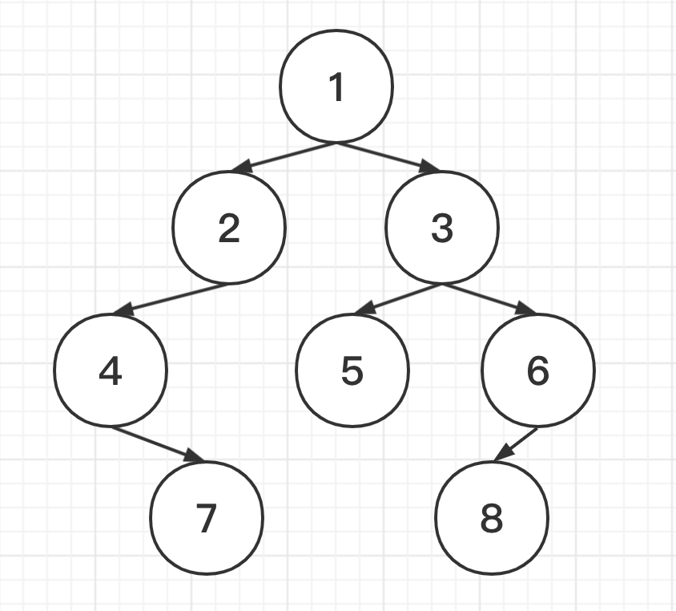

```c++
/**
 * Definition for binary tree
 * struct TreeNode {
 *     int val;
 *     TreeNode *left;
 *     TreeNode *right;
 *     TreeNode(int x) : val(x), left(NULL), right(NULL) {}
 * };
 */
class Solution {
public:
    TreeNode* reConstructBinaryTree(vector<int> pre,vector<int> vin) {
        if(pre.size()==0&&vin.size()==0){
            return NULL;
        }
        TreeNode* root = new TreeNode(pre[0]);
        int i;
        for(i;i<vin.size();i++){
            if(vin[i]==pre[0]){
                break;
            }
        }
        vector<int> pre_l(pre.begin()+1,pre.begin()+i+1);
        vector<int> pre_r(pre.begin()+i+1,pre.end());
        vector<int> vin_l(vin.begin(),vin.begin()+i);
        vector<int> vin_r(vin.begin()+i+1,vin.end());
        root->left=reConstructBinaryTree(pre_l,vin_l);
        root->right=reConstructBinaryTree(pre_r,vin_r);
        return root;
    }
};
```

##### No.5 [用两个栈实现队列](<https://www.nowcoder.com/practice/54275ddae22f475981afa2244dd448c6?tpId=13&tqId=11158&rp=1&ru=/ta/coding-interviews&qru=/ta/coding-interviews/question-ranking>)

> 用两个栈来实现一个队列，分别完成在队列尾部插入整数(push)和在队列头部删除整数(pop)的功能。 队列中的元素为int类型。保证操作合法，即保证pop操作时队列内已有元素。

<!--stack1用来记录数据插入的顺序，在需要pop的时候利用stack2来进行数据的逆序从而达到先进先出。-->

<!--但要注意在插入数据时，先将stack2中剩余的元素插入回stack1以保证数据队尾插入的属性。-->

```c++
#include<iostream>
#include<stdio.h>
#include<stack>
using namespace std;

class Solution
{
public:
    void push(int node) {
        while(!stack2.empty()){
            stack1.push(stack2.top());
            stack2.pop();
        }
        stack1.push(node);
    }

    int pop() {
        while(!stack1.empty()){
            stack2.push(stack1.top());
            stack1.pop();
        }
        int res=stack2.top();
        stack2.pop();
        return res;
    }

private:
    stack<int> stack1;
    stack<int> stack2;
};
int main()
{
    Solution s= *new Solution();
    s.push(3);
    s.push(5);
    cout<<s.pop()<<endl;
    s.push(1);
    s.push(4);
  	cout<<s.pop()<<endl;
    cout<<s.pop()<<endl;
    cout<<s.pop()<<endl;
    return 0;
}
```

##### -- No.6 [旋转数组的最小数字](<https://www.nowcoder.com/practice/9f3231a991af4f55b95579b44b7a01ba?tpId=13&tqId=11159&rp=1&ru=/ta/coding-interviews&qru=/ta/coding-interviews/question-ranking>)

> 把一个数组最开始的若干个元素搬到数组的末尾，我们称之为数组的旋转。
> 输入一个非递减排序的数组的一个旋转，输出旋转数组的最小元素。
> NOTE：给出的所有元素都大于0，若数组大小为0，请返回0。

<!--二分查找的变种，因为没有target用来做比较，所以用中间值和左右端点进行比较，判断mid在旋转数组的前半段还是后半段。-->

<!--如果mid处于旋转数组的前半段，left=mid+1；-->

<!--如果mid处于旋转数组的后半段，right=mid（可能mid就是最小值，避免错过）-->

<!--其他情况，left++缩小范围-->

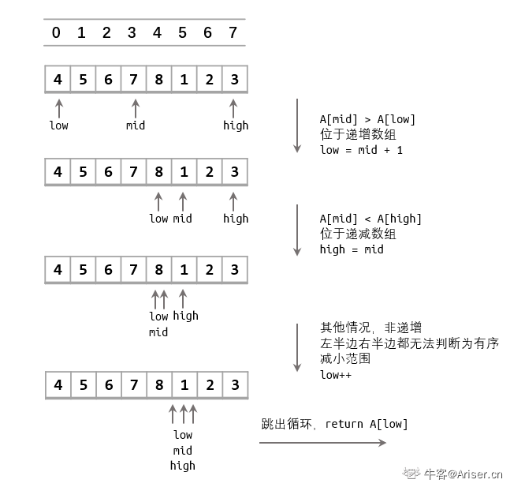

<!--特殊情况-->

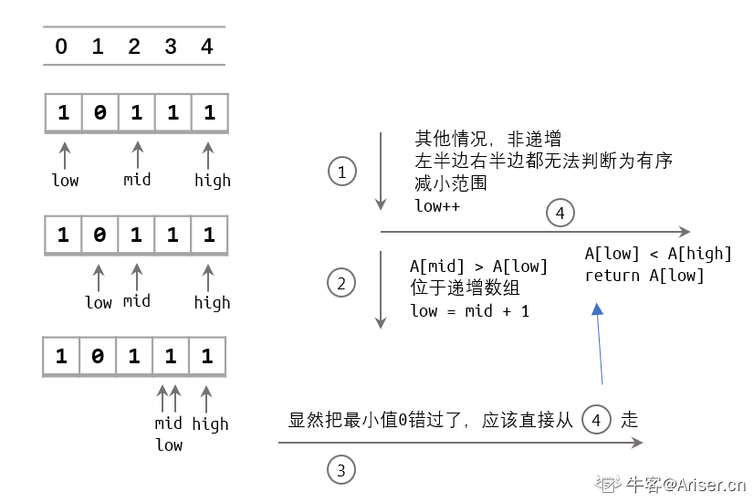

```c++
class Solution {public:    int minNumberInRotateArray(vector<int> rotateArray) {        if(rotateArray.size()==0){            return 0;        }        int left=0,right=rotateArray.size()-1;        while(left<right){            if(rotateArray[left]<rotateArray[right]){                return rotateArray[left];            }            int mid=(left+right)/2;            if(rotateArray[mid]>rotateArray[left]){                left=mid+1;            }else if(rotateArray[mid]<rotateArray[right]){                right=mid;            }else{                left++;            }        }        return rotateArray[left];    }};
```

### 第二天（2021-7-12）

------

##### No.7 [斐波那契数列](https://www.nowcoder.com/practice/c6c7742f5ba7442aada113136ddea0c3?tpId=13&tags=&title=&difficulty=0&judgeStatus=0&rp=1)

> 大家都知道斐波那契数列，现在要求输入一个整数n，请你输出斐波那契数列的第n项（从0开始，第0项为0，第1项是1）。

<!--从第三项开始，第n项的值是前两项的和，标准的递归算法-->

```c++
class Solution {public:    int Fibonacci(int n) {        if(n==0||n==1){            return n;        }        return Fibonacci(n-1)+Fibonacci(n-2);    }};
```

##### No.8 [跳台阶](https://www.nowcoder.com/practice/8c82a5b80378478f9484d87d1c5f12a4?tpId=13&tags=&title=&difficulty=0&judgeStatus=0&rp=1)

> 一只青蛙一次可以跳上1级台阶，也可以跳上2级。求该青蛙跳上一个n级的台阶总共有多少种跳法（先后次序不同算不同的结果）。

<!--第一级台阶：1-->

<!--第二级台阶：1+1，0+2-->

<!--第三级台阶：1+2，1+1+1，0+2+1-->

<!--我们可以看出，第n级台阶的跳法可以是第n-1级台阶跳一步或者第n-2级台阶跳两步，即f(n)=f(n-1)+f(n-2)，又是标准的递归算法-->

```c++
class Solution {public:    int jumpFloor(int number) {        if(number==1||number==2){            return number;        }        return jumpFloor(number-1)+jumpFloor(number-2);    }};// 时间复杂度O(2^n)
```

```c++
class Solution {public:    vector<int> dp();    int jumpFloor(int number) {        if(number==1||number==2){            return number;        }//         这里不用递归，为了避免重复计算记录每次计算完的n-1和n-2的值，在下一次循环中累加        int n,n1=2,n2=1;        for(int i=2;i<number;i++){            n=n1+n2;            n2=n1;// n-2右移变成n-1的值，便于下次循环累加            n1=n;// n-1右移变成n的值        }        return n;    }};// 时间复杂度O(n)
```

##### No.9 [跳台阶扩展问题](https://www.nowcoder.com/practice/22243d016f6b47f2a6928b4313c85387?tpId=13&tags=&title=&difficulty=0&judgeStatus=0&rp=1)

> 一只青蛙一次可以跳上1级台阶，也可以跳上2级……它也可以跳上n级。求该青蛙跳上一个n级的台阶(n为正整数)总共有多少种跳法。

<!--n=1时: 1-->

<!--n=2时: 1+1, 2-->

<!--n=3时: 2+1, 1+1+1, 1+2, 3-->

<!--n=4时: 2+1+1, 1+1+1+1, 1+2+1, 3+1, 1+1+2, 2+2,  1+3, 4-->

<!--我们可以看出，第n级台阶的跳法可以是第n-1级台阶跳一步或者第n-2级台阶跳两步或者n-3级台阶跳三步……即f(n)=f(0)+f(1)+f(2)+...+f(n-1)=2f(n-1),由此可得递归公式-->

```c++
class Solution {public:    int jumpFloorII(int number) {        if(number<=1){            return 1;        }//         return 2*jumpFloorII(number-1);//         迭代解法        int n,n1=1;        for(int i=2;i<=number;i++){            n=2*n1;            n1=n;        }        return n;    }};
```

```c++
class Solution {public:    int jumpFloorII(int number) {        vector<int> floor(number+1,0);        floor[0]=floor[1]=1;        int n=2,i;        while(n<=number)        {            int ret=0;            for(i=0;i<n;i++)            {                ret += floor[i];            }            floor[n++]=ret;        }        return floor[number];    }};
```

##### No.10 [矩阵覆盖](https://www.nowcoder.com/practice/72a5a919508a4251859fb2cfb987a0e6?tpId=13&tags=&title=&difficulty=0&judgeStatus=0&rp=1)

> 我们可以用2\*1的小矩形横着或者竖着去覆盖更大的矩形。请问用n个2\*1的小矩形无重叠地覆盖一个2\*n的大矩形，从同一个方向看总共有多少种不同的方法？


<!--从图中观察我们可以看出，由于大矩形的高为2，因此小矩形竖着放和两个矩形上下放一定能保证竖向无重叠覆盖，因此我们只考虑横向的长n可以怎么组成-->

<!--f(1)=1 f(2)=2 ……  f(n)=f(n-1)+f(n-2)-->

```c++
class Solution {public:    int rectCover(int number) {        if(number<=2){            return number;        }        return rectCover(number-1)+rectCover(number-2);    }};// 递归解法
```

##### -- No.11 [二进制中1的个数](https://www.nowcoder.com/practice/72a5a919508a4251859fb2cfb987a0e6?tpId=13&tags=&title=&difficulty=0&judgeStatus=0&rp=1)

> 输入一个整数，输出该数32位二进制表示中1的个数。其中负数用补码表示。

<!--计算一个数的补数，在规定的位数里，对该数的正数每位取反再加一即得到结果-->

<!--例如在四位二进制数中，-6表示为1010-->

<!--6->0110 按位取反 1001 再加一 1010-->

<!--十进制转换为二进制的方法：除以2取余数并将余数逆序排列-->

```c++
class Solution {public:     int  NumberOf1(int n) {//          stack<int> binary;         int count=0;         while(n>0){//              binary.push(n%2);             if(n%2==1){                 count++;             }             n=n/2;         }//          while(!binary.empty()){//              cout<<binary.top()<<endl;//              binary.pop();//          }         return count;     }};
```

很可惜，这个方法对大部分的结果都是有效的，但是对于`-2147483648`，二进制为`1000...000`，一共有31个0。因为计算机使用补码存储二进制数据的。对于这个数据，我们的方法输出0，实际上为1，所以这种方法是错误的。

```c++
class Solution {public:     int  NumberOf1(int n) {         int count=0;         while(n!=0){             count++;             n=n&(n-1);         }         return count;     }};
```

&按位与：每次将 n 和 n-1 进行 & 运算，从右往左去掉二进制最右边的一个1。

```val :1101000, val-1: 1100111 那么val & （val-1） : 1100000```

每次与操作结束后n都会少一个1，那么当n为0时，所有1就都被去除完毕了，这样经过了几次循环，就有几个1。

##### No.12 [数值的整数次方](https://www.nowcoder.com/practice/1a834e5e3e1a4b7ba251417554e07c00?tpId=13&tags=&title=&difficulty=0&judgeStatus=0&rp=1)

> 给定一个double类型的浮点数base和int类型的整数exponent。求base的exponent次方。
>
> 保证base和exponent不同时为0。不得使用库函数，同时不需要考虑大数问题，也不用考虑小数点后面0的位数。

<!--由于有公式x^n = (x*x)^n/2，可以利用递归来每次缩小一半的计算量-->

<!--2^4 = 4^2=16^1-->

<!--2^5=2*2^4-->

```c++
class Solution {public:    double Power(double base, int exponent) {        if(exponent==0){            return 1.0;        }        if(exponent==-1){            return 1.0/base;        }        if(exponent%2==0){            return Power(base*base, exponent/2);        }        return base*Power(base, exponent-1);    }};
```

```c++
class Solution {public:    double Power(double base, int exponent) {        if(exponent==0)            return 1.0;        double ret=Power(base,exponent/2);        if(exponent%2!=0){            if(exponent<0)                ret=ret*ret*(1.0/base);            else                ret=ret*ret*base;        }else{            ret*=ret;        }        return ret;    }};
```

### 第三天 （2021-7-13）

------

##### No.13 [调整数组位置使奇数位于偶数前面](https://www.nowcoder.com/practice/ef1f53ef31ca408cada5093c8780f44b?tpId=13&tags=&title=&difficulty=0&judgeStatus=0&rp=1)

> 输入一个整数数组，实现一个函数来调整该数组中数字的顺序，使得所有的奇数位于数组的前半部分，所有的偶数位于数组的后半部分，并保证奇数和奇数，偶数和偶数之间的相对位置不变。

```c++
class Solution {public:    vector<int> reOrderArray(vector<int>& array) {        vector<int> saveEven;        int slow=0,fast=0;        while(fast<array.size()){            if(array[fast]%2==1){                array[slow]=array[fast];                slow++;            }else{                saveEven.push_back(array[fast]);            }            fast++;        }        for(int i=0;i<saveEven.size();i++){            array[slow]=saveEven[i];            slow++;        }        return array;    }};// 时间复杂度：O（N）// 空间复杂度：O（N)
```

```c++
class Solution {public:    vector<int> reOrderArray(vector<int>& array) {        vector<int> newArray(array.size());        int slow=0,i=0;        int fast=array.size()-1,j=array.size()-1;        while(slow<array.size()&&fast>=0){            if(array[slow]%2==1){                newArray[i]=array[slow];                i++;            }            slow++;            if(array[fast]%2==0){                newArray[j]=array[fast];                j--;            }            fast--;        }        return newArray;    }};
```

##### No.14 [链表中倒数最后k个节点](https://www.nowcoder.com/practice/886370fe658f41b498d40fb34ae76ff9?tpId=13&tags=&title=&difficulty=0&judgeStatus=0&rp=1)

> 输入一个链表，输出一个链表，该输出链表包含原链表中从倒数第k个结点至尾节点的全部节点。
>
> 如果该链表长度小于k，请返回一个长度为 0 的链表

<!--快指针先行k步，然后头指针跟快指针同步前进，当快指针达到链表尾部时，头指针所在的节点就是倒数第k个节点-->

<!--如果链表长度比k要小，那么在快指针先行的时候就一定会在某一步指向NULL，直接return空链表即可-->

```c++
/**
 * struct ListNode {
 *	int val;
 *	struct ListNode *next;
 *	ListNode(int x) : val(x), next(nullptr) {}
 * };
 */
class Solution {
public:
    ListNode* FindKthToTail(ListNode* pHead, int k) {
        ListNode *first=pHead;
        for(int i=0;i<k;i++){
            if(first==NULL){
                return NULL;
            }
            first=first->next;
        }
        while(first!=NULL){
            first=first->next;
            pHead=pHead->next;
        }
        return pHead;
    }
};
```

##### No.15 [反转链表](https://www.nowcoder.com/practice/75e878df47f24fdc9dc3e400ec6058ca?tpId=13&tags=&title=&difficulty=0&judgeStatus=0&rp=1)

> 输入一个链表，反转链表后，输出新链表的表头。

```c++
/*
struct ListNode {
	int val;
	struct ListNode *next;
	ListNode(int x) :
			val(x), next(NULL) {
	}
};*/
class Solution {
public:
    ListNode* ReverseList(ListNode* pHead) {
        if(pHead==NULL||pHead->next==NULL){
            return pHead;
        }
        ListNode *head=ReverseList(pHead->next);
        pHead->next->next=pHead;
        pHead->next=NULL;
        return head;
    }
};
// 递归
```

```c++
/*
struct ListNode {
	int val;
	struct ListNode *next;
	ListNode(int x) :
			val(x), next(NULL) {
	}
};*/
class Solution {
public:
    ListNode* ReverseList(ListNode* pHead) {
        if(pHead==NULL||pHead->next==NULL){
            return pHead;
        }
        ListNode *pre,*nex,*curr;
        pre=NULL;
        curr=pHead;
        while(curr!=NULL){
            nex=curr->next;
            curr->next=pre;
            pre=curr;
            curr=nex;
        }
        return pre;
    }
};
// 迭代
```

##### No.16 [合并两个排序的链表](https://www.nowcoder.com/practice/d8b6b4358f774294a89de2a6ac4d9337?tpId=13&tags=&title=&difficulty=0&judgeStatus=0&rp=1)

> 输入两个单调递增的链表，输出两个链表合成后的链表，当然我们需要合成后的链表满足单调不减规则

```c++
/*
struct ListNode {
	int val;
	struct ListNode *next;
	ListNode(int x) :
			val(x), next(NULL) {
	}
};*/
class Solution {
public:
    ListNode* Merge(ListNode* pHead1, ListNode* pHead2) {
        ListNode* fake=new ListNode(-1);
        ListNode* pointer=fake;
        ListNode* p1=pHead1;
        ListNode* p2=pHead2;
        while(p1!=NULL&&p2!=NULL){
            if(p1->val<=p2->val){
                pointer->next=p1;
                p1=p1->next;
            }else{
                pointer->next=p2;
                p2=p2->next;
            }
            pointer=pointer->next;
        }
        if(p1==NULL){
            pointer->next=p2;
        }else{
            pointer->next=p1;
        }
        return fake->next;
    }
};
// 迭代 6ms 536kb
```

```c++
/*
struct ListNode {
	int val;
	struct ListNode *next;
	ListNode(int x) :
			val(x), next(NULL) {
	}
};*/
class Solution {
public:
    ListNode* Merge(ListNode* pHead1, ListNode* pHead2)
    {
        if(pHead1==nullptr)
            return pHead2;
        if(pHead2==nullptr)
            return pHead1;
        ListNode *head;
        if(pHead1->val<=pHead2->val)
        {
            head=pHead1;
            head->next=Merge(pHead1->next,pHead2);
        }
        else{
            head=pHead2;
            head->next=Merge(pHead1,pHead2->next);
        }
        return head;
    }
};
// 递归 3ms 588kb
```

##### No.17 [树的子结构](https://leetcode-cn.com/problems/shu-de-zi-jie-gou-lcof/submissions/)

> 输入两棵二叉树A，B，判断B是不是A的子结构。（ps：我们约定空树不是任意一个树的子结构）

```c++
/** * Definition for a binary tree node. * struct TreeNode { *     int val; *     TreeNode *left; *     TreeNode *right; *     TreeNode(int x) : val(x), left(NULL), right(NULL) {} * }; */class Solution {public:    bool isSubStructure(TreeNode* A, TreeNode* B) {        if(A==NULL||B==NULL){            return false;        }        return isSubtree(A,B) || isSubStructure(A->left, B) || isSubStructure(A->right,B);    }    bool isSubtree(TreeNode* pRoot1, TreeNode* pRoot2){        if(pRoot1==NULL&&pRoot2==NULL){            return true;        }        if(pRoot1==NULL){            return false;        }        if(pRoot2==NULL){            return true;        }        if(pRoot1->val!=pRoot2->val){            return false;        }        return isSubtree(pRoot1->left,pRoot2->left)&&isSubtree(pRoot1->right,pRoot2->right);    }};
```

##### No.18 [二叉树的镜像](https://www.nowcoder.com/practice/a9d0ecbacef9410ca97463e4a5c83be7?tpId=13&tags=&title=&difficulty=0&judgeStatus=0&rp=1)

> 操作给定的二叉树，将其变换为源二叉树的镜像。

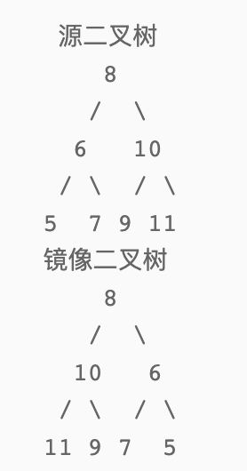

```c++
/** * struct TreeNode { *	int val; *	struct TreeNode *left; *	struct TreeNode *right; *	TreeNode(int x) : val(x), left(nullptr), right(nullptr) {} * }; */class Solution {public:    TreeNode* Mirror(TreeNode* pRoot) {        if(pRoot==NULL||pRoot->left==NULL&&pRoot->right==NULL){            return pRoot;        }        TreeNode* l=Mirror(pRoot->left);        TreeNode* r=Mirror(pRoot->right);        pRoot->left=r;        pRoot->right=l;        return pRoot;    }};
```

### 第四天（2021-7-14）

------

##### No.19 [顺时针打印矩阵](https://www.nowcoder.com/practice/9b4c81a02cd34f76be2659fa0d54342a?tpId=13&tags=&title=&difficulty=0&judgeStatus=0&rp=1)

> 输入一个矩阵，按照从外向里以顺时针的顺序依次打印出每一个数字，例如，如果输入如下4 X 4矩阵：
>
> ```
> [[1,2,3,4],[5,6,7,8],[9,10,11,12],[13,14,15,16]]
> ```
>
> 则依次打印出数字
>
> ```[1,2,3,4,8,12,16,15,14,13,9,5,6,7,11,10]```

```c++
class Solution {public:    vector<int> printMatrix(vector<vector<int> > matrix) {        int m=matrix.size();// hang         int n=matrix[0].size(); //lie        int up=0,down=m-1,left=0,right=n-1;        vector<int> res;        int x=0,y=0;        while(up<=down&&left<=right){            for(y=left;y<=right;y++){                res.push_back(matrix[up][y]);            }            up++;            for(x=up;x<=down;x++){                res.push_back(matrix[x][right]);            }            right--;            if(right<left||up>down){//              针对只有一行或只有一列的特殊情况                break;            }            for(y=right;y>=left;y--){                res.push_back(matrix[down][y]);            }            down--;            for(x=down;x>=up;x--){                res.push_back(matrix[x][left]);            }            left++;        }        return res;    }};
```

##### No.20 [包含min函数的栈](https://www.nowcoder.com/practice/4c776177d2c04c2494f2555c9fcc1e49?tpId=13&tags=&title=&difficulty=0&judgeStatus=0&rp=1)

> 定义栈的数据结构，请在该类型中实现一个能够得到栈中所含最小元素的min函数，并且调用 min函数、push函数 及 pop函数 的时间复杂度都是 O(1)
>
> push(value):将value压入栈中
>
> pop():弹出栈顶元素
>
> top():获取栈顶元素
>
> min():获取栈中最小元素

<!--维护两个栈，一个正常存储数据，一个存储当前栈中的最小值，永远保持两个栈的长度一致，同时push，同时pop-->

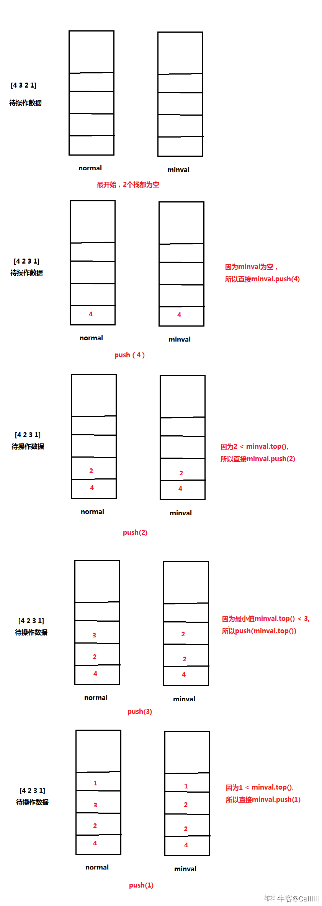

```c++
class Solution {private:    stack<int> mins,nums;public:    void push(int value) {        nums.push(value);        if(mins.empty()){            mins.push(value);        }else{            if(value<mins.top()){                mins.push(value);            }else{                mins.push(mins.top());            }        }    }    void pop() {        nums.pop();        mins.pop();    }    int top() {        return nums.top();    }    int min() {        return mins.top();    }};
```

##### No.21 [栈的压入弹出序列](https://www.nowcoder.com/practice/d77d11405cc7470d82554cb392585106?tpId=13&tags=&title=&difficulty=0&judgeStatus=0&rp=1)

> 输入两个整数序列，第一个序列表示栈的压入顺序，请判断第二个序列是否可能为该栈的弹出顺序。假设压入栈的所有数字均不相等。例如序列1,2,3,4,5是某栈的压入顺序，序列4,5,3,2,1是该压栈序列对应的一个弹出序列，但4,3,5,1,2就不可能是该压栈序列的弹出序列。（注意：这两个序列的长度是相等的）

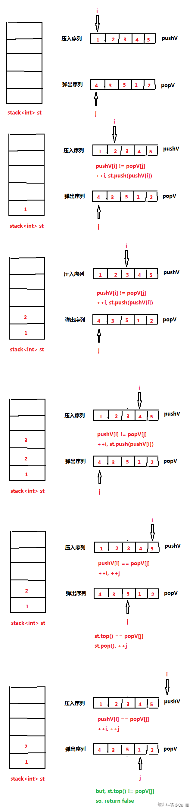

```c++
class Solution {public:    bool IsPopOrder(vector<int> pushV,vector<int> popV) {        stack<int> list;        if(pushV.size()!=popV.size()){            return false;        }        int i=0,j=0;        while(i<pushV.size()&&j<popV.size()){            if(list.empty()&&i<pushV.size()){                list.push(pushV[i]);                i++;            }            while(!list.empty()&&list.top()!=popV[j]){                list.push(pushV[i]);                i++;            }            while(!list.empty()&&list.top()==popV[j]){                list.pop();                j++;            }        }        if(list.empty()){            return true;        }else{            return false;        }            }};// 13ms 508kb
```

```c++
class Solution {public:    bool IsPopOrder(vector<int> pushV,vector<int> popV) {        stack<int> list;        if(pushV.size()!=popV.size()){            return false;        }        int i,j=0;        for(i=0;i<pushV.size();i++){            list.push(pushV[i]);            while(!list.empty()&&list.top()==popV[j]){                list.pop();                j++;            }        }        return list.empty();    }};
```

### 第五天（2021-7-15）

------

##### No.22 [从下往上打印二叉树](https://www.nowcoder.com/practice/7fe2212963db4790b57431d9ed259701?tpId=13&tags=&title=&difficulty=0&judgeStatus=0&rp=1)

> 从上往下打印出二叉树的每个节点，同层节点从左至右打印。

广度优先遍历BFS：

1. 初始化：一个队列queue<TreeNode*> q， 将root节点入队列q
2. 如果队列不空，做如下操作：
3. 弹出队列头，保存为node，将node的左右非空孩子加入队列
4. 做2,3步骤，知道队列为空

```c++
/*struct TreeNode {	int val;	struct TreeNode *left;	struct TreeNode *right;	TreeNode(int x) :			val(x), left(NULL), right(NULL) {	}};*/class Solution {public:    vector<int> PrintFromTopToBottom(TreeNode* root) {        vector<int> res;        if(root==NULL){            return res;        }        queue<TreeNode*> q;        q.push(root);        while(!q.empty()){            TreeNode* node=q.front();            q.pop();            if(node->left){q.push(node->left);}            if(node->right){q.push(node->right);}                        res.push_back(node->val);        }        return res;    }};
```

如果需要知道当前打印的数据在第几层

```c++
class Solution {
public:
    vector<int> PrintFromTopToBottom(TreeNode* root) {
        vector<int> res;
      	int layer=0;
        if(root==NULL){
            return res;
        }
        queue<TreeNode*> q;
        q.push(root);
        while(!q.empty()){
          int size=q.size();
          while(size--){
            TreeNode* node=q.front();
            q.pop();
            if(node->left){q.push(node->left);}
            if(node->right){q.push(node->right);}
            cout<<"第"<<layer<<"层，数为"<<node->val<<endl;
            res.push_back(node->val);
          }
          layer++;   
        }
        return res;
    }
};
```

##### No.23 [二叉树搜索树的后序遍历](https://www.nowcoder.com/practice/a861533d45854474ac791d90e447bafd?tpId=13&tags=&title=&difficulty=0&judgeStatus=0&rp=1)

> 输入一个整数数组，判断该数组是不是某二叉搜索树的后序遍历的结果。如果是则返回true,否则返回false。假设输入的数组的任意两个数字都互不相同。（ps：我们约定空树不是二叉搜索树）

<!--二叉搜索树（Binary Search Tree），它或者是一棵空树，或者是具有下列性质的二叉树： 若它的左子树不空，则左子树上所有结点的值均小于它的根结点的值； 若它的右子树不空，则右子树上所有结点的值均大于它的根结点的值； 它的左、右子树也分别为二叉排序树。-->

<!--后序遍历：左节点 -> 右节点 -> 根节点-->

```c++
class Solution {
public:
    bool check(vector<int> s,int first,int last){
        if(first>=last){
            return true;
        }
        int root=s[last];// 根节点
        int i=first;
        for(i=first;i<last;i++){
            if(s[i]>root){
                break;
            }
        }
        for(int j=i;j<last;j++){
            if(s[j]<root){
                return false;
            }
        }
        vector<int> left(s.begin(),s.begin()+i),right(s.begin()+i+1,s.begin()+s.size());
        bool subLeft=VerifySquenceOfBST(left);
        bool subRight=VerifySquenceOfBST(right);
        return check(s,first,i-1)&&check(s,i,last-1);
    }
    bool VerifySquenceOfBST(vector<int> sequence) {
        if(sequence.size()==0){
            return false;
        }
        return check(sequence,0,sequence.size()-1);
    }
};
```

##### No.24 [二叉树中和为某一值的路径](https://www.nowcoder.com/practice/b736e784e3e34731af99065031301bca?tpId=13&tags=&title=&difficulty=0&judgeStatus=0&rp=1)

> 输入一颗二叉树的根节点和一个整数，按字典序打印出二叉树中结点值的和为输入整数的所有路径。路径定义为从树的根结点开始往下一直到叶结点所经过的结点形成一条路径。

<!--递归遍历整棵树，每次遍历的时候把和的剩余值和路径传递下去，递归的终止条件是遍历到叶子节点，如果当前走的这段路径满足和为target那么就把路径记录在全局变量值之中，遍历完整棵树后得到结果。-->

```c++
/*struct TreeNode {	int val;	struct TreeNode *left;	struct TreeNode *right;	TreeNode(int x) :			val(x), left(NULL), right(NULL) {	}};*/class Solution {public:    vector<vector<int>> res;    void dfs(TreeNode* root,int num,vector<int> path){        path.push_back(root->val);        if(root->left==NULL&&root->right==NULL){            // leaf root            if(num-root->val==0){                res.push_back(path);            }            return;        }        if(root->left)dfs(root->left,num-root->val,path);        if(root->right)dfs(root->right,num-root->val,path);    }    vector<vector<int> > FindPath(TreeNode* root,int expectNumber) {        vector<int> path;        if(root){            dfs(root,expectNumber,path);        }        return res;    }};
```

### 第六天（2021-7-18）

------

##### No.25 [复杂链表的复制](https://www.nowcoder.com/practice/f836b2c43afc4b35ad6adc41ec941dba?tpId=13&tags=&title=&difficulty=0&judgeStatus=0&rp=1)

> 输入一个复杂链表（每个节点中有节点值，以及两个指针，一个指向下一个节点，另一个特殊指针random指向一个随机节点），请对此链表进行深拷贝，并返回拷贝后的头结点。（注意，输出结果中请不要返回参数中的节点引用，否则判题程序会直接返回空）。 下图是一个含有5个结点的复杂链表。图中实线箭头表示next指针，虚线箭头表示random指针。为简单起见，指向null的指针没有画出。

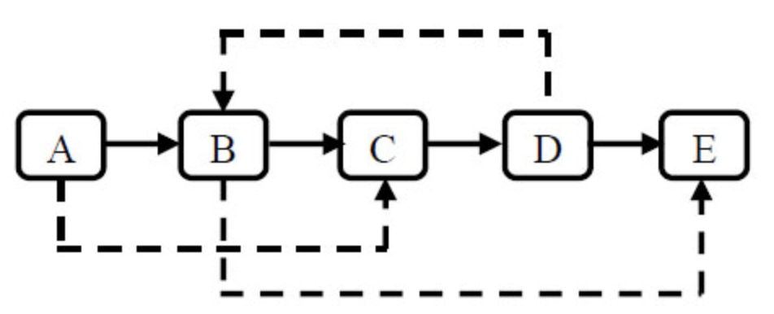

<!--step1：在每个结点的后面插入新结点。该新结点为克隆结点，这么做是为了连接random结点。-->

<!--step2：连接random结点。-->

<!--step3：拆分链表，下边为原链表，上边为clone链表。-->


```c++
/*struct RandomListNode {    int label;    struct RandomListNode *next, *random;    RandomListNode(int x) :            label(x), next(NULL), random(NULL) {    }};*/class Solution {public:    RandomListNode* Clone(RandomListNode* pHead) {        if(pHead==NULL){            return pHead;        }        RandomListNode* head=pHead;        while(head!=NULL){            RandomListNode* clone = new RandomListNode(head->label);            clone->next=head->next;            head->next=clone;            head=clone->next;        }        head=pHead;        while(head!=NULL){            if(head->random!=NULL){                head->next->random=head->random->next;            }            head=head->next->next;        }        RandomListNode *newHead=pHead->next;        head=pHead;        while(head->next!=NULL){            RandomListNode* node=head->next;            head->next=node->next;            head=node;        }        return newHead;    }};
```

##### No.26 [二叉搜索树与双向链表](https://www.nowcoder.com/practice/947f6eb80d944a84850b0538bf0ec3a5?tpId=13&tags=&title=&difficulty=0&judgeStatus=0&rp=1)

> 输入一棵二叉搜索树，将该二叉搜索树转换成一个排序的双向链表。
>
> 注意:
>
> 1.要求不能创建任何新的结点，只能调整树中结点指针的指向。当转化完成以后，树中节点的左指针需要指向前驱，树中节点的右指针需要指向后继
> 2.返回链表中的第一个节点的指针
> 3.函数返回的TreeNode，有左右指针，其实可以看成一个双向链表的数据结构
>
> 4.你不用输出或者处理，示例中输出里面的英文，比如"From left to right are:"这样的，程序会根据你的返回值自动打印输出

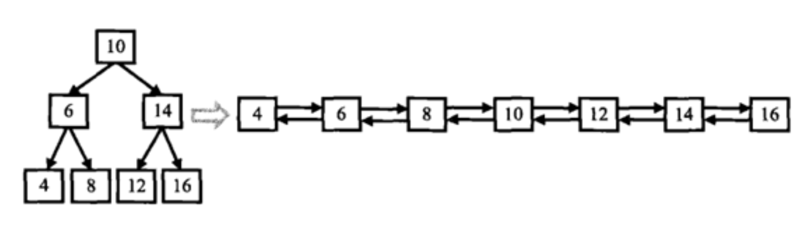

<!--用递归来解决这个问题，Convert方法返回一个排好序的双向链表的头，即对于示例中根节点10来说，Convert(pRoot->left)会返回4-6-8链表的头4，Convert(pRoot->right)会返回12-14-16链表头12，我们要讲8-10-12按要求连接并返回整个链表的头4，还要考虑左右子树分别为空的场景。-->

```c++
/*struct TreeNode {	int val;	struct TreeNode *left;	struct TreeNode *right;	TreeNode(int x) :			val(x), left(NULL), right(NULL) {	}};*/class Solution {public:    TreeNode* Convert(TreeNode* pRootOfTree)    {        if(pRootOfTree==NULL||(pRootOfTree->left==NULL&&pRootOfTree->right==NULL)){            return pRootOfTree;        }        TreeNode* head=pRootOfTree;        if(pRootOfTree->left){            head=Convert(pRootOfTree->left);            TreeNode* left=head;            while(left->right){                left=left->right;            }            left->right=pRootOfTree;            pRootOfTree->left=left;        }                if(pRootOfTree->right){            TreeNode* right=Convert(pRootOfTree->right);            right->left=pRootOfTree;            pRootOfTree->right=right;        }        return head;    }};
```

##### No.27 [字符串的排列](https://www.nowcoder.com/practice/fe6b651b66ae47d7acce78ffdd9a96c7?tpId=13&tags=&title=&difficulty=0&judgeStatus=0&rp=1)

> 输入一个字符串,按字典序打印出该字符串中字符的所有排列。例如输入字符串abc,则按字典序打印出由字符a,b,c所能排列出来的所有字符串abc,acb,bac,bca,cab和cba。

<!--处理思路类似24题，依然是用递归固定每一位然后向下一位传递需要的数据。但需要注意会有重复字符，因此需要用set去重。-->

```c++
class Solution {public:    set<string> res;    void dfs(vector<char> notUsed,string s){        if(notUsed.size()==1){            s+=notUsed[0];            res.insert(s);            return;        }        for(int i=0;i<notUsed.size();i++){            vector<char> temp(notUsed);            string loopS=s;            loopS+=notUsed[i];            temp.erase(temp.begin()+i);            dfs(temp,loopS);        }    }    vector<string> Permutation(string str) {        vector<char> book;        for(char c:str){            book.push_back(c);        }        string s="";        dfs(book,s);        return vector<string>{res.begin(),res.end()};    }};
```

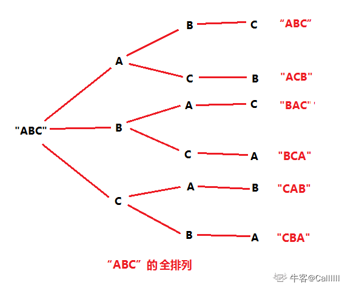

我们先固定A不动，然后交换B与C，从而得到`"ABC" 和 "ACB"`；然后固定B不动，交换AC得到```"BAC"、"BCA"```同理可得```"CAB"、"CBA"```

递归三部曲：

1. 递归函数的功能：`dfs(int pos, string s)`, 表示固定字符串`s`的`pos`下标的字符`s[pos]`
2. 递归终止条件：当`pos+1 == s.length()`的时候，终止，表示对最后一个字符进行固定，也就说明，完成了一次全排列
3. 下一次递归：`dfs(pos+1, s)`, 很显然，下一次递归就是对字符串的下一个下标进行固定

```c++
class Solution {public:    void dfs(int p,string s,set<string> &res){        if(p+1==s.size()){            res.insert(s);            return;        }        // for循环和swap的含义：对于“ABC”，        // 第一次'A' 与 'A'交换，字符串为"ABC", pos为0， 相当于固定'A'        // 第二次'A' 与 'B'交换，字符串为"BAC", pos为0， 相当于固定'B'        // 第三次'A' 与 'C'交换，字符串为"CBA", pos为0， 相当于固定'C'        for(int i=p;i<s.size();i++){            swap(s[p],s[i]);            dfs(p+1,s,res);            swap(s[p],s[i]);            // 回溯的原因：比如第二次交换后是"BAC"，需要回溯到"ABC"            // 然后进行第三次交换，才能得到"CBA"        }    }    vector<string> Permutation(string str) {        set<string> res;        dfs(0,str,res);        return vector<string> {res.begin(),res.end()};    }};
```

##### No.28 [数组中出现超过一半的数字](https://www.nowcoder.com/practice/e8a1b01a2df14cb2b228b30ee6a92163?tpId=13&tags=&title=&difficulty=0&judgeStatus=0&rp=1)

> 数组中有一个数字出现的次数超过数组长度的一半，请找出这个数字。例如输入一个长度为9的数组[1,2,3,2,2,2,5,4,2]。由于数字2在数组中出现了5次，超过数组长度的一半，因此输出2。你可以假设数组是非空的，并且给定的数组总是存在多数元素。1<=数组长度<=50000

```c++
class Solution {public:    int MoreThanHalfNum_Solution(vector<int> numbers) {        unordered_map<int,int> count;        for(int i=0;i<numbers.size();i++){            int n=numbers[i];            count[n]++;            if(count[n]>numbers.size()/2){                return n;            }        }        return -1;    }};
```

<!--如果两个数不相等，就消去这两个数，最坏情况下，每次消去一个众数和一个非众数，那么如果存在众数，最后留下的数肯定是众数。-->

```c++
class Solution {public:    int MoreThanHalfNum_Solution(vector<int> numbers) {        int cond=-1;        int count=0;        for(int i=0;i<numbers.size();i++){            if(count==0){                cond=numbers[i];                count++;            }else{                if(numbers[i]==cond){                    count++;                }else{                    count--;                }            }        }        return cond;    }};
```

##### No.29 [最小的k个数](https://www.nowcoder.com/practice/6a296eb82cf844ca8539b57c23e6e9bf?tpId=13&tags=&title=&difficulty=0&judgeStatus=0&rp=1)

> 给定一个数组，找出其中最小的K个数。例如数组元素是4,5,1,6,2,7,3,8这8个数字，则最小的4个数字是1,2,3,4。
>
> - 0 <= k <= input.length <= 10000
> - 0 <= input[i] <= 10000

```c++
class Solution {public:    vector<int> GetLeastNumbers_Solution(vector<int> input, int k) {        sort(input.begin(),input.end());        return vector<int>{input.begin(),input.begin()+k};    }};
```

##### No.30 [连续子数组的最大和](https://www.nowcoder.com/practice/459bd355da1549fa8a49e350bf3df484?tpId=13&tags=&title=&difficulty=0&judgeStatus=0&rp=1)

> 输入一个整型数组，数组里有正数也有负数。数组中的一个或连续多个整数组成一个子数组。求所有子数组的和的最大值。要求时间复杂度为 O(n).

<!--思路：对下标为i的元素array[i]，先试探的加上array[i], 如果和为负数，显然，以i结尾的元素对整个结果不作贡献。-->

具体过程：

1. 初始化：维护一个变量sum = 0
2. 如果sum+array[i] < 0, 说明以i结尾的不作贡献，重新赋值sum = 0，起点为下一个i
3. 否则更新tmp = tmp + array[i]
   最后判断tmp是否等于0， 如果等于0， 说明数组都是负数，选取一个最大值为答案。

```c++
class Solution {public:    int FindGreatestSumOfSubArray(vector<int> array) {        int left,right,sum,max;        left=sum=0;        max=array[0];        for(;left<array.size();left++){            int start=array[left];            sum+=start;            if(sum<0){                sum=0;                continue;            }            max=max>sum?max:sum;        }        if(sum!=0)            return max;        return *max_element(array.begin(), array.end());    }};
```

<!--动态规划-->

<!--状态定义：dp[i]表示以i结尾的连续子数组的最大和。所以最终要求dp[n-1]-->
<!--状态转移方程：dp[i] = max(array[i], dp[i-1]+array[i])-->
<!--解释：如果当前元素为整数，并且dp[i-1]为负数，那么当然结果就是只选当前元素-->

```c++
class Solution {public:    int FindGreatestSumOfSubArray(vector<int> array) {        int sz = array.size();        vector<int> dp(sz+1, 1);        dp[0] = 0; // 表示没有元素        int ret = array[0];        for (int i=1; i<=sz; ++i) {            dp[i] = max(array[i-1], dp[i-1]+array[i-1]);            ret = max(ret, dp[i]);        }        return ret;    }};
```

### 第七天（2021-7-19）

------

##### No.31 [整数中一出现的次数](https://www.nowcoder.com/practice/bd7f978302044eee894445e244c7eee6?tpId=13&tags=&title=&difficulty=0&judgeStatus=0&rp=1)

> 输入一个整数 n ，求1～n这n个整数的十进制表示中1出现的次数
> 例如，1~13中包含1的数字有1、10、11、12、13因此共出现6次

https://leetcode-cn.com/problems/1nzheng-shu-zhong-1chu-xian-de-ci-shu-lcof/solution/mian-shi-ti-43-1n-zheng-shu-zhong-1-chu-xian-de-2/

```c++
class Solution {
  public:
  int NumberOf1Between1AndN_Solution(int n) {
    int digit=1, res = 0;
    int high=n/10;
    int cur=n%10;
    int low = 0;
    while(!(high==0&&cur==0)){
      if(cur==0){
        res+=high*digit;
      }else if(cur==1){
        res+=high*digit+low+1;
      }else{
        res+=(high+1)*digit;
      }            
      low += cur * digit;
      cur = high % 10;
      high /= 10;
      digit*=10;
    }
    return res;
  }
};
```

##### No.32 [把数组排成最小的数](https://www.nowcoder.com/practice/8fecd3f8ba334add803bf2a06af1b993?tpId=13&tags=&title=&difficulty=0&judgeStatus=0&rp=1)

> 输入一个正整数数组，把数组里所有数字拼接起来排成一个数，打印能拼接出的所有数字中最小的一个。例如输入数组{3，32，321}，则打印出这三个数字能排成的最小数字为321323。

贪心：对于两个字符串a和b来说，如果a+b<b+a那么我们希望a放在b的前面，那么我们自定义一个排序规则来满足要求。

```c++
class Solution {
public:
    string mySort(string s1,string s2){
        return s1+s2<s2+s1?s1+s2:s2+s1;
    }
    string PrintMinNumber(vector<int> numbers) {
        sort(numbers.begin(),numbers.end());
        string res="";
        for(int i=0;i<numbers.size();i++){
            res=mySort(res,to_string(numbers[i]));
        }
        return res;
    }
};
```

假设n个整数的索引为[0...n-1]，如果我们对这n个索引进行全排列，然后再对每次全排列进行组织一下结果，选取最小的即为答案。

```c++
class Solution {
  public:    
  void perm(int pos, vector<int> &num, string &ret) {        
    if (pos + 1 == num.size()) {            
      // 一次全排列的结果            
      string tmp = "";            
      for (int val : num) {                
        tmp += to_string(val);            
      }            
      ret = min(ret, tmp);
      return;
    }
    for (int i = pos; i < num.size(); ++i) {
      swap(num[pos], num[i]);
      perm(pos+1, num, ret);
      swap(num[pos], num[i]);
    }
  }
  string PrintMinNumber(vector<int> nums) {        
    string ret(nums.size(), '9'); // nums.size()个'9'
    perm(0, nums, ret);
    return ret;    
  }
};
```

##### No.33 [丑数](https://www.nowcoder.com/practice/6aa9e04fc3794f68acf8778237ba065b?tpId=13&tags=&title=&difficulty=0&judgeStatus=0&rp=1)

> 把只包含质因子2、3和5的数称作丑数（Ugly Number）。例如6、8都是丑数，但14不是，因为它包含质因子7。 习惯上我们把1当做是第一个丑数。求按从小到大的顺序的第N个丑数。

<!--最小堆-->

<!--要得到从小到大的第 n 个丑数，可以使用最小堆实现。-->

<!--初始时堆为空。首先将最小的丑数 1 加入堆。-->

<!--每次取出堆顶元素 x，则 x是堆中最小的丑数，由于 2x, 3x, 5x也是丑数，因此将 2x, 3x, 5x 加入堆。-->

<!--上述做法会导致堆中出现重复元素的情况。为了避免重复元素，可以使用哈希集合去重，避免相同元素多次加入堆。-->

<!--在排除重复元素的情况下，第 n 次从最小堆中取出的元素即为第 n 个丑数。-->

```c++
class Solution {
public:
    int GetUglyNumber_Solution(int index) {
        if(index==0) return 0;
        priority_queue<long,vector<long>,greater<long>> ugly;
        set<long> same;
        vector<int> base{2,3,5};
        ugly.push(1);
        same.insert(1);
        for(int i=1;i<index;i++){
            int num=ugly.top();
            ugly.pop();
            for(int e:base){
                if(!same.count(num*e)){
                    same.insert(num*e);
                    ugly.push(num*e);
                }
            }
            
        }
        return ugly.top();
    }
};
```

<!--动态规划-->

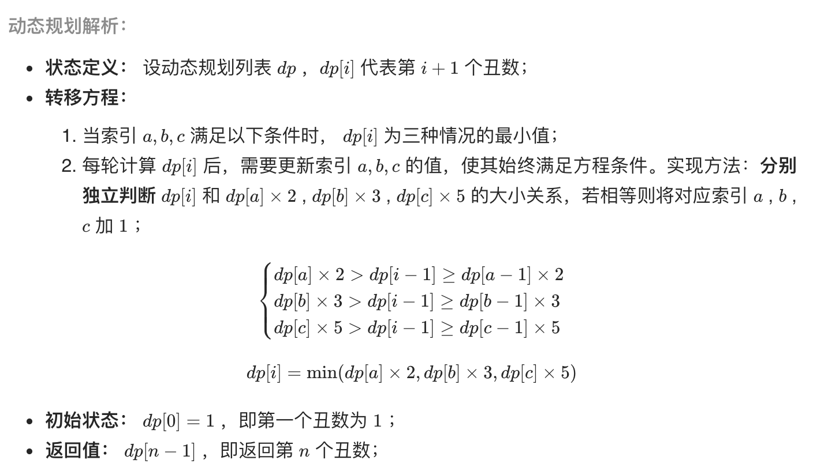

```c++
class Solution {
public:
    int GetUglyNumber_Solution(int index) {
        vector<long> ugly(index+1);
        vector<int> base{2,3,5};
        int a,b,c,i;
        a=b=c=1;
        ugly[0]=0;
        ugly[1]=1;
        for(i=2;i<=index;i++){
            ugly[i]=min(min(ugly[a]*2,ugly[b]*3),ugly[c]*5);
            if(ugly[i]==ugly[a]*2){
                a++;
            }
            if(ugly[i]==ugly[b]*3){
                b++;
            }
            if(ugly[i]==ugly[c]*5){
                c++;
            }
        }
        return ugly[index];
    }
};
```

### 第八天（2021-7-20）

------

##### No.34 [第一个只出现一次的字符](https://www.nowcoder.com/practice/1c82e8cf713b4bbeb2a5b31cf5b0417c?tpId=13&tags=&title=&difficulty=0&judgeStatus=0&rp=1)

> 在一个字符串(0<=字符串长度<=10000，全部由字母组成)中找到第一个只出现一次的字符,并返回它的位置, 如果没有则返回 -1（需要区分大小写）.（从0开始计数）

```c++
class Solution {
public:
    int FirstNotRepeatingChar(string str) {
        // 用一个list按顺序记录只出现一次的元素
        vector<char> oneTimeC;
        // 哈希表记录字母和初次出现的位置
        unordered_map<char,int> pos;
        for(int i=0;i<str.size();i++){
            char c=str[i];
            if(pos.count(c)){
                // 从oneTimeC中删掉
                int j=0;
                while(j<oneTimeC.size()){
                    if(oneTimeC[j]==c){
                        break;
                    }
                    j++;
                }
                if(j<oneTimeC.size()){
                    // 找到了给他删掉，已经删过就忽略
                    oneTimeC.erase(oneTimeC.begin()+j);
                }
            }else{
                oneTimeC.push_back(c);
                pos[c]=i;
            }
        }
        if(oneTimeC.size()==0){
            return -1;
        }else{
            return pos[oneTimeC[0]];
        }
    }
};
```

1. 初始化：bitset<128> b1表示只出现1次， b2表示出现2次以上
2. 遍历字符串，第一次出现，b1[ch] = 1
3. 如果第二次出现，b2[ch] = 1
4. 最后，找出第一个b1[ch] == 1 && b2[ch] == 0的字符

```c++
class Solution {
public:
    int FirstNotRepeatingChar(string str) {
        bitset<128> b1, b2;
        for (const char ch : str) {
            if (!b1[ch] && !b2[ch]) {
                b1[ch] = 1;
            }
            else if (b1[ch] && !b2[ch]) {
                b2[ch] = 1;
            }
        }
        for (int i=0; i<str.length(); ++i) {
            if (b1[str[i]] && !b2[str[i]]) {
                return i;
            }
        }
        return -1;
    }
};
```

##### No.35 [数组中的逆序对](https://www.nowcoder.com/practice/96bd6684e04a44eb80e6a68efc0ec6c5?tpId=13&tags=&title=&difficulty=0&judgeStatus=0&rp=1)

> 在数组中的两个数字，如果前面一个数字大于后面的数字，则这两个数字组成一个逆序对。输入一个数组,求出这个数组中的逆序对的总数P。并将P对1000000007取模的结果输出。 即输出P%1000000007
>
> 对于50%的数据,size≤10^4
> 对于100%的数据,size*≤10^5

https://leetcode-cn.com/problems/shu-zu-zhong-de-ni-xu-dui-lcof/solution/jian-zhi-offer-51-shu-zu-zhong-de-ni-xu-pvn2h/

```c++
class Solution {
public:
    int reversePairs(vector<int>& nums) {
        vector<int> tmp(nums.size());
        return mergeSort(0, nums.size() - 1, nums, tmp);
    }
private:
    int mergeSort(int l, int r, vector<int>& nums, vector<int>& tmp) {
        // 终止条件
        if (l >= r) return 0;
        // 递归划分
        int m = (l + r) / 2;
        long res = mergeSort(l, m, nums, tmp) + mergeSort(m + 1, r, nums, tmp);
        // 合并阶段
        int i = l, j = m + 1;
        for (int k = l; k <= r; k++)
            tmp[k] = nums[k];
        for (int k = l; k <= r; k++) {
            if (i == m + 1)
                nums[k] = tmp[j++];
            else if (j == r + 1 || tmp[i] <= tmp[j])
                nums[k] = tmp[i++];
            else {
                nums[k] = tmp[j++];
                res += m - i + 1; // 统计逆序对
            }
        }
        return res%1000000007;
    }
};
```

##### No.36 [两个链表的第一个公共节点](https://www.nowcoder.com/practice/6ab1d9a29e88450685099d45c9e31e46?tpId=13&tags=&title=&difficulty=0&judgeStatus=0&rp=1)

> 输入两个无环的单链表，找出它们的第一个公共结点。（注意因为传入数据是链表，所以错误测试数据的提示是用其他方式显示的，保证传入数据是正确的）

```c++
/*
struct ListNode {
	int val;
	struct ListNode *next;
	ListNode(int x) :
			val(x), next(NULL) {
	}
};*/
class Solution {
public:
    ListNode* FindFirstCommonNode( ListNode* pHead1, ListNode* pHead2) {
        unordered_map<ListNode*, int> cnt;
        ListNode *p1=pHead1;
        while(pHead1!=NULL){
            cnt[pHead1]++;
            pHead1=pHead1->next;
        }
        while(pHead2!=NULL){
            if(cnt.count(pHead2)){
                break;
            }
            pHead2=pHead2->next;
        }
        return pHead2;
    }
};
```

这里先假设链表`A`头结点与结点`8`的长度 与 链表`B`头结点与结点`8`的长度相等，那么就可以用双指针。

1. 初始化：指针`ta`指向链表`A`头结点，指针`tb`指向链表`B`头结点
2. 如果`ta == tb`， 说明找到了第一个公共的头结点，直接返回即可。
3. 否则，`ta != tb`，则`++ta，++tb`

所以现在的问题就变成，如何让本来长度不相等的变为相等的？
假设链表`A`长度为`a`， 链表`B`的长度为`b`，此时`a != b`
但是，`a+b == b+a`
因此，可以让a+b作为链表A的新长度，b+a作为链表B的新长度。

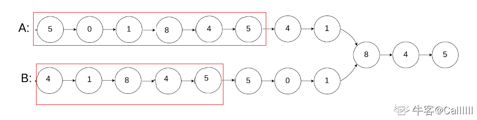

```c++
class Solution {
public:
    ListNode* FindFirstCommonNode( ListNode* pHead1, ListNode* pHead2) {
        ListNode *p1=pHead1,*p2=pHead2;
        while(p1!=p2){
            p1=p1!=NULL?p1->next:pHead2;
            p2=p2!=NULL?p2->next:pHead1;
        }
        return p1;
    }
};
```

### 第九天（2021-7-21）

------

##### No.37 [数字在升序数组中出现的次数](https://www.nowcoder.com/practice/70610bf967994b22bb1c26f9ae901fa2?tpId=13&tags=&title=&difficulty=0&judgeStatus=0&rp=1)

> 统计一个数字在升序数组中出现的次数。

<!--先用二分法找到target的左边界（右边界），从边界点开始计数。-->

```c++
class Solution {
public:
    int GetNumberOfK(vector<int> data ,int k) {
        if(data.size()==0) return 0;
        int left=0,right=data.size()-1;
        while(left<=right){
            int mid=(left+right)/2;
            if(data[mid]<k){
                left=mid+1;
            }else{
                right=mid-1;
            }
        }
        int count=0;
        while(data[left]==k){
            count++;
            left++;
        }
        return count;
    }
};
// time: O(logN)
```

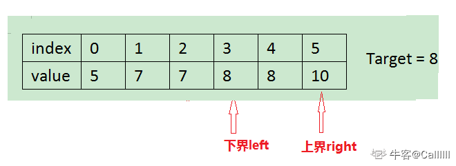

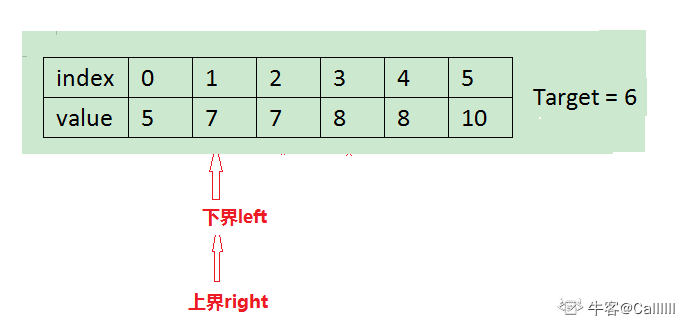

```c++
class Solution {
public:
    int GetNumberOfK(vector<int> data ,int k) {
        if(data.size()==0) return 0;
      	int lbound,rbound;
        int left=0,right=data.size();
        // left bound point
        while(left<right){
            int mid=(left+right)/2;
            if(data[mid]<k){
                left=mid+1;
            }else{
                right=mid;
            }
        }
        lbound=left;
        left=0,right=data.size();
        // right bound
        while(left<right){
            int mid=(left+right)/2;
            if(data[mid]>k){
                right=mid;
            }else{
                left=mid+1;
            }
        }
        rbound=l;
        return rbound-lbound;
    }
};
```

##### No.38 [二叉树的深度](https://www.nowcoder.com/practice/435fb86331474282a3499955f0a41e8b?tpId=13&tags=&title=&difficulty=0&judgeStatus=0&rp=1)

> 输入一棵二叉树，求该树的深度。从根结点到叶结点依次经过的结点（含根、叶结点）形成树的一条路径，最长路径的长度为树的深度。

<!--dfs深度遍历，注意不要把同一层的两个节点重复计算了-->

```c++
class Solution {
public:
    int TreeDepth(TreeNode* pRoot) {
        queue<TreeNode*> tree;
        if(!pRoot) return 0;
        tree.push(pRoot);
        int layer=0;
        while(!tree.empty()){
            int siz=tree.size();
            while(siz--){
                TreeNode* temp=tree.front();
                tree.pop();
                if(temp->left) tree.push(temp->left);
                if(temp->right) tree.push(temp->right);
            }
            layer++;
        }
        return layer;
    }
};
```

##### No.39 [二叉平衡树](https://www.nowcoder.com/practice/8b3b95850edb4115918ecebdf1b4d222?tpId=13&tags=&title=&difficulty=0&judgeStatus=0&rp=1)

> 输入一棵二叉树，判断该二叉树是否是平衡二叉树。
>
> 在这里，我们只需要考虑其平衡性，不需要考虑其是不是排序二叉树
>
> **平衡二叉树**（Balanced Binary Tree），具有以下性质：它是一棵空树或它的左右两个子树的高度差的绝对值不超过1，并且左右两个子树都是一棵平衡二叉树。
>
> 注：我们约定空树是平衡二叉树。

<!--因为平衡树的性质是子树的高度差不超过一，因此我们需要记录每个子树的高度，balancedTree函数用来计算每个节点的子树的高度，同时判断如果子树不是平衡树那么就不满足定义，返回负一，最终用-1来判断过程中所有子树是否是平衡树。-->

```c++
class Solution {
public:
    int balancedTree(TreeNode* root){
        if(root==NULL){return 0;}
        int left,right;
        //  height of the left subtree
        left=balancedTree(root->left);
        // height of the right subtree
        right=balancedTree(root->right);
        // the minus of the height
        int minus=abs(left-right);
        // if either subtree is not balanced tree, this tree is not balanced tree
        if(right==-1||left==-1){
            return -1;
        }
        // the height satisfied the defination
        if(minus<=1){
            // return the root height
            return max(left,right)+1;
        }else{
            return -1;
        }
    }
    bool IsBalanced_Solution(TreeNode* pRoot) {
        if(!pRoot) return true;
        int res=balancedTree(pRoot);
        return res==-1?false:true;
    }
};
```

```c++
class Solution {
public:
    map<TreeNode*, int> hs;
    int depth(TreeNode *root) {
        if (!root) return 0;
        if (hs.find(root) != hs.end()) return hs[root];
        int ldep = depth(root->left);
        int rdep = depth(root->right);
        return hs[root] = max(ldep, rdep) + 1;
    }
    bool judge(TreeNode *root) {
        if (!root) return true;
        return abs(hs[root->left] - hs[root->right]) <= 1 &&
        judge(root->left) && judge(root->right);
    }
    bool IsBalanced_Solution(TreeNode* root) {
        depth(root);
        return judge(root);
    }
};
```

##### No.40 [数组中只出现一次的两个数字](https://www.nowcoder.com/practice/389fc1c3d3be4479a154f63f495abff8?tpId=13&tags=&title=&difficulty=0&judgeStatus=0&rp=1)

> 一个整型数组里除了两个数字只出现一次，其他的数字都出现了两次。请写程序找出这两个只出现一次的数字。

```c++
class Solution {
public:
    vector<int> FindNumsAppearOnce(vector<int>& array) {
        unordered_map<int,int> count;
        vector<int> res;
        for(int e:array){
            count[e]++;
        }
        for(auto i:count){
            if(i.second==1){
                res.push_back(i.first);
            }
        }
        if(res[0]>res[1]){
            swap(res[0], res[1]);
        }
        return res;
    }
};
```

##### No.41 [和为S的连续正数序列](https://www.nowcoder.com/practice/c451a3fd84b64cb19485dad758a55ebe?tpId=13&tags=&title=&difficulty=0&judgeStatus=0&rp=1)

> 小明很喜欢数学,有一天他在做数学作业时,要求计算出9~16的和,他马上就写出了正确答案是100。但是他并不满足于此,他在想究竟有多少种连续的正数序列的和为100(至少包括两个数)。没多久,他就得到另一组连续正数和为100的序列:18,19,20,21,22。现在把问题交给你,你能不能也很快的找出所有和为S的连续正数序列? Good Luck!

```c++
class Solution {
public:
    vector<vector<int> > FindContinuousSequence(int sum) {
        vector<vector<int>> res;
        vector<int> record;
        int i,j,s;
        i=1;
        while(i*2<sum){
            j=i;
            s=0;
            while(s<sum){
                s+=j;
                record.push_back(j);
                if(s==sum){
                    res.push_back(record);
                }
                j++;
            }
            record.clear();
            i++;
        }
        return res;
    }
};
// time:O(N^2)
```

滑动窗口

1. 初始化，`i=1,j=1`, 表示窗口大小为`0`
2. 如果窗口中值的和小于目标值sum， 表示需要扩大窗口，`j += 1`
3. 否则，如果狂口值和大于目标值sum，表示需要缩小窗口，`i += 1`
4. 否则，等于目标值，存结果，缩小窗口，继续进行步骤`2,3,4`

```c++
class Solution {
public:
    vector<vector<int> > FindContinuousSequence(int sum) {
        vector<vector<int>> res;
        vector<int> record;
        int i,j,s;
        i=j=1;
        s=0;
        while(i*2<sum){
            record.push_back(j);
            s+=j;
            j++;
            while(s>=sum){
                if(s==sum){
                    res.push_back(record);
                }
                record.erase(record.begin());
                s-=i;
                i++;
            }
        }
        return res;
    }
};
// time: O(N)
```

##### No.42 [和为S的两个数字](https://www.nowcoder.com/practice/390da4f7a00f44bea7c2f3d19491311b?tpId=13&tags=&title=&difficulty=0&judgeStatus=0&rp=1)

> 输入一个递增排序的数组和一个数字S，在数组中查找两个数，使得他们的和正好是S，如果有多对数字的和等于S，返回两个数的乘积最小的，如果无法找出这样的数字，返回一个空数组即可。

<!--维护一个哈希列表，一边遍历数组，一边存储。如果发现有一对数字满足要求，就把他们填入vector中，如果vector中已经存在一对数了，那么保留乘积较小的，最后在返回之前交换一下顺序即可。-->

```c++
class Solution {
public:
    vector<int> FindNumbersWithSum(vector<int> array,int sum) {
        unordered_map<int,int> list;
        vector<int> save;
        for(int i=0;i<array.size();i++){
            int another=sum-array[i];
            if(list.count(another)){
                if(save.empty()){
                    save.push_back(array[i]);
                    save.push_back(another);
                }else if(array[i]*another<save[0]*save[1]){
                    save[0]=array[i];
                    save[1]=another;
                }
            }else{
                list[array[i]]++;
            }
        }
        if(!save.empty()&&save[0]>save[1]){
            swap(save[0],save[1]);
        }
        return save;
    }
};
// time:O(N) space:O(N)
```

<!--对于每一个数i，存在一个补数=sum-i，用二分法去数组中找补数是否存在，若存在则加入vector-->。

```c++
class Solution {
public:
    int findN(vector<int> array,int target){
        int l=0,r=array.size()-1;
        while(l<=r){
            int mid=(l+r)/2;
            if(array[mid]==target){
                return mid;
            }else if(array[mid]<target){
                l=mid+1;
            }else{
                r=mid-1;
            }
        }
        return -1;
    }
    vector<int> FindNumbersWithSum(vector<int> array,int sum) {
        vector<int> res;
        for(int i=0;i<array.size();i++){
            int another=sum-array[i];
            if(findN(array,another)!=-1&&findN(array,another)!=i){
                if(res.empty()){
                    res.push_back(array[i]);
                    res.push_back(another);
                }else if(array[i]*another<res[0]*res[1]){
                    res[0]=array[i];
                    res[1]=another;
                }
            }
        }
        return res;
    }
};
// time:O(NlogN) space:O(1)
```

<!--双指针-->

因为数组是有序的，所以可以用双指针，指向数组的首尾，具体步骤如下：

1. 初始化：指针i指向数组首， 指针j指向数组尾部

2. 如果arr[i] + arr[j] == sum , 说明是可能解
3. 否则如果arr[i] + arr[j] > sum, 说明和太大，所以--j
4. 否则如果arr[i] + arr[j] < sum, 说明和太小，所以++i

```c++
class Solution {
public:
    vector<int> FindNumbersWithSum(vector<int> array,int sum) {
        vector<int> res;
        int l=0,r=array.size()-1;
        while(l<r){
            if(array[l]+array[r]==sum){
                if(res.empty()){
                    res.push_back(array[l]);
                    res.push_back(array[r]);
                }else if(array[l]*array[r]<res[0]*res[1]){
                    res[0]=array[l];
                    res[1]=array[r];
                }
                r--;
                l++;
            }else if(array[l]+array[r]>sum){
                r--;
            }else if(array[l]+array[r]<sum){
                l++;
            }
        }
        return res;
    }
};
```

### 第十天（2021-7-22）

------

##### No.43 [左旋转字符串](https://www.nowcoder.com/practice/12d959b108cb42b1ab72cef4d36af5ec?tpId=13&tags=&title=&difficulty=0&judgeStatus=0&rp=1)

> 汇编语言中有一种移位指令叫做循环左移（ROL），现在有个简单的任务，就是用字符串模拟这个指令的运算结果。对于一个给定的字符序列 S，请你把其循环左移 K 位后的序列输出（保证 K 小于等于 S 的长度）。例如，字符序列S=”abcXYZdef”,要求输出循环左移 3 位后的结果，即“XYZdefabc”。是不是很简单？OK，搞定它

```c++
class Solution {
public:
    string LeftRotateString(string str, int n) {
        if(n>=str.size()){
            return str;
        }
        int k=n;
        string res="";
        for(int i=0;i<str.size();i++){
            res+=str[k];
            k=k==str.size()-1?0:k+1;
        }
        return res;
    }
};
// time:O(N) space:O(N)
```

##### No.44 [翻转单词序列](https://www.nowcoder.com/practice/3194a4f4cf814f63919d0790578d51f3?tpId=13&tags=&title=&difficulty=0&judgeStatus=0&rp=1)

> 牛客最近来了一个新员工Fish，每天早晨总是会拿着一本英文杂志，写些句子在本子上。同事Cat对Fish写的内容颇感兴趣，有一天他向Fish借来翻看，但却读不懂它的意思。例如，“nowcoder. a am I”。后来才意识到，这家伙原来把句子单词的顺序翻转了，正确的句子应该是“I am a nowcoder.”。Cat对一一的翻转这些单词顺序可不在行，你能帮助他么？
>
> 题目抽象：给定一个首尾可能带空格的字符串，请让你翻转该字符串。首尾不能有多余空格。如果全部是空格，请返回原字符串。

<!--从字符串的尾端往首部遍历，一个指针记录单词的结尾，另一个指针递减去找单词的起点（以空格为分隔），每找到一个单词就从起点到结尾把它记录下来，直到遍历到字符串的首部。-->

```c++
class Solution {
public:
    string ReverseSentence(string str) {
        int i,j;
        i=j=str.size()-1;
        string res="";
        while(i>=0&&j>=0){
            if(str[j]==' '||j==0){
                int copy=j==0?j:j+1;
                for(;copy<=i;copy++){
                    res+=str[copy];
                }
                if(str[j]==' '){
                    res+=' ';
                }
                i=j=j-1;
            }else{
                j--;
            }
        }
        return res;
    }
};
```

```c++
class Solution {
public:
    string ReverseSentence(string str) {
        string res="";
        vector<string> array;
        int i;
        for(i=0;i<str.size();i++){
            if(str[i]==' '){
                array.push_back(res);
                res="";
            }else{
                res+=str[i];
            }
        }
        array.push_back(res);
        res="";
        for(i=array.size()-1;i>=0;i--){
            res+=array[i];
            if(i!=0){
                res+=' ';
            }
        }
        return res;
    }
};
```

```c++
class Solution {
public:
    string ReverseSentence(string str) {
        // 预处理
        if (str.empty()) return str;
        int i = 0, sz = str.size();
        while(i < sz && str[i] == ' ') ++i;
        if (i == sz) return str;
        istringstream ss(str);
        vector<string> ret;
        string s;
        // 拆分单词
        while (ss >> s) 
            ret.push_back(s);
        reverse(ret.begin(), ret.end());
        ostringstream oss;
        // 合并成字符串
        for (int i=0; i<ret.size()-1; ++i)
            oss << ret[i] << ' ';
        oss << ret.back();
        return oss.str();
    }
};
```

##### No.45 [扑克牌顺子](https://www.nowcoder.com/practice/762836f4d43d43ca9deb273b3de8e1f4?tpId=13&tags=&title=&difficulty=0&judgeStatus=0&rp=1)

> 现在有2副扑克牌，从扑克牌中随机五张扑克牌，我们需要来判断一下是不是顺子。
> 有如下规则：
> \1. A为1，J为11，Q为12，K为13，A不能视为14
> \2. 大、小王为 0，0可以看作任意牌
> \3. 如果给出的五张牌能组成顺子（即这五张牌是连续的）就输出true，否则就输出false。
> 例如：给出数据[6,0,2,0,4]
> 中间的两个0一个看作3，一个看作5 。即：[6,3,2,5,4]
> 这样这五张牌在[2,6]区间连续，输出true
> 数据保证每组5个数字，每组最多含有4个零，数组的数取值为 [0, 13]

<!--维护一个长度为5的数组res，初始化为5个0代表能拼成顺子的五个位置，排序后的最后一个数一定是最大的，要将它填入res[4]的位置需要减一个特定的数minus，随后遍历整个数组把牌填入res特定的位置同时记录0的个数，随后累加res中数的和，如果和与0的个数刚好凑成5则说明这五个数一定能组成顺子。-->

```c++
class Solution {
public:
    bool IsContinuous( vector<int> numbers ) {
        sort(numbers.begin(),numbers.end());
        vector<int> res(5,0);
        int minus=numbers[4]-4;
        int count0=0;
        for(int i=4;i>=0;i--){
            if(numbers[i]==0){
                count0++;
            }else{
                int pos=numbers[i]-minus;
                if(pos>=0){
                    res[pos]=1;
                }
            }
        }
        int sum=0;
        for(int i=0;i<5;i++){
            sum+=res[i];
        }
        return sum+count0==5;
    }
};
```

<!--如果没有重复的数字，那么顺子满足最大值与最小值的差小于5-->

```c++
class Solution {
public:
    bool IsContinuous( vector<int> numbers ) {
        sort(numbers.begin(),numbers.end());
        int min=0;// 最小值的下标
        for(int i=0;i<4;i++){
            if(numbers[i]==0){
                min++;
                continue;
            }
            if(numbers[i]==numbers[i+1]){
                return false;
            }
        }
        return numbers[4]-numbers[min]<5;
    }
};
```

set+遍历

```c++
class Solution {
public:
    bool IsContinuous( vector<int> numbers ) {
        set<int> st;
        int max_ = 0, min_ = 14;
        for(int val:numbers){
            if(val!=0){
                if(st.count(val)){
                    return false;
                }
                st.insert(val);
                if(val<min_){
                    min_=val;
                }
                if(val>max_){
                    max_=val;
                }
            }
        }
        return max_-min_<5;
    }
};
```

### 第十一天（2021-7-23）

------

##### No.46 [圆圈中剩下的数](https://www.nowcoder.com/practice/f78a359491e64a50bce2d89cff857eb6?tpId=13&tags=&title=&difficulty=0&judgeStatus=0&rp=1)

> 每年六一儿童节,牛客都会准备一些小礼物去看望孤儿院的小朋友,今年亦是如此。HF作为牛客的资深元老,自然也准备了一些小游戏。其中,有个游戏是这样的:首先,让小朋友们围成一个大圈。然后,他随机指定一个数m,让编号为0的小朋友开始报数。每次喊到m-1的那个小朋友要出列唱首歌,然后可以在礼品箱中任意的挑选礼物,并且不再回到圈中,从他的下一个小朋友开始,继续0...m-1报数....这样下去....直到剩下最后一个小朋友,可以不用表演,并且拿到牛客名贵的“名侦探柯南”典藏版(名额有限哦!!^_^)。请你试着想下,哪个小朋友会得到这份礼品呢？(注：小朋友的编号是从0到n-1)

<!--给定一个由[0...n-1]构成的数组，第一次从0开始数m个数，然后删除，以后每次都从删除的数下一个位置开始数m个数，然后删除，直到剩余一个数字，找出那个数字。-->

```c++
class Solution {
public:
    int LastRemaining_Solution(int n, int m) {
        if(n==0) return -1;
        vector<int> circle(n);
        for(int i=0;i<n;i++)  circle[i]=i;
        int pointer=-1,count;
        while(circle.size()>1){
            for(count=m-1;count>=0;count--){
                if(pointer+1==circle.size()){
                    pointer=0;
                }else{
                    pointer=pointer+1;
                }
                
            }
            circle.erase(circle.begin()+pointer);
            pointer--;
        }
        return circle[0];
    }
};
```

假设f(n, m) 表示最终留下元素的序号。比如上例子中表示为:f(5,3) = 3

首先，长度为 n 的序列会先删除第 m % n 个元素，然后剩下一个长度为 n - 1 的序列。那么，我们可以递归地求解 f(n - 1, m)，就可以知道对于剩下的 n - 1 个元素，最终会留下第几个元素，我们设答案为 x = f(n - 1, m)。

由于我们删除了第 m % n 个元素，将序列的长度变为 n - 1。当我们知道了 f(n - 1, m) 对应的答案 x 之后，我们也就可以知道，长度为 n 的序列最后一个删除的元素，应当是从 m % n 开始数的第 x 个元素。因此有 f(n, m) = (m % n + x) % n = (m + x) % n。

当n等于1时，f(1,m) = 0

```c++
class Solution {
public:
    int f(int n, int m) {
        if (n == 1) return 0;
        int x = f(n-1, m);
        return (x+m) % n;
    }
    int LastRemaining_Solution(int n, int m)
    {
        if (n <= 0) return -1;
        return f(n,m);
    }
};
```

##### No.47 [求1+2+3+…+n](https://www.nowcoder.com/practice/7a0da8fc483247ff8800059e12d7caf1?tpId=13&tags=&title=&difficulty=0&judgeStatus=0&rp=1)

方法一：公式

```c++
class Solution {
public:
    int Sum_Solution(int n) {
        return (1+n)*n/2;
    }
};
// time:O(1) space:O(1)
```

方法二：循环累加

```c++
class Solution {
public:
    int Sum_Solution(int n) {
        int sum=0;
        for(int i=1;i<=n;i++){
            sum+=i;
        }
        return sum;
    }
};
// time:O(N) space:O(1)
```

方法三：迭代法

```c++
class Solution {
public:
    int Sum_Solution(int n) {
        if(n==1) return 1;
        return n+Sum_Solution(n-1);
    }
};
// time:O(N) space:O(N)
```

##### No.48 [不用加减乘除做加法](https://www.nowcoder.com/practice/59ac416b4b944300b617d4f7f111b215?tpId=13&tags=&title=&difficulty=0&judgeStatus=0&rp=1)

> 写一个函数，求两个整数之和，要求在函数体内不得使用+、-、*、/四则运算符号。

按位与、或、异或结果

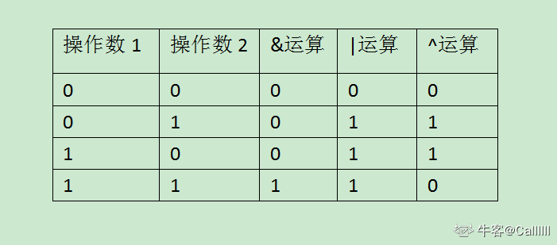

利用位运算来处理数据的加法

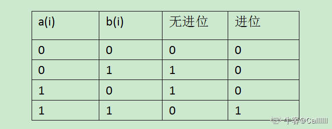

观察发现，无进位和运算就是按位异或结果，进位就是与运算结果但是需要左移一位，因为进位影响下一位的运算。
所以s = a + b,其实就是无进位和+进位的结果。

算法步骤：

1. 计算a和b的无进位和（异或），和进位（与结果并左移）
2. 如果进位不为0，则说明a+b的结果等于无进位和+进位，此时，把无进位和作为a，进位作为b，继续计算
3. 如果进位等于0， 说明此时a+b的结果就等于无进位和，返回无进位和即可

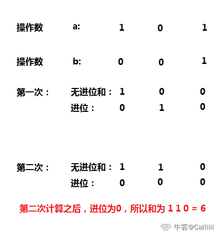


```c++
class Solution {
public:
    int Add(int num1, int num2) {
        while (num2 != 0) {
            // 负数左移会在低位补1，所以转化为无符号整数
            int c = ((unsigned int)(num1 & num2)) << 1;
            num1 ^= num2;
            num2 = c;
        }
        return num1;
    }
};
```

### 第十二天（2021-7-28）

------

##### No.49 [把字符串转换成整数](https://www.nowcoder.com/practice/1277c681251b4372bdef344468e4f26e?tpId=13&tags=&title=&difficulty=0&judgeStatus=0&rp=1)

> 将一个字符串转换成一个整数，要求不能使用字符串转换整数的库函数。 数值为0或者字符串不是一个合法的数值则返回0

```c++
class Solution {
public:
    int StrToInt(string str) {
        int count=1;
        long sum=0;
        for(int i=str.size()-1;i>=0;i--){
            if(str[i]>='0'&&str[i]<='9'){
                sum+=(str[i]-'0')*count;
                count*=10;
            }else if(str[i]=='+'){
                continue;
            }else if(str[i]=='-'){
                if(sum>INT_MAX+1L){
                    return -INT_MAX-1;
                }else{
                    return 0-sum;
                }
            }else{
                return 0;
            }
        }
        return sum>INT_MAX?INT_MAX:sum;;
    }
};
```

int的范围为 

注意处理越界

##### No.50 [数组中重复的数字](https://www.nowcoder.com/practice/6fe361ede7e54db1b84adc81d09d8524?tpId=13&tags=&title=&difficulty=0&judgeStatus=0&rp=1)

> 在一个长度为n的数组里的所有数字都在0到n-1的范围内。 数组中某些数字是重复的，但不知道有几个数字是重复的。也不知道每个数字重复几次。请找出数组中任一一个重复的数字。 例如，如果输入长度为7的数组[2,3,1,0,2,5,3]，那么对应的输出是2或者3。存在不合法的输入的话输出-1

```c++
class Solution {
public:
    int duplicate(vector<int>& numbers) {
        unordered_map<int,int> map;
        for(int i=0;i<numbers.size();i++){
            if(map.count(numbers[i])){
                return numbers[i];
            }else{
                map[numbers[i]]++;
            }
        }
        return -1;
    }
};
```

```c++
class Solution {
public:
    int duplicate(vector<int>& numbers) {
        sort(numbers.begin(),numbers.end());
        int i,j;
        i=0,j=1;
        while(i<numbers.size()&&j<numbers.size()){
            if(numbers[i]==numbers[j]){
                return numbers[i];
            }else{
                i++;
                j++;
            }
        }
        return -1;
    }
};
```

##### No.51 [构建乘积数组](https://www.nowcoder.com/practice/94a4d381a68b47b7a8bed86f2975db46?tpId=13&tags=&title=&difficulty=0&judgeStatus=0&rp=1)

> 给定一个数组A[0,1,...,n-1],请构建一个数组B[0,1,...,n-1],其中B中的元素B[i]=A[0]\*A[1]\*...\*A[i-1]\*A[i+1]\*...\*A[n-1]。不能使用除法。（注意：规定B[0] = A[1] * A[2] * ... * A[n-1]，B[n-1] = A[0] * A[1] * ... * A[n-2];）
>
> 对于A长度为1的情况，B无意义，故而无法构建，因此该情况不会存在。

B[i]=A[0]\*A[1]\*...\*A[i-1]\*A[i+1]\*...\*A[n-1]

left[i]=A[0]\*A[1]\*...\*A[i-1]

left[i+1]=A[0]\*A[1]\*...\*A[i-1]\*A[i]

left[i+1]=left[i]*A[i]

right[i+1]=A[i+2]\*...\*A[n-1]

right[i]=A[i+1]\*A[i+2]\*...\*A[n-1]

right[i]=right[i+1]*A[i+1]

B[i]=left[i]*right[i]

```c++
class Solution {
public:
    vector<int> multiply(const vector<int>& A) {
        vector<int> left(A.size(),1),right(A.size(),1);
        int i;
        for(i=1;i<A.size();i++){
            left[i]=left[i-1]*A[i-1];
        }
        for(i=A.size()-2;i>=0;i--){
            right[i]=right[i+1]*A[i+1];
        }
        vector<int> res;
        for(i=0;i<A.size();i++){
            res.push_back(left[i]*right[i]);
        }
        return res;
    }
};
```

```c++
// 节省空间
class Solution {
public:
    vector<int> multiply(const vector<int>& A) {
        vector<int> B(A.size(), 1);
        for (int i=1; i<A.size(); ++i) {
            B[i] = B[i-1] * A[i-1]; // left[i]用B[i]代替
        }
        int tmp = 1;
        for (int j=A.size()-2; j>=0; --j) {
            tmp *= A[j+1]; // right[i]用tmp代替
            B[j] *= tmp;
        }
        return B;
    }
};
```

##### No.52 [正则表达式匹配](https://www.nowcoder.com/practice/28970c15befb4ff3a264189087b99ad4?tpId=13&tags=&title=&difficulty=0&judgeStatus=0&rp=1)

> 请实现一个函数用来匹配包括'.'和'\*'的正则表达式。模式中的字符'.'表示任意一个字符，而'\*'表示它前面的字符可以出现任意次（包含0次）。 在本题中，匹配是指字符串的所有字符匹配整个模式。例如，字符串"aaa"与模式"a.a"和"ab\*ac\*a"匹配，但是与"aa.a"和"ab*a"均不匹配

##### No.53 [表示数值的字符串](https://www.nowcoder.com/practice/e69148f8528c4039ad89bb2546fd4ff8?tpId=13&tags=&title=&difficulty=0&judgeStatus=0&rp=1)

> 请实现一个函数用来判断字符串是否表示数值（包括整数和小数）。例如，字符串"+100","5e2","-123","3.1416"和"-1E-16"都表示数值。 但是"12e","1a3.14","1.2.3","+-5"和"12e+4.3"都不是

1、判断一下正负号,只能出现在首位和e后面一位，如果不是，返回False；

2、判断小数点，只能出现0或1次，不能在e后面出现，如果不是，返回False；

3、判断是否出现过数字；

4、判断字符e，前后都必须有数字，还需要再判断一下e后面是否出现数字（见代码），只能出现0或1次，如果不是，返回False；

```c++
class Solution {
public:
    bool isNumeric(string str) {
        bool hasPoint=false,hasE=false,hasSymbol=false,hasNum=false;
        for(int i=0;i<str.size();i++){
            if(str[i]=='+'||str[i]=='-'){
                if(i!=0){
                    if(str[i-1]=='e'||str[i-1]=='E'){
                        if(str[i+1]<='9'&&str[i+1]>='0'){
                            continue;
                        }
                    }
                    return false;
                }else{
                    if(str[i+1]!='\000'){
                        hasSymbol=true;
                    }else{
                        return false;
                    }
                }
            }else if(str[i]<='9'&&str[i]>='0'){
                hasNum=true;
                continue;
            }else if(str[i]=='e'||str[i]=='E'){
                hasE=true;
                if(i+1==str.size()){
                    return false;
                }
                if(str[i-1]<='9'&&str[i-1]>='0'){
                    continue;
                }else{
                    return false;
                }
            }else if(str[i]=='.'){
                if(hasPoint){
                    return false;
                }else if(hasE){
                    return false;
                }else{
                    hasPoint=true;
                }
            }else{
                return false;
            }
        }
        return hasNum;
    }
};
```

### 第十三天（2021-8-3）

------

##### No.54 [字符流中第一个重复的字符](https://www.nowcoder.com/practice/00de97733b8e4f97a3fb5c680ee10720?tpId=13&tags=&title=&difficulty=0&judgeStatus=0&rp=1)

> 请实现一个函数用来找出字符流中第一个只出现一次的字符。例如，当从字符流中只读出前两个字符"go"时，第一个只出现一次的字符是"g"。当从该字符流中读出前六个字符“google"时，第一个只出现一次的字符是"l"。
>
> 后台会用以下方式调用Insert 和 FirstAppearingOnce 函数
>
> string caseout = "";
>
> 1.读入测试用例字符串casein
>
> 2.如果对应语言有Init()函数的话，执行Init() 函数
>
> 3.循环遍历字符串里的每一个字符ch {
>
> Insert(ch);
>
> caseout += FirstAppearingOnce()
>
> }
>
> 4.输出caseout，进行比较。

```c++
class Solution
{
public:
    vector<char> saveStream;
    set<char> duplicate;
  //Insert one char from stringstream
    void Insert(char ch) {
        if(duplicate.count(ch)){
            int i;
            for(i=0;i<saveStream.size();i++){
                if(saveStream[i]==ch) break;
            }
            if(i<saveStream.size()&&i>=0){
                saveStream.erase(saveStream.begin()+i);
            }
            
        }else{
            saveStream.push_back(ch);
            duplicate.insert(ch);
        }
         
    }
  //return the first appearence once char in current stringstream
    char FirstAppearingOnce() {
        if(saveStream.size()==0){
            return '#';
        }else{
            return saveStream[0];
        }
    }

};
```

1. 初始化一个`unordered_map<char, int> mp, queue<char> q`
2. 对于`Insert(char ch)`操作， 如果ch是第一次出现，则添加到q中，然后在mp中记录一下次数，如果不是第一次出现，也就是重复了，那么我们就没必要添加到q中，但是还是需要在mp中更新一下次数，因为之后要根据次数来判断是否重复。
3. 对于`FirstAppearingOnce()`操作，我们直接判断q的头部，然后在mp中检查一下，是否重复，如果没有重复，那就是我们想要的数据。否则，如果重复了，那就应该弹出头部，然后判断下一个头部是否满足要求。

```c++
class Solution
{
public:
    queue<char> saveStream;
    unordered_map<char, int> duplicate;
  //Insert one char from stringstream
    void Insert(char ch) {
        saveStream.push(ch);
        duplicate[ch]++;
    }
  //return the first appearence once char in current stringstream
    char FirstAppearingOnce() {
        while(!saveStream.empty()){
            char res=saveStream.front();
            if(duplicate[res]==1){
                return res;
            }else{
                saveStream.pop();
            }
        }
        return '#';
    }

};
```

##### No.55 [链表中环的入口节点](https://www.nowcoder.com/practice/253d2c59ec3e4bc68da16833f79a38e4?tpId=13&tags=&title=&difficulty=0&judgeStatus=0&rp=1)

> 给一个链表，若其中包含环，请找出该链表的环的入口结点，否则，返回null。

快慢指针

从起点开始，快指针每次走两步，慢指针每次走一步，二者相遇之后，慢指针从头开始走，快指针从相遇点开始走，再次相遇的点一定是环的起点。

```c++
class Solution {
public:
    ListNode* EntryNodeOfLoop(ListNode* pHead) {
        ListNode *slow,*fast;
        if(pHead->next&&pHead->next->next){
            slow=pHead->next;
            fast=pHead->next->next;
        }else{
            return NULL;
        }
        while(fast&&fast->next&&slow!=fast){
            slow=slow->next;
            fast=fast->next->next;
        }
        if(!fast||!fast->next){
            return NULL;
        }
        slow=pHead;
        while(slow!=fast){
            slow=slow->next;
            fast=fast->next;
        }
        return slow;
    }
};
```

##### No.56 [删除链表中重复的节点](https://www.nowcoder.com/practice/fc533c45b73a41b0b44ccba763f866ef?tpId=13&tags=&title=&difficulty=0&judgeStatus=0&rp=1)

```c++
class Solution {
public:
    ListNode* deleteDuplication(ListNode* pHead) {
        if(!pHead||!pHead->next){
            return pHead;
        }
        ListNode *pre=new ListNode(-1);
        pre->next=pHead;
        ListNode *cur,*net,*head=pre;
        cur=pHead;
        net=pHead->next;
        while(net!=NULL){
            if(cur->val!=net->val){
                pre=cur;
                cur=net;
                net=net->next;
            }else{
                while(net!=NULL&&cur->val==net->val){
                    net=net->next;
                }
                if(net){
                    cur=net;
                    pre->next=cur;
                    net=net->next;
                }else{
                    pre->next=NULL;
                    break;
                }
            }
        }
        return head->next;
    }
};
```

